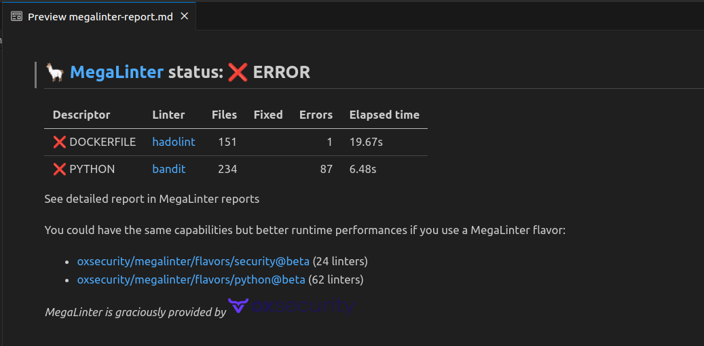

<!-- markdownlint-disable MD013 MD033 MD041 -->

<!-- header-intro-start -->
<!-- header-intro-end -->

<!-- header-logo-start -->
<div align="center">
  <a href="https://megalinter.io" target="blank" title="Visit MegaLinter Web Site">
    
  </a>
</div>
<!-- header-logo-end -->
<!-- mega-linter-title-start -->

# MegaLinter, by [](https://www.ox.security/?ref=megalinter)

<!-- mega-linter-title-end -->
<!-- mega-linter-badges-start -->

[](https://megalinter.io/flavors/)
[](https://npmjs.org/package/mega-linter-runner)
[](https://github.com/oxsecurity/megalinter/stargazers/)
[](https://github.com/oxsecurity/megalinter/actions?query=workflow%3AMegaLinter+branch%3Amain)
[](https://codecov.io/gh/oxsecurity/megalinter)
<!-- gh-dependents-info-used-by-start -->
[](https://github.com/oxsecurity/megalinter/blob/main/./docs/used-by-stats.md)<!-- gh-dependents-info-used-by-end -->
[](https://github.com/aquasecurity/trivy)
[](https://github.com/oxsecurity/megalinter/graphs/contributors/)
[](https://github.com/sponsors/nvuillam)
[](http://makeapullrequest.com)
[](https://twitter.com/intent/tweet?text=Check+MegaLinter+to+say+goodbye+to+dirty+code+in+your+projects+%3A%29+100%25+free+and+open+source+for+all+uses&url=https://megalinter.io/&via=NicolasVuillamy&hashtags=linters,code,quality,ci,python,java,golang,c,dotnet,kotlin,rust,scala,salesforce,terraform)
<!-- mega-linter-badges-end -->

<!-- welcome-phrase-start -->
MegaLinter is an **Open-Source** tool for **CI/CD workflows** that analyzes the **consistency of your code**, **IAC**, **configuration**, and **scripts** in your repository sources, to **ensure all your projects sources are clean and formatted** whatever IDE/toolbox is used by their developers, powered by [**OX Security**](https://www.ox.security/?ref=megalinter).

Supporting [**62** languages](#languages), [**23** formats](#formats), [**20** tooling formats](#tooling-formats) and **ready to use out of the box**, as a GitHub action or any CI system, **highly configurable** and **free for all uses**.

MegaLinter has **native integrations** with many of the major CI/CD tools of the market.

[](https://github.com/oxsecurity/megalinter/tree/main/docs/reporters/GitHubCommentReporter.md)
[](https://github.com/oxsecurity/megalinter/tree/main/docs/reporters/GitlabCommentReporter.md)
[](https://github.com/oxsecurity/megalinter/tree/main/docs/reporters/AzureCommentReporter.md)
[](https://github.com/oxsecurity/megalinter/tree/main/docs/reporters/BitbucketCommentReporter.md)
[](https://github.com/oxsecurity/megalinter/tree/main/docs/install-jenkins.md)
[](https://github.com/oxsecurity/megalinter/tree/main/docs/install-drone.md)
[](https://github.com/oxsecurity/megalinter/tree/main/docs/install-concourse.md)
[](https://github.com/oxsecurity/megalinter/tree/main/docs/install-docker.md)
[](https://github.com/oxsecurity/megalinter/tree/main/docs/reporters/SarifReporter.md)
[](https://github.com/oxsecurity/megalinter/tree/main/docs/reporters/ApiReporter.md)


<!-- welcome-phrase-end -->


[**Upgrade to MegaLinter v8 :)**](https://github.com/oxsecurity/megalinter/issues/3913)

[](https://www.youtube.com/watch?v=vbx-ifa1oXE)

<!-- online-doc-start -->
Before going below, see [**Online Documentation Web Site which has a much easier user navigation than this README**](https://megalinter.io/)
<!-- online-doc-end -->

<!-- table-of-contents-start -->
## Table of Contents

- [Why MegaLinter](#why-megalinter)
- [Quick Start](#quick-start)
- [Supported Linters](#supported-linters)
  - [Languages](#languages)
  - [Formats](#formats)
  - [Tooling formats](#tooling-formats)
  - [Other](#other)
- [Installation](#installation)
  - [Assisted installation](#assisted-installation)
  - [Which version to use ?](#which-version-to-use-)
  - [GitHub Action](#github-action)
  - [GitLab CI](#gitlab-ci)
    - [Manual Setup](#manual-setup)
    - [Using R2Devops](#using-r2devops)
  - [Azure Pipelines](#azure-pipelines)
  - [Bitbucket Pipelines](#bitbucket-pipelines)
  - [Jenkins](#jenkins)
  - [Concourse](#concourse)
    - [Pipeline step](#pipeline-step)
    - [Use it as reusable task](#use-it-as-reusable-task)
  - [Drone CI](#drone-ci)
    - [(Optional) Adjusting trigger rules](#optional-adjusting-trigger-rules)
  - [Docker container](#docker-container)
  - [Run MegaLinter locally](#run-megalinter-locally)
- [Configuration](#configuration)
  - [.mega-linter.yml file](#mega-linteryml-file)
  - [Common variables](#common-variables)
  - [Activation and deactivation](#activation-and-deactivation)
  - [Filter linted files](#filter-linted-files)
  - [Apply fixes](#apply-fixes)
    - [Apply fixes issues](#apply-fixes-issues)
    - [Notes](#notes)
  - [Linter specific variables](#linter-specific-variables)
  - [Pre-commands](#pre-commands)
  - [Post-commands](#post-commands)
  - [Environment variables security](#environment-variables-security)
    - [Secured env variables](#secured-env-variables)
    - [Secured configuration examples](#secured-configuration-examples)
    - [Default secured variables](#default-secured-variables)
    - [Unhide variables for linters](#unhide-variables-for-linters)
  - [CLI lint mode](#cli-lint-mode)
- [Reporters](#reporters)
- [Flavors](#flavors)
- [Badge](#badge)
  - [Markdown](#markdown)
  - [reStructuredText](#restructuredtext)
- [Plugins](#plugins)
  - [External Plugins Catalog](#external-plugins-catalog)
  - [Use external plugins](#use-external-plugins)
    - [Example](#example)
  - [Create your own plugin](#create-your-own-plugin)
    - [Limitations](#limitations)
- [They talk about MegaLinter](#they-talk-about-megalinter)
  - [English articles](#english-articles)
  - [French articles](#french-articles)
  - [Videos](#videos)
  - [Web Sites](#web-sites)
  - [Linters](#linters)
- [Frequently Asked Questions](#frequently-asked-questions)
- [How to contribute](#how-to-contribute)
- [Special thanks](#special-thanks)
  - [Maintainers](#maintainers)
  - [Contributors](#contributors)
  - [Open-source teams](#open-source-teams)
  - [Super-Linter team](#super-linter-team)
- [License](#license)
- [MegaLinter vs Super-Linter](#megalinter-vs-super-linter)
  - [Security](#security)
  - [Performances](#performances)
  - [More languages and formats linted](#more-languages-and-formats-linted)
  - [Automatically apply formatting and fixes](#automatically-apply-formatting-and-fixes)
  - [Run locally](#run-locally)
  - [Reports](#reports)
    - [Capabilities](#capabilities)
    - [Additional Reporters](#additional-reporters)
  - [Enhanced Configuration](#enhanced-configuration)
  - [Enhanced Documentation](#enhanced-documentation)
  - [Plugins management](#plugins-management)
  - [Simplify architecture and evolutive maintenance](#simplify-architecture-and-evolutive-maintenance)
  - [Improve robustness \& stability](#improve-robustness--stability)
<!-- table-of-contents-end -->

## Why MegaLinter

Projects need to contain clean code, in order to **avoid technical debt**, that makes **evolutive maintenance harder and time consuming**.

By using [**code formatters and code linters**](#supported-linters), you ensure that your code base is **easier to read** and **respects best practices**, from the kick-off to each step of the project lifecycle

Not all developers have the good habit to use linters in their IDEs, making code reviews harder and longer to process

By using **MegaLinter**, you'll enjoy the following benefits for you and your team:

- At **each pull request** it will **automatically analyze all updated code in all languages**
- Reading error logs, **developers learn best practices** of the language they're using
- [**MegaLinter documentation**](https://megalinter.io/) provides the **list of IDE plugins integrating each linter**, so developers know which linter and plugins to install
- MegaLinter is **ready out of the box** after a [**quick setup**](#quick-start)
- **Formatting and fixes** can be automatically [**applied on the git branch**](https://github.com/oxsecurity/megalinter/tree/main/docs/config-apply-fixes.md) or [**provided in reports**](https://github.com/oxsecurity/megalinter/tree/main/docs/reporters/UpdatedSourcesReporter.md)
- This tool is **100% open-source** and **free for all uses** (personal, professional, public and private repositories)
- MegaLinter can run on [**any CI tool**](https://github.com/oxsecurity/megalinter/tree/main/docs/install-assisted.md) and be [**run locally**](https://megalinter.io/mega-linter-runner/): **no need to authorize an external application**, and **your code base never leaves your tooling ecosystem**

<!-- quick-start-section-start -->
<!-- markdown-headers
---
title: Quick Start with MegaLinter
description: Setup MegaLinter in 5 minutes thanks to its assisted installation tool
---
-->
## Quick Start

- Run `npx mega-linter-runner --install` to generate configuration files (you need [node.js](https://nodejs.org/en/) to be installed)
- Commit, push, and create a pull request
- Watch !


**Notes**:

- This repo is a hard-fork of [GitHub Super-Linter](https://github.com/super-linter/super-linter), rewritten in python to add [lots of additional features](#mega-linter-vs-super-linter)
- If you are a Super-Linter user, you can transparently **switch to MegaLinter and keep the same configuration** (just replace `super-linter/super-linter@v3` by `oxsecurity/megalinter@v8` in your GitHub Action YML file, [like on this PR](https://github.com/nvuillam/npm-groovy-lint/pull/109))
- If you want to use MegaLinter extra features (recommended), please take 5 minutes to use [MegaLinter assisted installation](https://github.com/oxsecurity/megalinter/tree/main/docs/install-assisted.md)
- For a hand-holdy example of getting started with mega-linter check out [this blog post](https://ayyjohn.com/posts/linting-a-jekyll-blog-with-mega-linter) by Alec Johnson
<!-- quick-start-section-end -->

<!-- supported-linters-section-start -->
<!-- markdown-headers
---
title: List of the 100+ supported linters embedded in MegaLinter
description: Full list of all linters for all languages and formats that are available in MegaLinter
---
-->
## Supported Linters

All linters are integrated in the [MegaLinter docker image](https://hub.docker.com/r/oxsecurity/megalinter), which is frequently upgraded with their latest versions

<!-- languages-section-start-->
<!-- linters-table-start -->
### Languages

|                                                                               <!-- -->                                                                               | Language                                                                                                            | Linter                                                                                                                                                                                                                                                                                     |                                                                                                                                Additional                                                                                                                                 |
|:--------------------------------------------------------------------------------------------------------------------------------------------------------------------:|---------------------------------------------------------------------------------------------------------------------|--------------------------------------------------------------------------------------------------------------------------------------------------------------------------------------------------------------------------------------------------------------------------------------------|:-------------------------------------------------------------------------------------------------------------------------------------------------------------------------------------------------------------------------------------------------------------------------:|
|    </a> <!-- linter-icon -->    | [**BASH**](https://github.com/oxsecurity/megalinter/tree/main/docs/descriptors/bash.md)                             | [**bash-exec**](https://github.com/oxsecurity/megalinter/tree/main/docs/descriptors/bash_bash_exec.md)<br/>[_BASH_EXEC_](https://github.com/oxsecurity/megalinter/tree/main/docs/descriptors/bash_bash_exec.md)                                                                            |                                                                                                                                                                                                                                                                           |
|    </a> <!-- linter-icon -->    | [**BASH**](https://github.com/oxsecurity/megalinter/tree/main/docs/descriptors/bash.md)                             | [**shellcheck**](https://github.com/oxsecurity/megalinter/tree/main/docs/descriptors/bash_shellcheck.md)<br/>[_BASH_SHELLCHECK_](https://github.com/oxsecurity/megalinter/tree/main/docs/descriptors/bash_shellcheck.md)                                                                   |                                           [](https://github.com/koalaman/shellcheck)                                            |
|    </a> <!-- linter-icon -->    | [**BASH**](https://github.com/oxsecurity/megalinter/tree/main/docs/descriptors/bash.md)                             | [**shfmt**](https://github.com/oxsecurity/megalinter/tree/main/docs/descriptors/bash_shfmt.md)<br/>[_BASH_SHFMT_](https://github.com/oxsecurity/megalinter/tree/main/docs/descriptors/bash_shfmt.md)                                                                                       |                                                   [](https://github.com/mvdan/sh)                                                     |
|     </a> <!-- linter-icon -->      | [**C**](https://github.com/oxsecurity/megalinter/tree/main/docs/descriptors/c.md)                                   | [**cpplint**](https://github.com/oxsecurity/megalinter/tree/main/docs/descriptors/c_cpplint.md)<br/>[_C_CPPLINT_](https://github.com/oxsecurity/megalinter/tree/main/docs/descriptors/c_cpplint.md)                                                                                        |                                                                       [](https://github.com/cpplint/cpplint)                                                                        |
|     </a> <!-- linter-icon -->      | [**C**](https://github.com/oxsecurity/megalinter/tree/main/docs/descriptors/c.md)                                   | [**clang-format**](https://github.com/oxsecurity/megalinter/tree/main/docs/descriptors/c_clang_format.md)<br/>[_C_CLANG_FORMAT_](https://github.com/oxsecurity/megalinter/tree/main/docs/descriptors/c_clang_format.md)                                                                    |                                           [](https://github.com/llvm/llvm-project)                                             |
|  </a> <!-- linter-icon -->   | [**CLOJURE**](https://github.com/oxsecurity/megalinter/tree/main/docs/descriptors/clojure.md)                       | [**clj-kondo**](https://github.com/oxsecurity/megalinter/tree/main/docs/descriptors/clojure_clj_kondo.md)<br/>[_CLOJURE_CLJ_KONDO_](https://github.com/oxsecurity/megalinter/tree/main/docs/descriptors/clojure_clj_kondo.md)                                                              |                                                                    [](https://github.com/borkdude/clj-kondo)                                                                     |
|  </a> <!-- linter-icon -->   | [**CLOJURE**](https://github.com/oxsecurity/megalinter/tree/main/docs/descriptors/clojure.md)                       | [**cljstyle**](https://github.com/oxsecurity/megalinter/tree/main/docs/descriptors/clojure_cljstyle.md)<br/>[_CLOJURE_CLJSTYLE_](https://github.com/oxsecurity/megalinter/tree/main/docs/descriptors/clojure_cljstyle.md)                                                                  |                                           [](https://github.com/greglook/cljstyle)                                             |
|   </a> <!-- linter-icon -->   | [**COFFEE**](https://github.com/oxsecurity/megalinter/tree/main/docs/descriptors/coffee.md)                         | [**coffeelint**](https://github.com/oxsecurity/megalinter/tree/main/docs/descriptors/coffee_coffeelint.md)<br/>[_COFFEE_COFFEELINT_](https://github.com/oxsecurity/megalinter/tree/main/docs/descriptors/coffee_coffeelint.md)                                                             |                                                                  [](https://github.com/clutchski/coffeelint)                                                                   |
|    </a> <!-- linter-icon -->     | [**C++** (CPP)](https://github.com/oxsecurity/megalinter/tree/main/docs/descriptors/cpp.md)                         | [**cpplint**](https://github.com/oxsecurity/megalinter/tree/main/docs/descriptors/cpp_cpplint.md)<br/>[_CPP_CPPLINT_](https://github.com/oxsecurity/megalinter/tree/main/docs/descriptors/cpp_cpplint.md)                                                                                  |                                                                       [](https://github.com/cpplint/cpplint)                                                                        |
|    </a> <!-- linter-icon -->     | [**C++** (CPP)](https://github.com/oxsecurity/megalinter/tree/main/docs/descriptors/cpp.md)                         | [**clang-format**](https://github.com/oxsecurity/megalinter/tree/main/docs/descriptors/cpp_clang_format.md)<br/>[_CPP_CLANG_FORMAT_](https://github.com/oxsecurity/megalinter/tree/main/docs/descriptors/cpp_clang_format.md)                                                              |                                           [](https://github.com/llvm/llvm-project)                                             |
|   </a> <!-- linter-icon -->   | [**C#** (CSHARP)](https://github.com/oxsecurity/megalinter/tree/main/docs/descriptors/csharp.md)                    | [**dotnet-format**](https://github.com/oxsecurity/megalinter/tree/main/docs/descriptors/csharp_dotnet_format.md)<br/>[_CSHARP_DOTNET_FORMAT_](https://github.com/oxsecurity/megalinter/tree/main/docs/descriptors/csharp_dotnet_format.md)                                                 |                                                 [](https://github.com/dotnet/sdk)                                                   |
|   </a> <!-- linter-icon -->   | [**C#** (CSHARP)](https://github.com/oxsecurity/megalinter/tree/main/docs/descriptors/csharp.md)                    | [**csharpier**](https://github.com/oxsecurity/megalinter/tree/main/docs/descriptors/csharp_csharpier.md)<br/>[_CSHARP_CSHARPIER_](https://github.com/oxsecurity/megalinter/tree/main/docs/descriptors/csharp_csharpier.md)                                                                 |                                            [](https://github.com/belav/csharpier)                                              |
|   </a> <!-- linter-icon -->   | [**C#** (CSHARP)](https://github.com/oxsecurity/megalinter/tree/main/docs/descriptors/csharp.md)                    | [**roslynator**](https://github.com/oxsecurity/megalinter/tree/main/docs/descriptors/csharp_roslynator.md)<br/>[_CSHARP_ROSLYNATOR_](https://github.com/oxsecurity/megalinter/tree/main/docs/descriptors/csharp_roslynator.md)                                                             |                                          [](https://github.com/dotnet/Roslynator)                                            |
|    </a> <!-- linter-icon -->    | [**DART**](https://github.com/oxsecurity/megalinter/tree/main/docs/descriptors/dart.md)                             | [**dartanalyzer**](https://github.com/oxsecurity/megalinter/tree/main/docs/descriptors/dart_dartanalyzer.md)<br/>[_DART_DARTANALYZER_](https://github.com/oxsecurity/megalinter/tree/main/docs/descriptors/dart_dartanalyzer.md)                                                           |                                    [](https://github.com/dart-lang/sdk)                                   |
|     </a> <!-- linter-icon -->     | [**GO**](https://github.com/oxsecurity/megalinter/tree/main/docs/descriptors/go.md)                                 | [**golangci-lint**](https://github.com/oxsecurity/megalinter/tree/main/docs/descriptors/go_golangci_lint.md)<br/>[_GO_GOLANGCI_LINT_](https://github.com/oxsecurity/megalinter/tree/main/docs/descriptors/go_golangci_lint.md)                                                             |                                      [](https://github.com/golangci/golangci-lint)                                        |
|     </a> <!-- linter-icon -->     | [**GO**](https://github.com/oxsecurity/megalinter/tree/main/docs/descriptors/go.md)                                 | [**revive**](https://github.com/oxsecurity/megalinter/tree/main/docs/descriptors/go_revive.md)<br/>[_GO_REVIVE_](https://github.com/oxsecurity/megalinter/tree/main/docs/descriptors/go_revive.md)                                                                                         |                                                [](https://github.com/mgechev/revive)                                                 |
|   </a> <!-- linter-icon -->   | [**GROOVY**](https://github.com/oxsecurity/megalinter/tree/main/docs/descriptors/groovy.md)                         | [**npm-groovy-lint**](https://github.com/oxsecurity/megalinter/tree/main/docs/descriptors/groovy_npm_groovy_lint.md)<br/>[_GROOVY_NPM_GROOVY_LINT_](https://github.com/oxsecurity/megalinter/tree/main/docs/descriptors/groovy_npm_groovy_lint.md)                                         |            [](https://github.com/nvuillam/npm-groovy-lint)              |
|    </a> <!-- linter-icon -->    | [**JAVA**](https://github.com/oxsecurity/megalinter/tree/main/docs/descriptors/java.md)                             | [**checkstyle**](https://github.com/oxsecurity/megalinter/tree/main/docs/descriptors/java_checkstyle.md)<br/>[_JAVA_CHECKSTYLE_](https://github.com/oxsecurity/megalinter/tree/main/docs/descriptors/java_checkstyle.md)                                                                   |                                         [](https://github.com/checkstyle/checkstyle)                                          |
|    </a> <!-- linter-icon -->    | [**JAVA**](https://github.com/oxsecurity/megalinter/tree/main/docs/descriptors/java.md)                             | [**pmd**](https://github.com/oxsecurity/megalinter/tree/main/docs/descriptors/java_pmd.md)<br/>[_JAVA_PMD_](https://github.com/oxsecurity/megalinter/tree/main/docs/descriptors/java_pmd.md)                                                                                               |                                                       [](https://github.com/pmd/pmd)                                                        |
| </a> <!-- linter-icon --> | [**JAVASCRIPT**](https://github.com/oxsecurity/megalinter/tree/main/docs/descriptors/javascript.md)                 | [**eslint**](https://github.com/oxsecurity/megalinter/tree/main/docs/descriptors/javascript_eslint.md)<br/>[_JAVASCRIPT_ES_](https://github.com/oxsecurity/megalinter/tree/main/docs/descriptors/javascript_eslint.md)                                                                     |                       [](https://github.com/eslint/eslint)                         |
| </a> <!-- linter-icon --> | [**JAVASCRIPT**](https://github.com/oxsecurity/megalinter/tree/main/docs/descriptors/javascript.md)                 | [**standard**](https://github.com/oxsecurity/megalinter/tree/main/docs/descriptors/javascript_standard.md)<br/>[_JAVASCRIPT_STANDARD_](https://github.com/oxsecurity/megalinter/tree/main/docs/descriptors/javascript_standard.md)                                                         |                                           [](https://github.com/standard/standard)                                             |
| </a> <!-- linter-icon --> | [**JAVASCRIPT**](https://github.com/oxsecurity/megalinter/tree/main/docs/descriptors/javascript.md)                 | [**prettier**](https://github.com/oxsecurity/megalinter/tree/main/docs/descriptors/javascript_prettier.md)<br/>[_JAVASCRIPT_PRETTIER_](https://github.com/oxsecurity/megalinter/tree/main/docs/descriptors/javascript_prettier.md)                                                         |                                          [](https://github.com/prettier/prettier)                                            |
|    </a> <!-- linter-icon -->     | [**JSX**](https://github.com/oxsecurity/megalinter/tree/main/docs/descriptors/jsx.md)                               | [**eslint**](https://github.com/oxsecurity/megalinter/tree/main/docs/descriptors/jsx_eslint.md)<br/>[_JSX_ESLINT_](https://github.com/oxsecurity/megalinter/tree/main/docs/descriptors/jsx_eslint.md)                                                                                      |       [](https://github.com/yannickcr/eslint-plugin-react)         |
|   </a> <!-- linter-icon -->   | [**KOTLIN**](https://github.com/oxsecurity/megalinter/tree/main/docs/descriptors/kotlin.md)                         | [**ktlint**](https://github.com/oxsecurity/megalinter/tree/main/docs/descriptors/kotlin_ktlint.md)<br/>[_KOTLIN_KTLINT_](https://github.com/oxsecurity/megalinter/tree/main/docs/descriptors/kotlin_ktlint.md)                                                                             |                    [](https://github.com/pinterest/ktlint)                      |
|   </a> <!-- linter-icon -->   | [**KOTLIN**](https://github.com/oxsecurity/megalinter/tree/main/docs/descriptors/kotlin.md)                         | [**detekt**](https://github.com/oxsecurity/megalinter/tree/main/docs/descriptors/kotlin_detekt.md)<br/>[_KOTLIN_DETEKT_](https://github.com/oxsecurity/megalinter/tree/main/docs/descriptors/kotlin_detekt.md)                                                                             |                                                                         [](https://github.com/detekt/detekt)                                                                          |
|    </a> <!-- linter-icon -->     | [**LUA**](https://github.com/oxsecurity/megalinter/tree/main/docs/descriptors/lua.md)                               | [**luacheck**](https://github.com/oxsecurity/megalinter/tree/main/docs/descriptors/lua_luacheck.md)<br/>[_LUA_LUACHECK_](https://github.com/oxsecurity/megalinter/tree/main/docs/descriptors/lua_luacheck.md)                                                                              |                                                                     [](https://github.com/luarocks/luacheck)                                                                      |
|    </a> <!-- linter-icon -->     | [**LUA**](https://github.com/oxsecurity/megalinter/tree/main/docs/descriptors/lua.md)                               | [**selene**](https://github.com/oxsecurity/megalinter/tree/main/docs/descriptors/lua_selene.md)<br/>[_LUA_SELENE_](https://github.com/oxsecurity/megalinter/tree/main/docs/descriptors/lua_selene.md)                                                                                      |                                                                    [](https://github.com/Kampfkarren/selene)                                                                     |
|    </a> <!-- linter-icon -->     | [**LUA**](https://github.com/oxsecurity/megalinter/tree/main/docs/descriptors/lua.md)                               | [**stylua**](https://github.com/oxsecurity/megalinter/tree/main/docs/descriptors/lua_stylua.md)<br/>[_LUA_STYLUA_](https://github.com/oxsecurity/megalinter/tree/main/docs/descriptors/lua_stylua.md)                                                                                      |                                                                  [](https://github.com/JohnnyMorganz/StyLua)                                                                   |
|  </a> <!-- linter-icon -->   | [**MAKEFILE**](https://github.com/oxsecurity/megalinter/tree/main/docs/descriptors/makefile.md)                     | [**checkmake**](https://github.com/oxsecurity/megalinter/tree/main/docs/descriptors/makefile_checkmake.md)<br/>[_MAKEFILE_CHECKMAKE_](https://github.com/oxsecurity/megalinter/tree/main/docs/descriptors/makefile_checkmake.md)                                                           |                                                                      [](https://github.com/mrtazz/checkmake)                                                                       |
|    </a> <!-- linter-icon -->    | [**PERL**](https://github.com/oxsecurity/megalinter/tree/main/docs/descriptors/perl.md)                             | [**perlcritic**](https://github.com/oxsecurity/megalinter/tree/main/docs/descriptors/perl_perlcritic.md)<br/>[_PERL_PERLCRITIC_](https://github.com/oxsecurity/megalinter/tree/main/docs/descriptors/perl_perlcritic.md)                                                                   |                                                               [](https://github.com/Perl-Critic/Perl-Critic)                                                                |
|    </a> <!-- linter-icon -->     | [**PHP**](https://github.com/oxsecurity/megalinter/tree/main/docs/descriptors/php.md)                               | [**phpcs**](https://github.com/oxsecurity/megalinter/tree/main/docs/descriptors/php_phpcs.md)<br/>[_PHP_PHPCS_](https://github.com/oxsecurity/megalinter/tree/main/docs/descriptors/php_phpcs.md)                                                                                          |                                [](https://github.com/PHPCSStandards/PHP_CodeSniffer)                                 |
|    </a> <!-- linter-icon -->     | [**PHP**](https://github.com/oxsecurity/megalinter/tree/main/docs/descriptors/php.md)                               | [**phpstan**](https://github.com/oxsecurity/megalinter/tree/main/docs/descriptors/php_phpstan.md)<br/>[_PHP_PHPSTAN_](https://github.com/oxsecurity/megalinter/tree/main/docs/descriptors/php_phpstan.md)                                                                                  |         [](https://github.com/phpstan/phpstan)          |
|    </a> <!-- linter-icon -->     | [**PHP**](https://github.com/oxsecurity/megalinter/tree/main/docs/descriptors/php.md)                               | [**psalm**](https://github.com/oxsecurity/megalinter/tree/main/docs/descriptors/php_psalm.md)<br/>[_PHP_PSALM_](https://github.com/oxsecurity/megalinter/tree/main/docs/descriptors/php_psalm.md)                                                                                          |                                                   [](https://github.com/vimeo/psalm)                                                    |
|    </a> <!-- linter-icon -->     | [**PHP**](https://github.com/oxsecurity/megalinter/tree/main/docs/descriptors/php.md)                               | [**phplint**](https://github.com/oxsecurity/megalinter/tree/main/docs/descriptors/php_phplint.md)<br/>[_PHP_PHPLINT_](https://github.com/oxsecurity/megalinter/tree/main/docs/descriptors/php_phplint.md)                                                                                  |                                              [](https://github.com/overtrue/phplint)                                               |
|    </a> <!-- linter-icon -->     | [**PHP**](https://github.com/oxsecurity/megalinter/tree/main/docs/descriptors/php.md)                               | [**php-cs-fixer**](https://github.com/oxsecurity/megalinter/tree/main/docs/descriptors/php_php_cs_fixer.md)<br/>[_PHP_PHPCSFIXER_](https://github.com/oxsecurity/megalinter/tree/main/docs/descriptors/php_php_cs_fixer.md)                                                                |                                                             [](https://github.com/PHP-CS-Fixer/PHP-CS-Fixer)                                                              |
| </a> <!-- linter-icon --> | [**POWERSHELL**](https://github.com/oxsecurity/megalinter/tree/main/docs/descriptors/powershell.md)                 | [**powershell**](https://github.com/oxsecurity/megalinter/tree/main/docs/descriptors/powershell_powershell.md)<br/>[_POWERSHELL_POWERSHELL_](https://github.com/oxsecurity/megalinter/tree/main/docs/descriptors/powershell_powershell.md)                                                 |                                 [](https://github.com/PowerShell/PSScriptAnalyzer)                                   |
| </a> <!-- linter-icon --> | [**POWERSHELL**](https://github.com/oxsecurity/megalinter/tree/main/docs/descriptors/powershell.md)                 | [**powershell_formatter**](https://github.com/oxsecurity/megalinter/tree/main/docs/descriptors/powershell_powershell_formatter.md)<br/>[_POWERSHELL_POWERSHELL_FORMATTER_](https://github.com/oxsecurity/megalinter/tree/main/docs/descriptors/powershell_powershell_formatter.md)         |                                [](https://github.com/PowerShell/PSScriptAnalyzer)                                  |
|   </a> <!-- linter-icon -->   | [**PYTHON**](https://github.com/oxsecurity/megalinter/tree/main/docs/descriptors/python.md)                         | [**pylint**](https://github.com/oxsecurity/megalinter/tree/main/docs/descriptors/python_pylint.md)<br/>[_PYTHON_PYLINT_](https://github.com/oxsecurity/megalinter/tree/main/docs/descriptors/python_pylint.md)                                                                             |                                                                     [](https://github.com/pylint-dev/pylint)                                                                      |
|   </a> <!-- linter-icon -->   | [**PYTHON**](https://github.com/oxsecurity/megalinter/tree/main/docs/descriptors/python.md)                         | [**black**](https://github.com/oxsecurity/megalinter/tree/main/docs/descriptors/python_black.md)<br/>[_PYTHON_BLACK_](https://github.com/oxsecurity/megalinter/tree/main/docs/descriptors/python_black.md)                                                                                 |                                                  [](https://github.com/psf/black)                                                    |
|   </a> <!-- linter-icon -->   | [**PYTHON**](https://github.com/oxsecurity/megalinter/tree/main/docs/descriptors/python.md)                         | [**flake8**](https://github.com/oxsecurity/megalinter/tree/main/docs/descriptors/python_flake8.md)<br/>[_PYTHON_FLAKE8_](https://github.com/oxsecurity/megalinter/tree/main/docs/descriptors/python_flake8.md)                                                                             |                                                                          [](https://github.com/PyCQA/flake8)                                                                           |
|   </a> <!-- linter-icon -->   | [**PYTHON**](https://github.com/oxsecurity/megalinter/tree/main/docs/descriptors/python.md)                         | [**isort**](https://github.com/oxsecurity/megalinter/tree/main/docs/descriptors/python_isort.md)<br/>[_PYTHON_ISORT_](https://github.com/oxsecurity/megalinter/tree/main/docs/descriptors/python_isort.md)                                                                                 |                                                [](https://github.com/PyCQA/isort)                                                  |
|   </a> <!-- linter-icon -->   | [**PYTHON**](https://github.com/oxsecurity/megalinter/tree/main/docs/descriptors/python.md)                         | [**bandit**](https://github.com/oxsecurity/megalinter/tree/main/docs/descriptors/python_bandit.md)<br/>[_PYTHON_BANDIT_](https://github.com/oxsecurity/megalinter/tree/main/docs/descriptors/python_bandit.md)                                                                             |                                                  [](https://github.com/PyCQA/bandit)                                                   |
|   </a> <!-- linter-icon -->   | [**PYTHON**](https://github.com/oxsecurity/megalinter/tree/main/docs/descriptors/python.md)                         | [**mypy**](https://github.com/oxsecurity/megalinter/tree/main/docs/descriptors/python_mypy.md)<br/>[_PYTHON_MYPY_](https://github.com/oxsecurity/megalinter/tree/main/docs/descriptors/python_mypy.md)                                                                                     |                                                                           [](https://github.com/python/mypy)                                                                            |
|   </a> <!-- linter-icon -->   | [**PYTHON**](https://github.com/oxsecurity/megalinter/tree/main/docs/descriptors/python.md)                         | [**pyright**](https://github.com/oxsecurity/megalinter/tree/main/docs/descriptors/python_pyright.md)<br/>[_PYTHON_PYRIGHT_](https://github.com/oxsecurity/megalinter/tree/main/docs/descriptors/python_pyright.md)                                                                         |                                                                     [](https://github.com/microsoft/pyright)                                                                      |
|   </a> <!-- linter-icon -->   | [**PYTHON**](https://github.com/oxsecurity/megalinter/tree/main/docs/descriptors/python.md)                         | [**ruff**](https://github.com/oxsecurity/megalinter/tree/main/docs/descriptors/python_ruff.md)<br/>[_PYTHON_RUFF_](https://github.com/oxsecurity/megalinter/tree/main/docs/descriptors/python_ruff.md)                                                                                     |                      [](https://github.com/astral-sh/ruff)                        |
|     </a> <!-- linter-icon -->      | [**R**](https://github.com/oxsecurity/megalinter/tree/main/docs/descriptors/r.md)                                   | [**lintr**](https://github.com/oxsecurity/megalinter/tree/main/docs/descriptors/r_lintr.md)<br/>[_R_LINTR_](https://github.com/oxsecurity/megalinter/tree/main/docs/descriptors/r_lintr.md)                                                                                                |                                                                           [](https://github.com/r-lib/lintr)                                                                            |
|    </a> <!-- linter-icon -->    | [**RAKU**](https://github.com/oxsecurity/megalinter/tree/main/docs/descriptors/raku.md)                             | [**raku**](https://github.com/oxsecurity/megalinter/tree/main/docs/descriptors/raku_raku.md)<br/>[_RAKU_RAKU_](https://github.com/oxsecurity/megalinter/tree/main/docs/descriptors/raku_raku.md)                                                                                           |                                                                         [](https://github.com/rakudo/rakudo)                                                                          |
|    </a> <!-- linter-icon -->    | [**RUBY**](https://github.com/oxsecurity/megalinter/tree/main/docs/descriptors/ruby.md)                             | [**rubocop**](https://github.com/oxsecurity/megalinter/tree/main/docs/descriptors/ruby_rubocop.md)<br/>[_RUBY_RUBOCOP_](https://github.com/oxsecurity/megalinter/tree/main/docs/descriptors/ruby_rubocop.md)                                                                               |                                          [](https://github.com/rubocop-hq/rubocop)                                            |
|    </a> <!-- linter-icon -->    | [**RUST**](https://github.com/oxsecurity/megalinter/tree/main/docs/descriptors/rust.md)                             | [**clippy**](https://github.com/oxsecurity/megalinter/tree/main/docs/descriptors/rust_clippy.md)<br/>[_RUST_CLIPPY_](https://github.com/oxsecurity/megalinter/tree/main/docs/descriptors/rust_clippy.md)                                                                                   |                                                                 [](https://github.com/rust-lang/rust-clippy)                                                                  |
| </a> <!-- linter-icon --> | [**SALESFORCE**](https://github.com/oxsecurity/megalinter/tree/main/docs/descriptors/salesforce.md)                 | [**sfdx-scanner-apex**](https://github.com/oxsecurity/megalinter/tree/main/docs/descriptors/salesforce_sfdx_scanner_apex.md)<br/>[_SALESFORCE_SFDX_SCANNER_APEX_](https://github.com/oxsecurity/megalinter/tree/main/docs/descriptors/salesforce_sfdx_scanner_apex.md)                     |                                                              [](https://github.com/forcedotcom/sfdx-scanner)                                                               |
| </a> <!-- linter-icon --> | [**SALESFORCE**](https://github.com/oxsecurity/megalinter/tree/main/docs/descriptors/salesforce.md)                 | [**sfdx-scanner-aura**](https://github.com/oxsecurity/megalinter/tree/main/docs/descriptors/salesforce_sfdx_scanner_aura.md)<br/>[_SALESFORCE_SFDX_SCANNER_AURA_](https://github.com/oxsecurity/megalinter/tree/main/docs/descriptors/salesforce_sfdx_scanner_aura.md)                     |                                                              [](https://github.com/forcedotcom/sfdx-scanner)                                                               |
| </a> <!-- linter-icon --> | [**SALESFORCE**](https://github.com/oxsecurity/megalinter/tree/main/docs/descriptors/salesforce.md)                 | [**sfdx-scanner-lwc**](https://github.com/oxsecurity/megalinter/tree/main/docs/descriptors/salesforce_sfdx_scanner_lwc.md)<br/>[_SALESFORCE_SFDX_SCANNER_LWC_](https://github.com/oxsecurity/megalinter/tree/main/docs/descriptors/salesforce_sfdx_scanner_lwc.md)                         |                                                              [](https://github.com/forcedotcom/sfdx-scanner)                                                               |
| </a> <!-- linter-icon --> | [**SALESFORCE**](https://github.com/oxsecurity/megalinter/tree/main/docs/descriptors/salesforce.md)                 | [**lightning-flow-scanner**](https://github.com/oxsecurity/megalinter/tree/main/docs/descriptors/salesforce_lightning_flow_scanner.md)<br/>[_SALESFORCE_LIGHTNING_FLOW_SCANNER_](https://github.com/oxsecurity/megalinter/tree/main/docs/descriptors/salesforce_lightning_flow_scanner.md) |                                    [](https://github.com/Lightning-Flow-Scanner/lightning-flow-scanner-sfdx)                                     |
|   </a> <!-- linter-icon -->    | [**SCALA**](https://github.com/oxsecurity/megalinter/tree/main/docs/descriptors/scala.md)                           | [**scalafix**](https://github.com/oxsecurity/megalinter/tree/main/docs/descriptors/scala_scalafix.md)<br/>[_SCALA_SCALAFIX_](https://github.com/oxsecurity/megalinter/tree/main/docs/descriptors/scala_scalafix.md)                                                                        |                                                                  [](https://github.com/scalacenter/scalafix)                                                                   |
|    </a> <!-- linter-icon -->     | [**SQL**](https://github.com/oxsecurity/megalinter/tree/main/docs/descriptors/sql.md)                               | [**sqlfluff**](https://github.com/oxsecurity/megalinter/tree/main/docs/descriptors/sql_sqlfluff.md)<br/>[_SQL_SQLFLUFF_](https://github.com/oxsecurity/megalinter/tree/main/docs/descriptors/sql_sqlfluff.md)                                                                              |                                                                     [](https://github.com/sqlfluff/sqlfluff)                                                                      |
|    </a> <!-- linter-icon -->     | [**SQL**](https://github.com/oxsecurity/megalinter/tree/main/docs/descriptors/sql.md)                               | [**tsqllint**](https://github.com/oxsecurity/megalinter/tree/main/docs/descriptors/sql_tsqllint.md)<br/>[_SQL_TSQLLINT_](https://github.com/oxsecurity/megalinter/tree/main/docs/descriptors/sql_tsqllint.md)                                                                              |                                                                     [](https://github.com/tsqllint/tsqllint)                                                                      |
|   </a> <!-- linter-icon -->    | [**SWIFT**](https://github.com/oxsecurity/megalinter/tree/main/docs/descriptors/swift.md)                           | [**swiftlint**](https://github.com/oxsecurity/megalinter/tree/main/docs/descriptors/swift_swiftlint.md)<br/>[_SWIFT_SWIFTLINT_](https://github.com/oxsecurity/megalinter/tree/main/docs/descriptors/swift_swiftlint.md)                                                                    |                                             [](https://github.com/realm/SwiftLint)                                               |
|    </a> <!-- linter-icon -->     | [**TSX**](https://github.com/oxsecurity/megalinter/tree/main/docs/descriptors/tsx.md)                               | [**eslint**](https://github.com/oxsecurity/megalinter/tree/main/docs/descriptors/tsx_eslint.md)<br/>[_TSX_ESLINT_](https://github.com/oxsecurity/megalinter/tree/main/docs/descriptors/tsx_eslint.md)                                                                                      |      [](https://github.com/jsx-eslint/eslint-plugin-react)        |
| </a> <!-- linter-icon --> | [**TYPESCRIPT**](https://github.com/oxsecurity/megalinter/tree/main/docs/descriptors/typescript.md)                 | [**eslint**](https://github.com/oxsecurity/megalinter/tree/main/docs/descriptors/typescript_eslint.md)<br/>[_TYPESCRIPT_ES_](https://github.com/oxsecurity/megalinter/tree/main/docs/descriptors/typescript_eslint.md)                                                                     | [](https://github.com/typescript-eslint/typescript-eslint)   |
| </a> <!-- linter-icon --> | [**TYPESCRIPT**](https://github.com/oxsecurity/megalinter/tree/main/docs/descriptors/typescript.md)                 | [**ts-standard**](https://github.com/oxsecurity/megalinter/tree/main/docs/descriptors/typescript_ts_standard.md)<br/>[_TYPESCRIPT_STANDARD_](https://github.com/oxsecurity/megalinter/tree/main/docs/descriptors/typescript_ts_standard.md)                                                |                                        [](https://github.com/standard/ts-standard)                                          |
| </a> <!-- linter-icon --> | [**TYPESCRIPT**](https://github.com/oxsecurity/megalinter/tree/main/docs/descriptors/typescript.md)                 | [**prettier**](https://github.com/oxsecurity/megalinter/tree/main/docs/descriptors/typescript_prettier.md)<br/>[_TYPESCRIPT_PRETTIER_](https://github.com/oxsecurity/megalinter/tree/main/docs/descriptors/typescript_prettier.md)                                                         |                                          [](https://github.com/prettier/prettier)                                            |
|  </a> <!-- linter-icon -->  | [**Visual Basic .NET** (VBDOTNET)](https://github.com/oxsecurity/megalinter/tree/main/docs/descriptors/vbdotnet.md) | [**dotnet-format**](https://github.com/oxsecurity/megalinter/tree/main/docs/descriptors/vbdotnet_dotnet_format.md)<br/>[_VBDOTNET_DOTNET_FORMAT_](https://github.com/oxsecurity/megalinter/tree/main/docs/descriptors/vbdotnet_dotnet_format.md)                                           |                                                 [](https://github.com/dotnet/sdk)                                                   |

### Formats

|                                                                              <!-- -->                                                                              | Format                                                                                          | Linter                                                                                                                                                                                                                                                                                       |                                                                                                                          Additional                                                                                                                           |
|:------------------------------------------------------------------------------------------------------------------------------------------------------------------:|-------------------------------------------------------------------------------------------------|----------------------------------------------------------------------------------------------------------------------------------------------------------------------------------------------------------------------------------------------------------------------------------------------|:-------------------------------------------------------------------------------------------------------------------------------------------------------------------------------------------------------------------------------------------------------------:|
|   </a> <!-- linter-icon -->    | [**CSS**](https://github.com/oxsecurity/megalinter/tree/main/docs/descriptors/css.md)           | [**stylelint**](https://github.com/oxsecurity/megalinter/tree/main/docs/descriptors/css_stylelint.md)<br/>[_CSS_STYLELINT_](https://github.com/oxsecurity/megalinter/tree/main/docs/descriptors/css_stylelint.md)                                                                            |                                   [](https://github.com/stylelint/stylelint)                                     |
|   </a> <!-- linter-icon -->    | [**ENV**](https://github.com/oxsecurity/megalinter/tree/main/docs/descriptors/env.md)           | [**dotenv-linter**](https://github.com/oxsecurity/megalinter/tree/main/docs/descriptors/env_dotenv_linter.md)<br/>[_ENV_DOTENV_LINTER_](https://github.com/oxsecurity/megalinter/tree/main/docs/descriptors/env_dotenv_linter.md)                                                            |                           [](https://github.com/dotenv-linter/dotenv-linter)                             |
| </a> <!-- linter-icon -->  | [**GRAPHQL**](https://github.com/oxsecurity/megalinter/tree/main/docs/descriptors/graphql.md)   | [**graphql-schema-linter**](https://github.com/oxsecurity/megalinter/tree/main/docs/descriptors/graphql_graphql_schema_linter.md)<br/>[_GRAPHQL_GRAPHQL_SCHEMA_LINTER_](https://github.com/oxsecurity/megalinter/tree/main/docs/descriptors/graphql_graphql_schema_linter.md)                |                                                  [](https://github.com/cjoudrey/graphql-schema-linter)                                                   |
|   </a> <!-- linter-icon -->   | [**HTML**](https://github.com/oxsecurity/megalinter/tree/main/docs/descriptors/html.md)         | [**djlint**](https://github.com/oxsecurity/megalinter/tree/main/docs/descriptors/html_djlint.md)<br/>[_HTML_DJLINT_](https://github.com/oxsecurity/megalinter/tree/main/docs/descriptors/html_djlint.md)                                                                                     |                                                     [](https://github.com/Riverside-Healthcare/djlint)                                                      |
|   </a> <!-- linter-icon -->   | [**HTML**](https://github.com/oxsecurity/megalinter/tree/main/docs/descriptors/html.md)         | [**htmlhint**](https://github.com/oxsecurity/megalinter/tree/main/docs/descriptors/html_htmlhint.md)<br/>[_HTML_HTMLHINT_](https://github.com/oxsecurity/megalinter/tree/main/docs/descriptors/html_htmlhint.md)                                                                             |                                                               [](https://github.com/htmlhint/HTMLHint)                                                                |
|   </a> <!-- linter-icon -->   | [**JSON**](https://github.com/oxsecurity/megalinter/tree/main/docs/descriptors/json.md)         | [**jsonlint**](https://github.com/oxsecurity/megalinter/tree/main/docs/descriptors/json_jsonlint.md)<br/>[_JSON_JSONLINT_](https://github.com/oxsecurity/megalinter/tree/main/docs/descriptors/json_jsonlint.md)                                                                             |                                                                [](https://github.com/prantlf/jsonlint)                                                                 |
|   </a> <!-- linter-icon -->   | [**JSON**](https://github.com/oxsecurity/megalinter/tree/main/docs/descriptors/json.md)         | [**eslint-plugin-jsonc**](https://github.com/oxsecurity/megalinter/tree/main/docs/descriptors/json_eslint_plugin_jsonc.md)<br/>[_JSON_ESLINT_PLUGIN_JSONC_](https://github.com/oxsecurity/megalinter/tree/main/docs/descriptors/json_eslint_plugin_jsonc.md)                                 | [](https://github.com/ota-meshi/eslint-plugin-jsonc)   |
|   </a> <!-- linter-icon -->   | [**JSON**](https://github.com/oxsecurity/megalinter/tree/main/docs/descriptors/json.md)         | [**v8r**](https://github.com/oxsecurity/megalinter/tree/main/docs/descriptors/json_v8r.md)<br/>[_JSON_V8R_](https://github.com/oxsecurity/megalinter/tree/main/docs/descriptors/json_v8r.md)                                                                                                 |                                                                    [](https://github.com/chris48s/v8r)                                                                     |
|   </a> <!-- linter-icon -->   | [**JSON**](https://github.com/oxsecurity/megalinter/tree/main/docs/descriptors/json.md)         | [**prettier**](https://github.com/oxsecurity/megalinter/tree/main/docs/descriptors/json_prettier.md)<br/>[_JSON_PRETTIER_](https://github.com/oxsecurity/megalinter/tree/main/docs/descriptors/json_prettier.md)                                                                             |                                    [](https://github.com/prettier/prettier)                                      |
|   </a> <!-- linter-icon -->   | [**JSON**](https://github.com/oxsecurity/megalinter/tree/main/docs/descriptors/json.md)         | [**npm-package-json-lint**](https://github.com/oxsecurity/megalinter/tree/main/docs/descriptors/json_npm_package_json_lint.md)<br/>[_JSON_NPM_PACKAGE_JSON_LINT_](https://github.com/oxsecurity/megalinter/tree/main/docs/descriptors/json_npm_package_json_lint.md)                         |                                                 [](https://github.com/tclindner/npm-package-json-lint)                                                  |
|  </a> <!-- linter-icon -->   | [**LATEX**](https://github.com/oxsecurity/megalinter/tree/main/docs/descriptors/latex.md)       | [**chktex**](https://github.com/oxsecurity/megalinter/tree/main/docs/descriptors/latex_chktex.md)<br/>[_LATEX_CHKTEX_](https://github.com/oxsecurity/megalinter/tree/main/docs/descriptors/latex_chktex.md)                                                                                  |                                                                                                                                                                                                                                                               |
| </a> <!-- linter-icon --> | [**MARKDOWN**](https://github.com/oxsecurity/megalinter/tree/main/docs/descriptors/markdown.md) | [**markdownlint**](https://github.com/oxsecurity/megalinter/tree/main/docs/descriptors/markdown_markdownlint.md)<br/>[_MARKDOWN_MARKDOWNLINT_](https://github.com/oxsecurity/megalinter/tree/main/docs/descriptors/markdown_markdownlint.md)                                                 |                              [](https://github.com/DavidAnson/markdownlint)                                |
| </a> <!-- linter-icon --> | [**MARKDOWN**](https://github.com/oxsecurity/megalinter/tree/main/docs/descriptors/markdown.md) | [**remark-lint**](https://github.com/oxsecurity/megalinter/tree/main/docs/descriptors/markdown_remark_lint.md)<br/>[_MARKDOWN_REMARK_LINT_](https://github.com/oxsecurity/megalinter/tree/main/docs/descriptors/markdown_remark_lint.md)                                                     |                                 [](https://github.com/remarkjs/remark-lint)                                   |
| </a> <!-- linter-icon --> | [**MARKDOWN**](https://github.com/oxsecurity/megalinter/tree/main/docs/descriptors/markdown.md) | [**markdown-link-check**](https://github.com/oxsecurity/megalinter/tree/main/docs/descriptors/markdown_markdown_link_check.md)<br/>[_MARKDOWN_MARKDOWN_LINK_CHECK_](https://github.com/oxsecurity/megalinter/tree/main/docs/descriptors/markdown_markdown_link_check.md)                     |                                                       [](https://github.com/tcort/markdown-link-check)                                                        |
| </a> <!-- linter-icon --> | [**MARKDOWN**](https://github.com/oxsecurity/megalinter/tree/main/docs/descriptors/markdown.md) | [**markdown-table-formatter**](https://github.com/oxsecurity/megalinter/tree/main/docs/descriptors/markdown_markdown_table_formatter.md)<br/>[_MARKDOWN_MARKDOWN_TABLE_FORMATTER_](https://github.com/oxsecurity/megalinter/tree/main/docs/descriptors/markdown_markdown_table_formatter.md) |                    [](https://github.com/nvuillam/markdown-table-formatter)                      |
| </a> <!-- linter-icon --> | [**PROTOBUF**](https://github.com/oxsecurity/megalinter/tree/main/docs/descriptors/protobuf.md) | [**protolint**](https://github.com/oxsecurity/megalinter/tree/main/docs/descriptors/protobuf_protolint.md)<br/>[_PROTOBUF_PROTOLINT_](https://github.com/oxsecurity/megalinter/tree/main/docs/descriptors/protobuf_protolint.md)                                                             |                                   [](https://github.com/yoheimuta/protolint)                                     |
|   </a> <!-- linter-icon -->    | [**RST**](https://github.com/oxsecurity/megalinter/tree/main/docs/descriptors/rst.md)           | [**rst-lint**](https://github.com/oxsecurity/megalinter/tree/main/docs/descriptors/rst_rst_lint.md)<br/>[_RST_RST_LINT_](https://github.com/oxsecurity/megalinter/tree/main/docs/descriptors/rst_rst_lint.md)                                                                                |                                                  [](https://github.com/twolfson/restructuredtext-lint)                                                   |
|   </a> <!-- linter-icon -->    | [**RST**](https://github.com/oxsecurity/megalinter/tree/main/docs/descriptors/rst.md)           | [**rstcheck**](https://github.com/oxsecurity/megalinter/tree/main/docs/descriptors/rst_rstcheck.md)<br/>[_RST_RSTCHECK_](https://github.com/oxsecurity/megalinter/tree/main/docs/descriptors/rst_rstcheck.md)                                                                                |                                                                  [](https://github.com/myint/rstcheck)                                                                   |
|   </a> <!-- linter-icon -->    | [**RST**](https://github.com/oxsecurity/megalinter/tree/main/docs/descriptors/rst.md)           | [**rstfmt**](https://github.com/oxsecurity/megalinter/tree/main/docs/descriptors/rst_rstfmt.md)<br/>[_RST_RSTFMT_](https://github.com/oxsecurity/megalinter/tree/main/docs/descriptors/rst_rstfmt.md)                                                                                        |                                                                                                                                                                                                          |
|   </a> <!-- linter-icon -->    | [**XML**](https://github.com/oxsecurity/megalinter/tree/main/docs/descriptors/xml.md)           | [**xmllint**](https://github.com/oxsecurity/megalinter/tree/main/docs/descriptors/xml_xmllint.md)<br/>[_XML_XMLLINT_](https://github.com/oxsecurity/megalinter/tree/main/docs/descriptors/xml_xmllint.md)                                                                                    |                                                                                                                                                                                                            |
|   </a> <!-- linter-icon -->   | [**YAML**](https://github.com/oxsecurity/megalinter/tree/main/docs/descriptors/yaml.md)         | [**prettier**](https://github.com/oxsecurity/megalinter/tree/main/docs/descriptors/yaml_prettier.md)<br/>[_YAML_PRETTIER_](https://github.com/oxsecurity/megalinter/tree/main/docs/descriptors/yaml_prettier.md)                                                                             |                                    [](https://github.com/prettier/prettier)                                      |
|   </a> <!-- linter-icon -->   | [**YAML**](https://github.com/oxsecurity/megalinter/tree/main/docs/descriptors/yaml.md)         | [**yamllint**](https://github.com/oxsecurity/megalinter/tree/main/docs/descriptors/yaml_yamllint.md)<br/>[_YAML_YAMLLINT_](https://github.com/oxsecurity/megalinter/tree/main/docs/descriptors/yaml_yamllint.md)                                                                             |                                                            [](https://github.com/adrienverge/yamllint)                                                             |
|   </a> <!-- linter-icon -->   | [**YAML**](https://github.com/oxsecurity/megalinter/tree/main/docs/descriptors/yaml.md)         | [**v8r**](https://github.com/oxsecurity/megalinter/tree/main/docs/descriptors/yaml_v8r.md)<br/>[_YAML_V8R_](https://github.com/oxsecurity/megalinter/tree/main/docs/descriptors/yaml_v8r.md)                                                                                                 |                                                                    [](https://github.com/chris48s/v8r)                                                                     |

### Tooling formats

|                                                                                 <!-- -->                                                                                 | Tooling format                                                                                              | Linter                                                                                                                                                                                                                                                                                   |                                                                                                                             Additional                                                                                                                             |
|:------------------------------------------------------------------------------------------------------------------------------------------------------------------------:|-------------------------------------------------------------------------------------------------------------|------------------------------------------------------------------------------------------------------------------------------------------------------------------------------------------------------------------------------------------------------------------------------------------|:------------------------------------------------------------------------------------------------------------------------------------------------------------------------------------------------------------------------------------------------------------------:|
|    </a> <!-- linter-icon -->     | [**ACTION**](https://github.com/oxsecurity/megalinter/tree/main/docs/descriptors/action.md)                 | [**actionlint**](https://github.com/oxsecurity/megalinter/tree/main/docs/descriptors/action_actionlint.md)<br/>[_ACTION_ACTIONLINT_](https://github.com/oxsecurity/megalinter/tree/main/docs/descriptors/action_actionlint.md)                                                           |                                                                   [](https://github.com/rhysd/actionlint)                                                                   |
|    </a> <!-- linter-icon -->     | [**ANSIBLE**](https://github.com/oxsecurity/megalinter/tree/main/docs/descriptors/ansible.md)               | [**ansible-lint**](https://github.com/oxsecurity/megalinter/tree/main/docs/descriptors/ansible_ansible_lint.md)<br/>[_ANSIBLE_ANSIBLE_LINT_](https://github.com/oxsecurity/megalinter/tree/main/docs/descriptors/ansible_ansible_lint.md)                                                |                                      [](https://github.com/ansible/ansible-lint)                                        |
|    </a> <!-- linter-icon -->     | [**API**](https://github.com/oxsecurity/megalinter/tree/main/docs/descriptors/api.md)                       | [**spectral**](https://github.com/oxsecurity/megalinter/tree/main/docs/descriptors/api_spectral.md)<br/>[_API_SPECTRAL_](https://github.com/oxsecurity/megalinter/tree/main/docs/descriptors/api_spectral.md)                                                                            |                                                               [](https://github.com/stoplightio/spectral)                                                               |
|      </a> <!-- linter-icon -->       | [**ARM**](https://github.com/oxsecurity/megalinter/tree/main/docs/descriptors/arm.md)                       | [**arm-ttk**](https://github.com/oxsecurity/megalinter/tree/main/docs/descriptors/arm_arm_ttk.md)<br/>[_ARM_ARM_TTK_](https://github.com/oxsecurity/megalinter/tree/main/docs/descriptors/arm_arm_ttk.md)                                                                                |                                                                      [](https://github.com/Azure/arm-ttk)                                                                      |
|    </a> <!-- linter-icon -->     | [**BICEP**](https://github.com/oxsecurity/megalinter/tree/main/docs/descriptors/bicep.md)                   | [**bicep_linter**](https://github.com/oxsecurity/megalinter/tree/main/docs/descriptors/bicep_bicep_linter.md)<br/>[_BICEP_BICEP_LINTER_](https://github.com/oxsecurity/megalinter/tree/main/docs/descriptors/bicep_bicep_linter.md)                                                      |                                                                        [](https://github.com/Azure/bicep)                                                                        |
| </a> <!-- linter-icon --> | [**CLOUDFORMATION**](https://github.com/oxsecurity/megalinter/tree/main/docs/descriptors/cloudformation.md) | [**cfn-lint**](https://github.com/oxsecurity/megalinter/tree/main/docs/descriptors/cloudformation_cfn_lint.md)<br/>[_CLOUDFORMATION_CFN_LINT_](https://github.com/oxsecurity/megalinter/tree/main/docs/descriptors/cloudformation_cfn_lint.md)                                           |                               [](https://github.com/aws-cloudformation/cfn-lint)                                 |
|   </a> <!-- linter-icon -->   | [**DOCKERFILE**](https://github.com/oxsecurity/megalinter/tree/main/docs/descriptors/dockerfile.md)         | [**hadolint**](https://github.com/oxsecurity/megalinter/tree/main/docs/descriptors/dockerfile_hadolint.md)<br/>[_DOCKERFILE_HADOLINT_](https://github.com/oxsecurity/megalinter/tree/main/docs/descriptors/dockerfile_hadolint.md)                                                       |                                         [](https://github.com/hadolint/hadolint)                                           |
|  </a> <!-- linter-icon -->  | [**EDITORCONFIG**](https://github.com/oxsecurity/megalinter/tree/main/docs/descriptors/editorconfig.md)     | [**editorconfig-checker**](https://github.com/oxsecurity/megalinter/tree/main/docs/descriptors/editorconfig_editorconfig_checker.md)<br/>[_EDITORCONFIG_EDITORCONFIG_CHECKER_](https://github.com/oxsecurity/megalinter/tree/main/docs/descriptors/editorconfig_editorconfig_checker.md) |                                          [](https://github.com/editorconfig-checker/editorconfig-checker)                                          |
|    </a> <!-- linter-icon -->     | [**GHERKIN**](https://github.com/oxsecurity/megalinter/tree/main/docs/descriptors/gherkin.md)               | [**gherkin-lint**](https://github.com/oxsecurity/megalinter/tree/main/docs/descriptors/gherkin_gherkin_lint.md)<br/>[_GHERKIN_GHERKIN_LINT_](https://github.com/oxsecurity/megalinter/tree/main/docs/descriptors/gherkin_gherkin_lint.md)                                                |                                                               [](https://github.com/vsiakka/gherkin-lint)                                                               |
|   </a> <!-- linter-icon -->   | [**KUBERNETES**](https://github.com/oxsecurity/megalinter/tree/main/docs/descriptors/kubernetes.md)         | [**kubeconform**](https://github.com/oxsecurity/megalinter/tree/main/docs/descriptors/kubernetes_kubeconform.md)<br/>[_KUBERNETES_KUBECONFORM_](https://github.com/oxsecurity/megalinter/tree/main/docs/descriptors/kubernetes_kubeconform.md)                                           |                                                                  [](https://github.com/yannh/kubeconform)                                                                  |
|   </a> <!-- linter-icon -->   | [**KUBERNETES**](https://github.com/oxsecurity/megalinter/tree/main/docs/descriptors/kubernetes.md)         | [**helm**](https://github.com/oxsecurity/megalinter/tree/main/docs/descriptors/kubernetes_helm.md)<br/>[_KUBERNETES_HELM_](https://github.com/oxsecurity/megalinter/tree/main/docs/descriptors/kubernetes_helm.md)                                                                       |                                                                          [](https://github.com/helm/helm)                                                                          |
|   </a> <!-- linter-icon -->   | [**KUBERNETES**](https://github.com/oxsecurity/megalinter/tree/main/docs/descriptors/kubernetes.md)         | [**kubescape**](https://github.com/oxsecurity/megalinter/tree/main/docs/descriptors/kubernetes_kubescape.md)<br/>[_KUBERNETES_KUBESCAPE_](https://github.com/oxsecurity/megalinter/tree/main/docs/descriptors/kubernetes_kubescape.md)                                                   |  [](https://github.com/kubescape/kubescape)  |
|     </a> <!-- linter-icon -->     | [**PUPPET**](https://github.com/oxsecurity/megalinter/tree/main/docs/descriptors/puppet.md)                 | [**puppet-lint**](https://github.com/oxsecurity/megalinter/tree/main/docs/descriptors/puppet_puppet_lint.md)<br/>[_PUPPET_PUPPET_LINT_](https://github.com/oxsecurity/megalinter/tree/main/docs/descriptors/puppet_puppet_lint.md)                                                       |                                   [](https://github.com/puppetlabs/puppet-lint)                                    |
|   </a> <!-- linter-icon -->    | [**SNAKEMAKE**](https://github.com/oxsecurity/megalinter/tree/main/docs/descriptors/snakemake.md)           | [**snakemake**](https://github.com/oxsecurity/megalinter/tree/main/docs/descriptors/snakemake_snakemake.md)<br/>[_SNAKEMAKE_LINT_](https://github.com/oxsecurity/megalinter/tree/main/docs/descriptors/snakemake_snakemake.md)                                                           |                                                                [](https://github.com/snakemake/snakemake)                                                                |
|   </a> <!-- linter-icon -->    | [**SNAKEMAKE**](https://github.com/oxsecurity/megalinter/tree/main/docs/descriptors/snakemake.md)           | [**snakefmt**](https://github.com/oxsecurity/megalinter/tree/main/docs/descriptors/snakemake_snakefmt.md)<br/>[_SNAKEMAKE_SNAKEFMT_](https://github.com/oxsecurity/megalinter/tree/main/docs/descriptors/snakemake_snakefmt.md)                                                          |                                      [](https://github.com/snakemake/snakefmt)                                       |
|     </a> <!-- linter-icon -->     | [**TEKTON**](https://github.com/oxsecurity/megalinter/tree/main/docs/descriptors/tekton.md)                 | [**tekton-lint**](https://github.com/oxsecurity/megalinter/tree/main/docs/descriptors/tekton_tekton_lint.md)<br/>[_TEKTON_TEKTON_LINT_](https://github.com/oxsecurity/megalinter/tree/main/docs/descriptors/tekton_tekton_lint.md)                                                       |                                                                    [](https://github.com/IBM/tekton-lint)                                                                    |
|   </a> <!-- linter-icon -->    | [**TERRAFORM**](https://github.com/oxsecurity/megalinter/tree/main/docs/descriptors/terraform.md)           | [**tflint**](https://github.com/oxsecurity/megalinter/tree/main/docs/descriptors/terraform_tflint.md)<br/>[_TERRAFORM_TFLINT_](https://github.com/oxsecurity/megalinter/tree/main/docs/descriptors/terraform_tflint.md)                                                                  |                                  [](https://github.com/terraform-linters/tflint)                                    |
|   </a> <!-- linter-icon -->    | [**TERRAFORM**](https://github.com/oxsecurity/megalinter/tree/main/docs/descriptors/terraform.md)           | [**terrascan**](https://github.com/oxsecurity/megalinter/tree/main/docs/descriptors/terraform_terrascan.md)<br/>[_TERRAFORM_TERRASCAN_](https://github.com/oxsecurity/megalinter/tree/main/docs/descriptors/terraform_terrascan.md)                                                      |    [](https://github.com/tenable/terrascan)    |
|   </a> <!-- linter-icon -->    | [**TERRAFORM**](https://github.com/oxsecurity/megalinter/tree/main/docs/descriptors/terraform.md)           | [**terragrunt**](https://github.com/oxsecurity/megalinter/tree/main/docs/descriptors/terraform_terragrunt.md)<br/>[_TERRAFORM_TERRAGRUNT_](https://github.com/oxsecurity/megalinter/tree/main/docs/descriptors/terraform_terragrunt.md)                                                  |                                  [](https://github.com/gruntwork-io/terragrunt)                                   |
|   </a> <!-- linter-icon -->    | [**TERRAFORM**](https://github.com/oxsecurity/megalinter/tree/main/docs/descriptors/terraform.md)           | [**terraform-fmt**](https://github.com/oxsecurity/megalinter/tree/main/docs/descriptors/terraform_terraform_fmt.md)<br/>[_TERRAFORM_TERRAFORM_FMT_](https://github.com/oxsecurity/megalinter/tree/main/docs/descriptors/terraform_terraform_fmt.md)                                      |                                     [](https://github.com/hashicorp/terraform)                                      |

### Other

|                                                                              <!-- -->                                                                               | Code quality checker                                                                                | Linter                                                                                                                                                                                                                                     |                                                                                                                       Additional                                                                                                                       |
|:-------------------------------------------------------------------------------------------------------------------------------------------------------------------:|-----------------------------------------------------------------------------------------------------|--------------------------------------------------------------------------------------------------------------------------------------------------------------------------------------------------------------------------------------------|:------------------------------------------------------------------------------------------------------------------------------------------------------------------------------------------------------------------------------------------------------:|
| </a> <!-- linter-icon --> | [**COPYPASTE**](https://github.com/oxsecurity/megalinter/tree/main/docs/descriptors/copypaste.md)   | [**jscpd**](https://github.com/oxsecurity/megalinter/tree/main/docs/descriptors/copypaste_jscpd.md)<br/>[_COPYPASTE_JSCPD_](https://github.com/oxsecurity/megalinter/tree/main/docs/descriptors/copypaste_jscpd.md)                        |                                                             [](https://github.com/kucherenko/jscpd)                                                             |
|  </a> <!-- linter-icon -->  | [**REPOSITORY**](https://github.com/oxsecurity/megalinter/tree/main/docs/descriptors/repository.md) | [**checkov**](https://github.com/oxsecurity/megalinter/tree/main/docs/descriptors/repository_checkov.md)<br/>[_REPOSITORY_CHECKOV_](https://github.com/oxsecurity/megalinter/tree/main/docs/descriptors/repository_checkov.md)             |                                [](https://github.com/bridgecrewio/checkov)                                  |
|  </a> <!-- linter-icon -->  | [**REPOSITORY**](https://github.com/oxsecurity/megalinter/tree/main/docs/descriptors/repository.md) | [**devskim**](https://github.com/oxsecurity/megalinter/tree/main/docs/descriptors/repository_devskim.md)<br/>[_REPOSITORY_DEVSKIM_](https://github.com/oxsecurity/megalinter/tree/main/docs/descriptors/repository_devskim.md)             |                                   [](https://github.com/microsoft/DevSkim)                                     |
|  </a> <!-- linter-icon -->  | [**REPOSITORY**](https://github.com/oxsecurity/megalinter/tree/main/docs/descriptors/repository.md) | [**dustilock**](https://github.com/oxsecurity/megalinter/tree/main/docs/descriptors/repository_dustilock.md)<br/>[_REPOSITORY_DUSTILOCK_](https://github.com/oxsecurity/megalinter/tree/main/docs/descriptors/repository_dustilock.md)     |                                 [](https://github.com/Checkmarx/dustilock)                                   |
|  </a> <!-- linter-icon -->  | [**REPOSITORY**](https://github.com/oxsecurity/megalinter/tree/main/docs/descriptors/repository.md) | [**git_diff**](https://github.com/oxsecurity/megalinter/tree/main/docs/descriptors/repository_git_diff.md)<br/>[_REPOSITORY_GIT_DIFF_](https://github.com/oxsecurity/megalinter/tree/main/docs/descriptors/repository_git_diff.md)         |                                                                      [](https://github.com/git/git)                                                                      |
|  </a> <!-- linter-icon -->  | [**REPOSITORY**](https://github.com/oxsecurity/megalinter/tree/main/docs/descriptors/repository.md) | [**gitleaks**](https://github.com/oxsecurity/megalinter/tree/main/docs/descriptors/repository_gitleaks.md)<br/>[_REPOSITORY_GITLEAKS_](https://github.com/oxsecurity/megalinter/tree/main/docs/descriptors/repository_gitleaks.md)         |                                   [](https://github.com/gitleaks/gitleaks)                                     |
|  </a> <!-- linter-icon -->  | [**REPOSITORY**](https://github.com/oxsecurity/megalinter/tree/main/docs/descriptors/repository.md) | [**grype**](https://github.com/oxsecurity/megalinter/tree/main/docs/descriptors/repository_grype.md)<br/>[_REPOSITORY_GRYPE_](https://github.com/oxsecurity/megalinter/tree/main/docs/descriptors/repository_grype.md)                     |  [](https://github.com/anchore/grype)  |
|  </a> <!-- linter-icon -->  | [**REPOSITORY**](https://github.com/oxsecurity/megalinter/tree/main/docs/descriptors/repository.md) | [**kics**](https://github.com/oxsecurity/megalinter/tree/main/docs/descriptors/repository_kics.md)<br/>[_REPOSITORY_KICS_](https://github.com/oxsecurity/megalinter/tree/main/docs/descriptors/repository_kics.md)                         |                                      [](https://github.com/checkmarx/kics)                                        |
|  </a> <!-- linter-icon -->  | [**REPOSITORY**](https://github.com/oxsecurity/megalinter/tree/main/docs/descriptors/repository.md) | [**ls-lint**](https://github.com/oxsecurity/megalinter/tree/main/docs/descriptors/repository_ls_lint.md)<br/>[_REPOSITORY_LS_LINT_](https://github.com/oxsecurity/megalinter/tree/main/docs/descriptors/repository_ls_lint.md)             |                                                           [](https://github.com/loeffel-io/ls-lint)                                                           |
|  </a> <!-- linter-icon -->  | [**REPOSITORY**](https://github.com/oxsecurity/megalinter/tree/main/docs/descriptors/repository.md) | [**secretlint**](https://github.com/oxsecurity/megalinter/tree/main/docs/descriptors/repository_secretlint.md)<br/>[_REPOSITORY_SECRETLINT_](https://github.com/oxsecurity/megalinter/tree/main/docs/descriptors/repository_secretlint.md) |                               [](https://github.com/secretlint/secretlint)                                 |
|  </a> <!-- linter-icon -->  | [**REPOSITORY**](https://github.com/oxsecurity/megalinter/tree/main/docs/descriptors/repository.md) | [**semgrep**](https://github.com/oxsecurity/megalinter/tree/main/docs/descriptors/repository_semgrep.md)<br/>[_REPOSITORY_SEMGREP_](https://github.com/oxsecurity/megalinter/tree/main/docs/descriptors/repository_semgrep.md)             |                                [](https://github.com/returntocorp/semgrep)                                  |
|  </a> <!-- linter-icon -->  | [**REPOSITORY**](https://github.com/oxsecurity/megalinter/tree/main/docs/descriptors/repository.md) | [**syft**](https://github.com/oxsecurity/megalinter/tree/main/docs/descriptors/repository_syft.md)<br/>[_REPOSITORY_SYFT_](https://github.com/oxsecurity/megalinter/tree/main/docs/descriptors/repository_syft.md)                         |                                        [](https://github.com/anchore/syft)                                          |
|  </a> <!-- linter-icon -->  | [**REPOSITORY**](https://github.com/oxsecurity/megalinter/tree/main/docs/descriptors/repository.md) | [**trivy**](https://github.com/oxsecurity/megalinter/tree/main/docs/descriptors/repository_trivy.md)<br/>[_REPOSITORY_TRIVY_](https://github.com/oxsecurity/megalinter/tree/main/docs/descriptors/repository_trivy.md)                     |                                  [](https://github.com/aquasecurity/trivy)                                    |
|  </a> <!-- linter-icon -->  | [**REPOSITORY**](https://github.com/oxsecurity/megalinter/tree/main/docs/descriptors/repository.md) | [**trivy-sbom**](https://github.com/oxsecurity/megalinter/tree/main/docs/descriptors/repository_trivy_sbom.md)<br/>[_REPOSITORY_TRIVY_SBOM_](https://github.com/oxsecurity/megalinter/tree/main/docs/descriptors/repository_trivy_sbom.md) |                                  [](https://github.com/aquasecurity/trivy)                                    |
|  </a> <!-- linter-icon -->  | [**REPOSITORY**](https://github.com/oxsecurity/megalinter/tree/main/docs/descriptors/repository.md) | [**trufflehog**](https://github.com/oxsecurity/megalinter/tree/main/docs/descriptors/repository_trufflehog.md)<br/>[_REPOSITORY_TRUFFLEHOG_](https://github.com/oxsecurity/megalinter/tree/main/docs/descriptors/repository_trufflehog.md) |                                                   [](https://github.com/trufflesecurity/trufflehog)                                                   |
|   </a> <!-- linter-icon -->   | [**SPELL**](https://github.com/oxsecurity/megalinter/tree/main/docs/descriptors/spell.md)           | [**cspell**](https://github.com/oxsecurity/megalinter/tree/main/docs/descriptors/spell_cspell.md)<br/>[_SPELL_CSPELL_](https://github.com/oxsecurity/megalinter/tree/main/docs/descriptors/spell_cspell.md)                                |                                                    [](https://github.com/streetsidesoftware/cspell)                                                    |
|   </a> <!-- linter-icon -->   | [**SPELL**](https://github.com/oxsecurity/megalinter/tree/main/docs/descriptors/spell.md)           | [**proselint**](https://github.com/oxsecurity/megalinter/tree/main/docs/descriptors/spell_proselint.md)<br/>[_SPELL_PROSELINT_](https://github.com/oxsecurity/megalinter/tree/main/docs/descriptors/spell_proselint.md)                    |                                                           [](https://github.com/amperser/proselint)                                                           |
|   </a> <!-- linter-icon -->   | [**SPELL**](https://github.com/oxsecurity/megalinter/tree/main/docs/descriptors/spell.md)           | [**vale**](https://github.com/oxsecurity/megalinter/tree/main/docs/descriptors/spell_vale.md)<br/>[_SPELL_VALE_](https://github.com/oxsecurity/megalinter/tree/main/docs/descriptors/spell_vale.md)                                        |                                                               [](https://github.com/errata-ai/vale)                                                               |
|   </a> <!-- linter-icon -->   | [**SPELL**](https://github.com/oxsecurity/megalinter/tree/main/docs/descriptors/spell.md)           | [**lychee**](https://github.com/oxsecurity/megalinter/tree/main/docs/descriptors/spell_lychee.md)<br/>[_SPELL_LYCHEE_](https://github.com/oxsecurity/megalinter/tree/main/docs/descriptors/spell_lychee.md)                                |                                                           [](https://github.com/lycheeverse/lychee)                                                           |

<!-- linters-table-end -->
<!-- supported-linters-section-end -->

<!-- installation-section-start -->
<!-- markdown-headers
---
title: MegaLinter Installation Guide
description: How to install MegaLinter on Github Actions, Gitlab CI, Azure Pipelines, Jenkins, Concourse, Drone CI or to run locally
---
-->
## Installation

<!-- install-assisted-section-start -->
<!-- markdown-headers
---
title: Install mega-linter with automated setup
description: Setup MegaLinter in 5 minutes thanks to its assisted installation tool
---
-->
### Assisted installation

Just run `npx mega-linter-runner --install` at the root of your repository and answer questions, it will generate ready to use configuration files for MegaLinter :)


<!-- install-assisted-section-end -->
<!-- install-version-section-start -->
<!-- markdown-headers
---
title: Selecting a MegaLinter version to use
description: You can use latest release or beta version of MegaLinter, know the differences !
---
-->
### Which version to use ?

The following instructions examples are using latest MegaLinter stable version (**v8** , always corresponding to the [latest release](https://github.com/oxsecurity/megalinter/releases))

- Docker image: `oxsecurity/megalinter:v8`
- GitHub Action: `oxsecurity/megalinter@v8`

You can also use **beta** version (corresponding to the content of main branch)

- Docker image: `oxsecurity/megalinter:beta`
- GitHub Action: `oxsecurity/megalinter@beta`

<!-- install-version-section-end -->
<!-- install-github-section-start -->
<!-- markdown-headers
---
title: Install MegaLinter on GitHub Actions
description: Manual instructions to setup MegaLinter in a GitHub Action Workflow 
---
-->
### GitHub Action

1. Create a new file in your repository called `.github/workflows/mega-linter.yml`
2. Copy the [example workflow from below](https://raw.githubusercontent.com/oxsecurity/megalinter/main/TEMPLATES/mega-linter.yml) into that new file, no extra configuration required
3. Commit that file to a new branch
4. Open up a pull request and observe the action working
5. Enjoy your more _stable_, and _cleaner_ code base

**NOTES:**

- If you pass the _Environment_ variable `GITHUB_TOKEN: ${{ secrets.GITHUB_TOKEN }}` in your workflow, then the **MegaLinter** will mark the status of each individual linter run in the Checks section of a pull request. Without this you will only see the overall status of the full run. There is no need to set the **GitHub** Secret as it's automatically set by GitHub, it only needs to be passed to the action.
- You can also **use it outside of GitHub Actions** (CircleCI, Azure Pipelines, Jenkins, GitLab, or even locally with a docker run) , and have status on Github Pull Request if `GITHUB_TARGET_URL` environment variable exists.

In your repository you should have a `.github/workflows` folder with **GitHub** Action similar to below:

- `.github/workflows/mega-linter.yml`

<details>
<summary>This file should have this code</summary>

```yml
---
# MegaLinter GitHub Action configuration file
# More info at https://megalinter.io
name: MegaLinter

on:
  # Trigger mega-linter at every push. Action will also be visible from Pull Requests to main
  push: # Comment this line to trigger action only on pull-requests (not recommended if you don't pay for GH Actions)
  pull_request:
    branches: [master, main]

env: # Comment env block if you don't want to apply fixes
  # Apply linter fixes configuration
  APPLY_FIXES: all # When active, APPLY_FIXES must also be defined as environment variable (in github/workflows/mega-linter.yml or other CI tool)
  APPLY_FIXES_EVENT: pull_request # Decide which event triggers application of fixes in a commit or a PR (pull_request, push, all)
  APPLY_FIXES_MODE: commit # If APPLY_FIXES is used, defines if the fixes are directly committed (commit) or posted in a PR (pull_request)

concurrency:
  group: ${{ github.ref }}-${{ github.workflow }}
  cancel-in-progress: true

jobs:
  megalinter:
    name: MegaLinter
    runs-on: ubuntu-latest
    permissions:
      # Give the default GITHUB_TOKEN write permission to commit and push, comment issues & post new PR
      # Remove the ones you do not need
      contents: write
      issues: write
      pull-requests: write
    steps:
      # Git Checkout
      - name: Checkout Code
        uses: actions/checkout@v4
        with:
          token: ${{ secrets.PAT || secrets.GITHUB_TOKEN }}
          fetch-depth: 0 # If you use VALIDATE_ALL_CODEBASE = true, you can remove this line to improve performances

      # MegaLinter
      - name: MegaLinter
        id: ml
        # You can override MegaLinter flavor used to have faster performances
        # More info at https://megalinter.io/flavors/
        uses: oxsecurity/megalinter@v8
        env:
          # All available variables are described in documentation
          # https://megalinter.io/configuration/
          VALIDATE_ALL_CODEBASE: ${{ github.event_name == 'push' && github.ref == 'refs/heads/main' }} # Validates all source when push on main, else just the git diff with main. Override with true if you always want to lint all sources
          GITHUB_TOKEN: ${{ secrets.GITHUB_TOKEN }}
          # ADD YOUR CUSTOM ENV VARIABLES HERE OR DEFINE THEM IN A FILE .mega-linter.yml AT THE ROOT OF YOUR REPOSITORY
          # DISABLE: COPYPASTE,SPELL # Uncomment to disable copy-paste and spell checks

      # Upload MegaLinter artifacts
      - name: Archive production artifacts
        if: success() || failure()
        uses: actions/upload-artifact@v4
        with:
          name: MegaLinter reports
          path: |
            megalinter-reports
            mega-linter.log

      # Create pull request if applicable (for now works only on PR from same repository, not from forks)
      - name: Create Pull Request with applied fixes
        id: cpr
        if: steps.ml.outputs.has_updated_sources == 1 && (env.APPLY_FIXES_EVENT == 'all' || env.APPLY_FIXES_EVENT == github.event_name) && env.APPLY_FIXES_MODE == 'pull_request' && (github.event_name == 'push' || github.event.pull_request.head.repo.full_name == github.repository) && !contains(github.event.head_commit.message, 'skip fix')
        uses: peter-evans/create-pull-request@v6
        with:
          token: ${{ secrets.PAT || secrets.GITHUB_TOKEN }}
          commit-message: "[MegaLinter] Apply linters automatic fixes"
          title: "[MegaLinter] Apply linters automatic fixes"
          labels: bot
      - name: Create PR output
        if: steps.ml.outputs.has_updated_sources == 1 && (env.APPLY_FIXES_EVENT == 'all' || env.APPLY_FIXES_EVENT == github.event_name) && env.APPLY_FIXES_MODE == 'pull_request' && (github.event_name == 'push' || github.event.pull_request.head.repo.full_name == github.repository) && !contains(github.event.head_commit.message, 'skip fix')
        run: |
          echo "Pull Request Number - ${{ steps.cpr.outputs.pull-request-number }}"
          echo "Pull Request URL - ${{ steps.cpr.outputs.pull-request-url }}"

      # Push new commit if applicable (for now works only on PR from same repository, not from forks)
      - name: Prepare commit
        if: steps.ml.outputs.has_updated_sources == 1 && (env.APPLY_FIXES_EVENT == 'all' || env.APPLY_FIXES_EVENT == github.event_name) && env.APPLY_FIXES_MODE == 'commit' && github.ref != 'refs/heads/main' && (github.event_name == 'push' || github.event.pull_request.head.repo.full_name == github.repository) && !contains(github.event.head_commit.message, 'skip fix')
        run: sudo chown -Rc $UID .git/
      - name: Commit and push applied linter fixes
        if: steps.ml.outputs.has_updated_sources == 1 && (env.APPLY_FIXES_EVENT == 'all' || env.APPLY_FIXES_EVENT == github.event_name) && env.APPLY_FIXES_MODE == 'commit' && github.ref != 'refs/heads/main' && (github.event_name == 'push' || github.event.pull_request.head.repo.full_name == github.repository) && !contains(github.event.head_commit.message, 'skip fix')
        uses: stefanzweifel/git-auto-commit-action@v4
        with:
          branch: ${{ github.event.pull_request.head.ref || github.head_ref || github.ref }}
          commit_message: "[MegaLinter] Apply linters fixes"
          commit_user_name: megalinter-bot
          commit_user_email: nicolas.vuillamy@ox.security
```

</details>

<!-- install-github-section-end -->
<!-- install-gitlab-section-start -->
<!-- markdown-headers
---
title: Install MegaLinter on Gitlab CI
description: Manual instructions to setup MegaLinter as a Gitlab Pipeline job
---
-->
### GitLab CI

#### Manual setup

Create or update `.gitlab-ci.yml` file at the root of your repository

```yaml
# MegaLinter GitLab CI job configuration file
# More info at https://megalinter.io/

mega-linter:
  stage: test
  # You can override MegaLinter flavor used to have faster performances
  # More info at https://megalinter.io/flavors/
  image: oxsecurity/megalinter:v8
  script: [ "true" ] # if script: ["true"] doesn't work, you may try ->  script: [ "/bin/bash /entrypoint.sh" ]
  variables:
    # All available variables are described in documentation
    # https://megalinter.io/configuration/
    DEFAULT_WORKSPACE: $CI_PROJECT_DIR
    # ADD YOUR CUSTOM ENV VARIABLES HERE TO OVERRIDE VALUES OF .mega-linter.yml AT THE ROOT OF YOUR REPOSITORY
  artifacts:
    when: always
    paths:
      - megalinter-reports
    expire_in: 1 week
```

Create a Gitlab access token and define it in a variable **GITLAB_ACCESS_TOKEN_MEGALINTER** in the project CI/CD masked variables. Make sure your token (e.g. if a project token) as the appropriate [role](https://docs.gitlab.com/ee/user/permissions.html) for commenting a merge request (at least developer).


#### Using R2Devops


Our friends at [R2Devops](https://r2devops.io/) have packaged a [Gitlab-CI MegaLinter workflow](https://r2devops.io/marketplace/gitlab/r2devops/hub/mega_linter) on their [open-source templates marketplace](https://r2devops.io/marketplace), and it can post MegaLinter results in Gitlab Code Quality Reports !

[](https://r2devops.io/marketplace/gitlab/r2devops/hub/mega_linter)

<!-- install-gitlab-section-end -->
<!-- install-azure-section-start -->
<!-- markdown-headers
---
title: Install MegaLinter on Azure Pipelines
description: Manual instructions to setup MegaLinter as an Azure Pipelines job
---
-->
### Azure Pipelines

Use the following Azure Pipelines [YAML template](https://docs.microsoft.com/en-us/azure/devops/pipelines/yaml-schema)

Add the following job in your `azure-pipelines.yaml` file

```yaml
  # Run MegaLinter to detect linting and security issues
  - job: MegaLinter
    pool:
      vmImage: ubuntu-latest
    steps:
      # Checkout repo
      - checkout: self

      # Pull MegaLinter docker image
      - script: docker pull oxsecurity/megalinter:v8
        displayName: Pull MegaLinter

      # Run MegaLinter
      - script: |
          docker run -v $(System.DefaultWorkingDirectory):/tmp/lint \
            --env-file <(env | grep -e SYSTEM_ -e BUILD_ -e TF_ -e AGENT_) \
            -e SYSTEM_ACCESSTOKEN=$(System.AccessToken) \
            -e GIT_AUTHORIZATION_BEARER=$(System.AccessToken) \
            oxsecurity/megalinter:v8
        displayName: Run MegaLinter

      # Upload MegaLinter reports
      - task: PublishPipelineArtifact@1
        condition: succeededOrFailed()
        displayName: Upload MegaLinter reports
        inputs:
          targetPath: "$(System.DefaultWorkingDirectory)/megalinter-reports/"
          artifactName: MegaLinterReport
```

To benefit from Pull Request comments, please follow [configuration instructions](https://github.com/oxsecurity/megalinter/tree/main/docs/reporters/AzureCommentReporter.md)

You can also follow this [detailed tutorial](https://github.com/DonKoning/megaLinter) by [DonKoning](https://github.com/DonKoning)

<!-- install-azure-section-end -->
<!-- install-bitbucket-section-start -->
<!-- markdown-headers
---
title: Install MegaLinter on Bitbucket Pipelines
description: Manual instructions to setup MegaLinter as a Bitbucket Pipelines job
---
-->
### Bitbucket Pipelines

1. Create a `bitbucket-pipelines.yml` file on the root directory of your repository

2. Copy and paste the following template or add the step to your existing pipeline.

```yaml
image: atlassian/default-image:3
pipelines:
  default:
    - parallel:
      - step:
          name: Run MegaLinter
          image: oxsecurity/megalinter:v8
          script:
            - export DEFAULT_WORKSPACE=$BITBUCKET_CLONE_DIR && bash /entrypoint.sh
          artifacts:
            -  megalinter-reports/**
```

<!-- install-bitbucket-section-end -->
<!-- install-jenkins-section-start -->
<!-- markdown-headers
---
title: Install MegaLinter on Jenkins
description: Manual instructions to setup MegaLinter as a Jenkins job
---
-->
### Jenkins

Add the following stage in your Jenkinsfile

You may activate [File.io reporter](https://megalinter.io/reporters/FileIoReporter/) or [E-mail reporter](https://megalinter.io/reporters/EmailReporter/) to access detailed logs and fixed source

```groovy
// Lint with MegaLinter: https://megalinter.io/
stage('MegaLinter') {
    agent {
        docker {
            image 'oxsecurity/megalinter:v8'
            args "-u root -e VALIDATE_ALL_CODEBASE=true -v ${WORKSPACE}:/tmp/lint --entrypoint=''"
            reuseNode true
        }
    }
    steps {
        sh '/entrypoint.sh'
    }
    post {
        always {
            archiveArtifacts allowEmptyArchive: true, artifacts: 'mega-linter.log,megalinter-reports/**/*', defaultExcludes: false, followSymlinks: false
        }
    }
}
```

CloudBees themselves made a nice tutorial about how to use MegaLinter with Jenkins !

<div style="text-align:center"><iframe width="560" height="315" src="https://www.youtube.com/embed/KhkNf2tQ3hM" title="YouTube video player" frameborder="0" allow="accelerometer; autoplay; clipboard-write; encrypted-media; gyroscope; picture-in-picture" allowfullscreen></iframe></div>

<!-- install-jenkins-section-end -->
<!-- install-concourse-section-start -->
<!-- markdown-headers
---
title: Install MegaLinter on Concourse
description: Manual instructions to setup MegaLinter as a Concourse job
---
-->
### Concourse

#### Pipeline step

Use the following `job.step` in your pipeline template

Note: make sure you have `job.plan.get` step which gets `repo` containing your repository as shown in example

```yaml
---

  - name: linting
    plan:
      - get: repo
      - task: linting
        config:
          platform: linux
          image_resource:
            type: docker-image
            source:
              repository: oxsecurity/megalinter
              tag: v8
          inputs:
            - name: repo
          run:
            path: bash
            args:
            - -cxe
            - |
              cd repo
              export DEFAULT_WORKSPACE=$(pwd)
              bash -ex /entrypoint.sh
              ## doing this because concourse doesn't work as other CI systems
          # params:
            # PARALLEL: true
            # DISABLE: SPELL
            # APPLY_FIXES: all
            # DISABLE_ERRORS: true
            # VALIDATE_ALL_CODEBASE: true
```

OR

#### Use it as reusable task

Create reusable concourse task which can be used with multiple pipelines

1. Create task file `task-linting.yaml`

```yaml
---
platform: linux
image_resource:
  type: docker-image
  source:
    repository: oxsecurity/megalinter
    tag: v8

inputs:
- name: repo

## uncomment this if you want reports as task output
# output:
# - name: reports
#   path: repo/megalinter-reports

run:
  path: bash
  args:
  - -cxe
  - |
    cd repo
    export DEFAULT_WORKSPACE=$(pwd)
    bash -ex /entrypoint.sh
```

2. Use that `task-linting.yaml` task in pipeline

Note:

  1. make sure `task-linting.yaml` is available in that `repo` input at root

  2. task `output` is **not** shown here

```yaml
resources:

  - name: linting
    plan:
      - get: repo
      - task: linting
        file: repo/task-linting.yaml
        # params:
        #   PARALLEL: true
        #   DISABLE: SPELL
        #   APPLY_FIXES: all
        #   DISABLE_ERRORS: true
        #   VALIDATE_ALL_CODEBASE: true
```

<!-- install-concourse-section-end -->
<!-- install-drone-section-start -->
<!-- markdown-headers
---
title: Install MegaLinter on Drone CI
description: Manual instructions to setup MegaLinter as a Drone CI job
---
-->
### Drone CI

**Warning: Drone CI support is experimental and is undergoing heavy modifications (see issue [#2047](https://github.com/oxsecurity/megalinter/issues/2047)).**

1. Create a `.drone.yml` file on the root directory of your repository

2. Copy and paste the following template:

```yaml
kind: pipeline
type: docker
name: MegaLinter

workspace:
  path: /tmp/lint

steps:

- name: megalinter
  image: oxsecurity/megalinter:v8
  environment:
    DEFAULT_WORKSPACE: /tmp/lint
```

This uses the [Drone CI docker runner](https://docs.drone.io/pipeline/docker/overview/), so it's needed to install and configure it beforehand on your Drone CI server.

#### (Optional) Adjusting trigger rules

The Drone CI workflow should trigger automatically for every scenario (push, pull request, sync) however, you can _optionally_ change this behavior by changing the trigger. For example:

```yaml
kind: pipeline
type: docker
name: MegaLinter

workspace:
  path: /tmp/lint

steps:

- name: megalinter
  image: oxsecurity/megalinter:v8
  environment:
    DEFAULT_WORKSPACE: /tmp/lint

trigger:
  event:
  - push
```

The workflow above should only trigger on push, not on any other situation. For more information about how to configure Drone CI trigger rules, [click here](https://docs.drone.io/pipeline/triggers/).

<!-- install-drone-section-end -->
<!-- install-docker-section-start -->
<!-- markdown-headers
---
title: Run MegaLinter as a Docker image
description: Manual instructions to run MegaLinter as a docker image
---
-->
### Docker container

You can also run megalinter with its Docker container, just execute this command:

`docker run --rm -v /var/run/docker.sock:/var/run/docker.sock:rw -v $(pwd):/tmp/lint:rw oxsecurity/megalinter:v8`

**No extra arguments are needed,** however, megalinter will lint all of the files inside the `/tmp/lint` folder, so it may be needed to configure your tool of choice to use the `/tmp/lint` folder as workspace.
This can also be changed:

_Example:_

`docker run --rm -v /var/run/docker.sock:/var/run/docker.sock:rw -v $(pwd):/example/folder:rw oxsecurity/megalinter:v8`

<!-- install-docker-section-end -->
<!-- install-locally-section-start -->
<!-- markdown-headers
---
title: Run MegaLinter locally on your computer
description: Manual instructions to run MegaLinter locally on your computer
---
-->
### Run MegaLinter locally

[](https://npmjs.org/package/mega-linter-runner)
[](https://npmjs.org/package/mega-linter-runner)
[](https://npmjs.org/package/mega-linter-runner)

You can use [mega-linter-runner](https://megalinter.io/mega-linter-runner/) to locally run MegaLinter with the same configuration defined in [.mega-linter.yml](https://github.com/oxsecurity/megalinter/tree/main/docs/config-file.md) file

See [mega-linter-runner installation instructions](https://megalinter.io/mega-linter-runner/#installation)

Example

```shell
npx mega-linter-runner --flavor salesforce -e "'ENABLE=DOCKERFILE,MARKDOWN,YAML'" -e 'SHOW_ELAPSED_TIME=true'
```

Note: You can also use such command line in your custom CI/CD pipelines

<!-- install-locally-section-end -->
<!-- installation-section-end -->

<!-- configuration-section-start -->
<!-- markdown-headers
---
title: MegaLinter configuration Guide
description: List of all configuration variables that can be used to customize the use of MegaLinter (activation, filtering, auto-update, pre-post commands)
---
-->
## Configuration

<!-- config-file-section-start -->
<!-- markdown-headers
---
title: MegaLinter configuration file
description: Use config file with auto-completion to customize MegaLinter behaviour
---
-->
### .mega-linter.yml file

MegaLinter configuration variables are defined in a **.mega-linter.yml** file at the root of the repository or with **environment variables**.
You can see an example config file in this repo: [**.mega-linter.yml**](https://github.com/oxsecurity/megalinter/blob/main/.mega-linter.yml)

Configuration is assisted with autocompletion and validation in most commonly used IDEs, thanks to [JSON schema](https://megalinter.io/json-schemas/configuration.html) stored on [schemastore.org](https://www.schemastore.org/)

- VSCode: You need a VSCode extension like [Red Hat YAML](https://marketplace.visualstudio.com/items?itemName=redhat.vscode-yaml)
- IDEA family: Auto-completion natively supported

You can also define variables as environment variables.
- In case a variable exists in both ENV and `.mega-linter.yml` file, priority is given to ENV variable.


<!-- config-file-section-end -->
<!-- config-variables-section-start -->
<!-- markdown-headers
---
title: All Megalinter configuration common variables
description: List of common variables that you can use to customize MegaLinter behaviour
---
-->
### Common variables

| **ENV VAR**                                                                                                               | **Default Value**                             | **Notes**                                                                                                                                                                                                                                              |
|---------------------------------------------------------------------------------------------------------------------------|-----------------------------------------------|--------------------------------------------------------------------------------------------------------------------------------------------------------------------------------------------------------------------------------------------------------|
| **ADDITIONAL_EXCLUDED_DIRECTORIES**                                                                                       | \[\]                                          | List of additional excluded directory basenames. they're excluded at any nested level.                                                                                                                                                                 |
| [**APPLY_FIXES**](https://github.com/oxsecurity/megalinter/tree/main/docs/config-apply-fixes.md)                          | `none`                                        | Activates formatting and autofix [(more info)](https://github.com/oxsecurity/megalinter/tree/main/docs/config-apply-fixes.md)                                                                                                                          |
| **CLEAR_REPORT_FOLDER**                                                                                                   | `false`                                       | Flag to clear files from report folder (usually megalinter-reports) before starting the linting process                                                                                                                                                |
| **CONFIG_PROPERTIES_TO_APPEND**                                                                                           | \[\]                                          | List of configuration properties to append their values (instead of replacing them) in case of using EXTENDS.                                                                                                                                          |
| **DEFAULT_BRANCH**                                                                                                        | `HEAD`                                        | Deprecated: The name of the repository's default branch.                                                                                                                                                                                               |
| **DEFAULT_WORKSPACE**                                                                                                     | `/tmp/lint`                                   | The location containing files to lint if you are running locally.                                                                                                                                                                                      |
| **DISABLE_ERRORS**                                                                                                        | `false`                                       | Flag to have the linter complete with exit code 0 even if errors were detected.                                                                                                                                                                        |
| [**DISABLE**](https://github.com/oxsecurity/megalinter/tree/main/docs/config-activation.md)                               | <!-- -->                                      | List of disabled descriptors keys [(more info)](https://github.com/oxsecurity/megalinter/tree/main/docs/config-activation.md)                                                                                                                          |
| [**DISABLE_LINTERS**](https://github.com/oxsecurity/megalinter/tree/main/docs/config-activation.md)                       | <!-- -->                                      | List of disabled linters keys [(more info)](https://github.com/oxsecurity/megalinter/tree/main/docs/config-activation.md)                                                                                                                              |
| [**DISABLE_ERRORS_LINTERS**](https://github.com/oxsecurity/megalinter/tree/main/docs/config-activation.md)                | <!-- -->                                      | List of enabled but not blocking linters keys [(more info)](https://github.com/oxsecurity/megalinter/tree/main/docs/config-activation.md)                                                                                                              |
| [**ENABLE**](https://github.com/oxsecurity/megalinter/tree/main/docs/config-activation.md)                                | <!-- -->                                      | List of enabled descriptors keys [(more info)](https://github.com/oxsecurity/megalinter/tree/main/docs/config-activation.md)                                                                                                                           |
| [**ENABLE_LINTERS**](https://github.com/oxsecurity/megalinter/tree/main/docs/config-activation.md)                        | <!-- -->                                      | List of enabled linters keys [(more info)](https://github.com/oxsecurity/megalinter/tree/main/docs/config-activation.md)                                                                                                                               |
| **EXCLUDED_DIRECTORIES**                                                                                                  | \[many values\]                             | List of excluded directory basenames. they're excluded at any nested level.                                                                                                                                                                            |
| **EXTENDS**                                                                                                               | <!-- -->                                      | Base `mega-linter.yml` config file(s) to extend local configuration from. Can be a single URL or a list of `.mega-linter.yml` config files URLs. Later files take precedence.                                                                          |
| **FAIL_IF_MISSING_LINTER_IN_FLAVOR**                                                                                      | `false`                                       | If set to `true`, MegaLinter fails if a linter is missing in the selected flavor                                                                                                                                                                       |
| **FAIL_IF_UPDATED_SOURCES**                                                                                               | `false`                                       | If set to `true`, MegaLinter fails if a linter or formatter has autofixed sources, even if there are no errors                                                                                                                                         |
| [**FILTER_REGEX_EXCLUDE**](https://github.com/oxsecurity/megalinter/tree/main/docs/config-filtering.md)                   | `none`                                        | Regular expression defining which files will be excluded from linting [(more info)](https://github.com/oxsecurity/megalinter/tree/main/docs/config-filtering.md) .ex: `.*src/test.*`)                                                                  |
| [**FILTER_REGEX_INCLUDE**](https://github.com/oxsecurity/megalinter/tree/main/docs/config-filtering.md)                   | `all`                                         | Regular expression defining which files will be processed by linters [(more info)](https://github.com/oxsecurity/megalinter/tree/main/docs/config-filtering.md) .ex: `.*src/.*`)                                                                       |
| **FLAVOR_SUGGESTIONS**                                                                                                    | `true`                                        | Provides suggestions about different MegaLinter flavors to use to improve runtime performances                                                                                                                                                         |
| **FORMATTERS_DISABLE_ERRORS**                                                                                             | `true`                                        | Formatter errors will be reported as errors (and not warnings) if this variable is set to `false`                                                                                                                                                      |
| **GIT_AUTHORIZATION_BEARER**                                                                                              | <!-- -->                                      | If set, calls git with **`Authorization: Bearer`+value**                                                                                                                                                                                               |
| **GITHUB_WORKSPACE**                                                                                                      | <!-- -->                                      | Base directory for `REPORT_OUTPUT_FOLDER`, for user-defined linter rules location, for location of linted files if `DEFAULT_WORKSPACE` isn't set                                                                                                       |
| **IGNORE_GENERATED_FILES**                                                                                                | `false`                                       | If set to `true`, MegaLinter will skip files containing `@generated` marker but without `@not-generated` marker (more info at [https://generated.at](https://generated.at/))                                                                           |
| **IGNORE_GITIGNORED_FILES**                                                                                               | `true`                                        | If set to `true`, MegaLinter will skip files ignored by git using `.gitignore` file                                                                                                                                                                    |
| **JAVASCRIPT_DEFAULT_STYLE**                                                                                              | `standard`                                    | Javascript default style to check/apply. `standard`,`prettier`                                                                                                                                                                                         |
| **LINTER_RULES_PATH**                                                                                                     | `.github/linters`                             | Directory for all linter configuration rules.<br/> Can be a local folder or a remote URL (ex: `https://raw.githubusercontent.com/some_org/some_repo/mega-linter-rules` )                                                                               |
| **LOG_FILE**                                                                                                              | `mega-linter.log`                             | The file name for outputting logs. All output is sent to the log file regardless of `LOG_LEVEL`. Use `none` to not generate this file.                                                                                                                 |
| **LOG_LEVEL**                                                                                                             | `INFO`                                        | How much output the script will generate to the console. One of `INFO`, `DEBUG`, `WARNING` or `ERROR`.                                                                                                                                                 |
| **MARKDOWN_DEFAULT_STYLE**                                                                                                | `markdownlint`                                | Markdown default style to check/apply. `markdownlint`,`remark-lint`                                                                                                                                                                                    |
| **MEGALINTER_CONFIG**                                                                                                     | `.mega-linter.yml`                            | Name of MegaLinter configuration file. Can be defined remotely, in that case set this environment variable with the remote URL of `.mega-linter.yml` config file                                                                                       |
| **MEGALINTER_FILES_TO_LINT**                                                                                              | \[\]                                          | Comma-separated list of files to analyze. Using this variable will bypass other file listing methods                                                                                                                                                   |
| **PARALLEL**                                                                                                              | `true`                                        | Process linters in parallel to improve overall MegaLinter performance. If true, linters of same language or formats are grouped in the same parallel process to avoid lock issues if fixing the same files                                             |
| **PARALLEL_PROCESS_NUMBER**                                                                                               | <!-- -->                                      | All available cores are used by default. If there are too many, you need to decrease the number of used cores in order to enhance performances (example: `4`)                                                                                          |
| [**PLUGINS**](#plugins)                                                                                                   | \[\]                                          | List of plugin urls to install and run during MegaLinter run                                                                                                                                                                                           |
| [**POST_COMMANDS**](https://github.com/oxsecurity/megalinter/tree/main/docs/config-postcommands.md)                       | \[\]                                          | Custom bash commands to run after linters                                                                                                                                                                                                              |
| [**PRE_COMMANDS**](https://github.com/oxsecurity/megalinter/tree/main/docs/config-precommands.md)                         | \[\]                                          | Custom bash commands to run before linters                                                                                                                                                                                                             |
| **PRINT_ALPACA**                                                                                                          | `true`                                        | Enable printing alpaca image to console                                                                                                                                                                                                                |
| **PRINT_ALL_FILES**                                                                                                       | `false`                                       | Display all files analyzed by the linter instead of only the number                                                                                                                                                                                    |
| **REPORT_OUTPUT_FOLDER**                                                                                                  | `${GITHUB_WORKSPACE}/megalinter-reports`      | Directory for generating report files. Set to `none` to not generate reports                                                                                                                                                                           |
| [**SECURED_ENV_VARIABLES**](https://github.com/oxsecurity/megalinter/tree/main/docs/config-variables-security.md)         | \[\]                                          | Additional list of secured environment variables to hide when calling linters.                                                                                                                                                                         |
| [**SECURED_ENV_VARIABLES_DEFAULT**](https://github.com/oxsecurity/megalinter/tree/main/docs/config-variables-security.md) | MegaLinter & CI platforms sensitive variables | List of secured environment variables to hide when calling linters. [Default list](https://github.com/oxsecurity/megalinter/tree/main/docs/config-variables-security.md). This is not recommended to override this variable, use SECURED_ENV_VARIABLES |
| **SHOW_ELAPSED_TIME**                                                                                                     | `false`                                       | Displays elapsed time in reports                                                                                                                                                                                                                       |
| **SHOW_SKIPPED_LINTERS**                                                                                                  | `true`                                        | Displays all disabled linters mega-linter could have run                                                                                                                                                                                               |
| **SKIP_CLI_LINT_MODES**                                                                                                   | \[\]                                          | Comma-separated list of cli_lint_modes. To use if you want to skip linters with some CLI lint modes (ex: `file,project`). Available values: `file`,`cli_lint_mode`,`project`.                                                                          |
| **TYPESCRIPT_DEFAULT_STYLE**                                                                                              | `standard`                                    | Typescript default style to check/apply. `standard`,`prettier`                                                                                                                                                                                         |
| **VALIDATE_ALL_CODEBASE**                                                                                                 | `true`                                        | Will parse the entire repository and find all files to validate across all types. **NOTE:** When set to `false`, only **new** or **edited** files will be parsed for validation.                                                                       |

<!-- config-variables-section-end -->
<!-- config-activation-section-start -->
<!-- markdown-headers
---
title: Configure activation and deactivation of linters within MegaLinter
description: You can enable, disable, make not blocking, allow a minimum number of errors...
---
-->
### Activation and deactivation

MegaLinter have all linters enabled by default, but allows to enable only some, or disable only some

- If `ENABLE` isn't set, all descriptors are activated by default. If set, all linters of listed descriptors will be activated by default
- If `ENABLE_LINTERS` is set, only listed linters will be processed
- If `DISABLE` is set, the linters in the listed descriptors will be skipped
- If `DISABLE_LINTERS` is set, the listed linters will be skipped
- If `DISABLE_ERRORS_LINTERS` is set, the listed linters will be run, but if errors are found, they will be considered as non blocking

Examples:

- Run all javascript and groovy linters except STANDARD javascript linter. DevSkim errors will be non-blocking

```yaml
ENABLE: JAVASCRIPT,GROOVY
DISABLE_LINTERS: JAVASCRIPT_STANDARD
DISABLE_ERRORS_LINTERS: REPOSITORY_DEVSKIM
```

- Run all linters except PHP linters (PHP_BUILTIN, PHP_PHPCS, PHP_PHPSTAN, PHP_PSALM)

```yaml
DISABLE: PHP
```

- Run all linters except PHP_PHPSTAN and PHP_PSALM linters

```yaml
DISABLE_LINTERS:
  - PHP_PHPSTAN
  - PHP_PSALM
```

<!-- config-activation-section-end -->
<!-- config-filtering-section-start -->
<!-- markdown-headers
---
title: Configure filtering of files analyzed by MegaLinter
description: Exclude files from linting
---
-->
### Filter linted files

If you need to lint only a folder or exclude some files from linting, you can use optional environment parameters `FILTER_REGEX_INCLUDE` and `FILTER_REGEX_EXCLUDE`
You can apply filters to a single linter by defining variable `<LINTER_KEY>_FILTER_REGEX_INCLUDE` and `<LINTER_KEY>_FILTER_REGEX_EXCLUDE`

Examples:

- Lint only src folder: `FILTER_REGEX_INCLUDE: (src/)`
- Don't lint files inside test and example folders: `FILTER_REGEX_EXCLUDE: (test/|examples/)`
- Don't lint javascript files inside test folder: `FILTER_REGEX_EXCLUDE: (test/.*\.js)`

Warning: not applicable with linters using CLI lint mode `project` ([see details](https://github.com/oxsecurity/megalinter/tree/main/docs/config-cli-lint-mode.md))

<!-- config-filtering-section-end -->
<!-- config-apply-fixes-section-start -->
<!-- markdown-headers
---
title: Configure auto-fixing of issues by MegaLinter
description: Use MegaLinter to auto apply corrections on your repository files
---
-->
### Apply fixes

Mega-linter is able to apply fixes provided by linters. To use this capability, you need 3 **env variables** defined at top level

- **APPLY_FIXES**: `all` to apply fixes of all linters, or a list of linter keys (ex: `JAVASCRIPT_ES`,`MARKDOWN_MARKDOWNLINT`)

Only for GitHub Action Workflow file if you use it:

- **APPLY_FIXES_EVENT**: `all`, `push`, `pull_request`, `none` _(use none in case of use of [Updated sources reporter](https://github.com/oxsecurity/megalinter/tree/main/docs/reporters/UpdatedSourcesReporter.md))_
- **APPLY_FIXES_MODE**: `commit` to create a new commit and push it on the same branch, or `pull_request` to create a new PR targeting the branch.

#### Apply fixes issues

You may see **github permission errors**, or workflows not run on the new commit.

To solve these issues, you can apply one of the following solutions.

- Method 1: The most secured
  - [Create Fine Grained Personal Access Token](https://docs.github.com/en/authentication/keeping-your-account-and-data-secure/creating-a-personal-access-token#creating-a-fine-grained-personal-access-token), scoped only on your repository and then copy the PAT value
  - [Define environment secret variable](https://docs.github.com/en/actions/security-guides/encrypted-secrets#creating-encrypted-secrets-for-an-environment) named **PAT** on your repository, and paste the PAT value
  - Update your Github Actions Workflow to add the environment name

- Method 2: Easier, but any contributor with write access can see your Personal Access Token
  - [Create Classic Personal Access Token](https://docs.github.com/en/free-pro-team@latest/github/authenticating-to-github/creating-a-personal-access-token#creating-a-token), then copy the PAT value
  - [Define secret variable](https://docs.github.com/en/free-pro-team@latest/actions/reference/encrypted-secrets#creating-encrypted-secrets-for-a-repository) named **PAT** on your repository, and paste the PAT value

#### Notes

- You can use [**Updated sources reporter**](https://github.com/oxsecurity/megalinter/tree/main/docs/reporters/UpdatedSourcesReporter.md) if you don't want fixes to be automatically applied on git branch, but **download them in a zipped file** and manually **extract them in your project**
- If used, **APPLY_FIXES_EVENT** and **APPLY_FIXES_MODE** can not be defined in `.mega-linter.yml`config file, they must be set as environment variables
- If you use **APPLY_FIXES**, add the following line in your `.gitignore file`

```shell
megalinter-reports/
```

<!-- config-apply-fixes-section-end -->
<!-- config-linters-section-start -->
<!-- markdown-headers
---
title: Linter scoped variables
description: Every linters has its own variables that can be customized
---
-->
### Linter specific variables

See variables related to a single linter behavior in [linters documentations](#supported-linters)

<!-- config-linters-section-end -->
<!-- config-precommands-section-start -->
<!-- markdown-headers
---
title: Configure custom commands to run before linters
description: Customize your MegaLinter run by installing linters extensions with npm, pip, or even raw bash before linters are run
---
-->
### Pre-commands

MegaLinter can run custom commands before running linters (for example, installing an plugin required by one of the linters you use)

Example in `.mega-linter.yml` config file

```yaml
PRE_COMMANDS:
  - command: npm install eslint-plugin-whatever
    cwd: root        # Will be run at the root of MegaLinter docker image
    secured_env: true  # True by default, but if defined to false, no global variable will be hidden (for example if you need GITHUB_TOKEN)
  - command: echo "pre-test command has been called"
    cwd: workspace   # Will be run at the root of the workspace (usually your repository root)
    continue_if_failed: False  # Will stop the process if command is failed (return code > 0)
  - command: pip install flake8-cognitive-complexity
    venv: flake8 # Will be run within flake8 python virtualenv. There is one virtualenv per python-based linter, with the same name
  - command: export MY_OUTPUT_VAR="my output var" && export MY_OUTPUT_VAR2="my output var2"
    output_variables: ["MY_OUTPUT_VAR","MY_OUTPUT_VAR2"] # Will collect the values of output variables and update MegaLinter own ENV context
  - command: echo "Some command called before loading MegaLinter plugins"
    cwd: workspace   # Will be run at the root of the workspace (usually your repository root)
    continue_if_failed: False  # Will stop the process if command is failed (return code > 0)
    tag: before_plugins # Tag indicating that the command will be run before loading plugins
```

| Property               | Description                                                                                                                              | Default value |
|------------------------|------------------------------------------------------------------------------------------------------------------------------------------|---------------|
| **command**            | Command line to run                                                                                                                      | Mandatory     |
| **cwd**                | Directory where to run the command (`workspace` or `root`)                                                                               | `workspace`   |
| **secured_env**        | Apply filtering of secured env variables before calling the command (default true)<br/>Be careful if you disable it !                    | `true`        |
| **continue_if_failed** | If set to `false`, stop MegaLinter process in case of command failure                                                                    | `true`        |
| **venv**               | If set, runs the command into the related python venv                                                                                    | <!-- -->      |
| **output_variables**   | ENV variables to get from output after running the commands, and store in MegaLinter ENV context, so they can be reused in next commands | `[]`          |
| **tag**                | Tag defining at which commands entry point the command will be run   (available tags: `before_plugins`)                                  | <!-- -->      |

<!-- config-precommands-section-end -->
<!-- config-postcommands-section-start -->
<!-- markdown-headers
---
title: Configure custom commands to run after linters
description: Customize your MegaLinter run by running commands after linters are run
---
-->
### Post-commands

MegaLinter can run custom commands after running linters (for example, running additional tests)

Example in `.mega-linter.yml` config file

```yaml
POST_COMMANDS:
  - command: npm run test
    cwd: "workspace"   # Will be run at the root of the workspace (usually your repository root)
    continue_if_failed: False  # Will stop the process if command is failed (return code > 0)
```

<!-- config-postcommands-section-end -->
<!-- config-variables-security-section-start -->
<!-- markdown-headers
---
title: Configure environment variables security with MegaLinter
description: Hide from linter executables the environment variables that can contain secrets
---
-->
### Environment variables security

#### Secured env variables

MegaLinter runs on a docker image and calls the linters via command line to gather their results.

If you run it from your **CI/CD pipelines**, the docker image may have **access to your environment variables, that can contain secrets** defined in CI/CD variables.

As it can be complicated to **trust** the authors of all the open-source linters, **MegaLinter removes variables from the environment used to call linters**.

Thanks to this feature, you only need to [**trust MegaLinter and its internal python dependencies**](https://github.com/oxsecurity/megalinter/blob/main/megalinter/setup.py), but there is **no need to trust all the linters that are used** !

You can add secured variables to the default list using configuration property **SECURED_ENV_VARIABLES** in .mega-linter.yml or in an environment variable (priority is given to ENV variables above `.mega-linter.yml` property).

Values can be:

- String (ex: `MY_SECRET_VAR`)
- Regular Expression (ex: `(MY.*VAR)`)

Environment variables are secured for each command line called (linters, plugins, sarif formatter...) except for [PRE_COMMANDS](https://github.com/oxsecurity/megalinter/tree/main/docs/config-precommands.md) , ONLY if you define `secured_env: false` in the command.

#### Secured configuration examples

- Example of adding extra secured variables `.mega-linter.yml`:

```yaml
SECURED_ENV_VARIABLES:
  - MY_SECRET_TOKEN
  - ANOTHER_VAR_CONTAINING_SENSITIVE_DATA
  - OX_API_KEY
  - (MY.*VAR)  # Regex format
```

- Example of adding extra secured variables in CI variables, so they can not be overridden in .mega-linter.yml:

```shell
SECURED_ENV_VARIABLES=MY_SECRET_TOKEN,ANOTHER_VAR_CONTAINING_SENSITIVE_DATA,OX_API_KEY
```

#### Default secured variables

If you override SECURED_ENV_VARIABLES_DEFAULT, it replaces the default list, so it's better to only define SECURED_ENV_VARIABLES to add them to the default list !

SECURED_ENV_VARIABLES_DEFAULT contains:

- GITHUB_TOKEN
- PAT
- SYSTEM_ACCESSTOKEN
- GIT_AUTHORIZATION_BEARER
- CI_JOB_TOKEN
- GITLAB_ACCESS_TOKEN_MEGALINTER
- GITLAB_CUSTOM_CERTIFICATE
- WEBHOOK_REPORTER_BEARER_TOKEN
- NODE_TOKEN
- NPM_TOKEN
- DOCKER_USERNAME
- DOCKER_PASSWORD
- CODECOV_TOKEN
- GCR_USERNAME
- GCR_PASSWORD
- SMTP_PASSWORD
- CI_SFDX_HARDIS_GITLAB_TOKEN
- (SFDX_CLIENT_ID_.*)
- (SFDX_CLIENT_KEY_.*)

#### Unhide variables for linters

You can configure exceptions for a specific linter by defining **(linter-key)_UNSECURED_ENV_VARIABLES**.

Variable names in this list won't be hidden to the linter commands.

```yaml
TERRAFORM_TFLINT_UNSECURED_ENV_VARIABLES:
  - GITHUB_TOKEN # Can contain string only, not regex
```

<!-- config-variables-security-section-end -->
<!-- config-cli-lint-mode-section-start -->
<!-- markdown-headers
---
title: Override the way linters are called by MegaLinter
description: Cli lint mode can be list_of_files, project or files
---
-->
### CLI lint mode

Each linter is pre-configured to use a default lint mode, which are visible in the MegaLinter documentation ([example](https://megalinter.io/latest/descriptors/repository_trivy/#how-the-linting-is-performed)). The possible values are:

- `list_of_files`: The linter is called only once, and passed a list of all the files to be processed
- `project`: The linter is called only once, from the root folder of the repository, and it scans for the files to process, as no file names are provided it
- `file`: The linter is called once per file, which hurts performance

You can override the CLI_LINT_MODE by using a configuration variable for each linter (see [linters documentation](https://megalinter.io/supported-linters/)).

- Linters that default to the `file` lint mode cannot be overridden to use the `list_of_files` lint mode
- Linters that default to the `project` lint mode cannot be overridden to use either the `list_of_files` or `file` lint modes.

Allowing `file` or `list_of_files` to be overridden to `project` is mostly for workarounds. For example, some linters have a problem finding their config file when the current folder isn't the repository's root folder.

Special considerations:

- Linters that are configured to use the `project` lint mode ignore variables like `FILTER_REGEX_INCLUDE` and `FILTER_REGEX_EXCLUDE`, as they are not passed a list of files to lint. For those linters, you must check their documentation to see if a linter can be configured to ignore specific files. For example, the [Secretlint](https://megalinter.io/latest/descriptors/repository_secretlint/) linter ignore files listed in `~/.secretlintignore` by default, or it can be configured to instead ignore files listed in `~/.gitignore` by setting `REPOSITORY_SECRETLINT_ARGUMENTS` to `--secretlintignore .gitignore.`.

<!-- config-cli-lint-mode-section-end -->
<!-- configuration-section-end -->

<!-- reporters-section-start -->
<!-- markdown-headers
---
title: MegaLinter Reporters Guide
description: "List of all available reporters: Text, SARIF, TAP, GitHub, Gitlab, Azure, IDE, File.io, Email, JSON"
---
-->
## Reporters

MegaLinter can generate various reports that you can activate / deactivate and customize

| Reporter                                                                                                                           | Description                                                                                                   | Default                      |
|------------------------------------------------------------------------------------------------------------------------------------|---------------------------------------------------------------------------------------------------------------|------------------------------|
| [Text files](https://github.com/oxsecurity/megalinter/tree/main/docs/reporters/TextReporter.md)                                    | Generates **One log file by linter** + suggestions for fixes that can not be automated                        | Active                       |
| [SARIF (beta)](https://github.com/oxsecurity/megalinter/tree/main/docs/reporters/SarifReporter.md)                                 | Generates an aggregated SARIF output file                                                                     | Inactive                     |
| [GitHub Pull Request comments](https://github.com/oxsecurity/megalinter/tree/main/docs/reporters/GitHubCommentReporter.md)         | MegaLinter posts a comment on the PR with a summary of lint results, and links to detailed logs               | Active if GitHub Action      |
| [Gitlab Merge Request comments](https://github.com/oxsecurity/megalinter/tree/main/docs/reporters/GitlabCommentReporter.md)        | Mega-Linter posts a comment on the MR with a summary of lint results, and links to detailed logs              | Active if in Gitlab CI       |
| [Azure Pipelines Pull Request comments](https://github.com/oxsecurity/megalinter/tree/main/docs/reporters/AzureCommentReporter.md) | Mega-Linter posts a comment on the PR with a summary of lint results, and links to detailed logs              | Active if in Azure Pipelines |
| [Bitbucket Pull Request comments](https://github.com/oxsecurity/megalinter/tree/main/docs/reporters/BitbucketCommentReporter.md)   | Mega-Linter posts a comment on the PR with a summary of lint results, and links to detailed logs              | Active if in Bitbucket CI    |
| [API (Grafana)](https://github.com/oxsecurity/megalinter/tree/main/docs/reporters/ApiReporter.md)                                  | Sends logs and metrics to Grafana endpoint (Loki / Prometheus)                                                | Inactive                     |
| [Updated sources](https://github.com/oxsecurity/megalinter/tree/main/docs/reporters/UpdatedSourcesReporter.md)                     | Zip containing **all formatted and autofixed sources** so you can extract them in your repository             | Active                       |
| [IDE Configuration](https://github.com/oxsecurity/megalinter/tree/main/docs/reporters/ConfigReporter.md)                           | Apply MegaLinter configuration in your local IDE with linter config files and IDE extensions                  | Active                       |
| [GitHub Status](https://github.com/oxsecurity/megalinter/tree/main/docs/reporters/GitHubStatusReporter.md)                         | One GitHub status by linter on the PR, with links to detailed logs                                            | Active if GitHub Action      |
| [File.io](https://github.com/oxsecurity/megalinter/tree/main/docs/reporters/FileIoReporter.md)                                     | **Send reports on file.io** so you can access them with a simple hyperlink provided at the end of console log | Inactive                     |
| [JSON](https://github.com/oxsecurity/megalinter/tree/main/docs/reporters/JsonReporter.md)                                          | Generates a JSON output report file                                                                           | Inactive                     |
| [Email](https://github.com/oxsecurity/megalinter/tree/main/docs/reporters/EmailReporter.md)                                        | Receive **all reports on your e-mail**, if you can not use artifacts                                          | Active                       |
| [TAP files](https://github.com/oxsecurity/megalinter/tree/main/docs/reporters/TapReporter.md)                                      | One file by linter following [**Test Anything Protocol**](https://testanything.org/) format                   | Active                       |
| [Console](https://github.com/oxsecurity/megalinter/tree/main/docs/reporters/ConsoleReporter.md)                                    | **Execution logs** visible in **console** with **summary table** and **links to other reports** at the end    | Active                       |
| [Markdown Summary](https://github.com/oxsecurity/megalinter/tree/main/docs/reporters/MarkdownSummaryReporter.md)                   | Generates a Markdown summary report file                                                                      | Inactive                     |
<!-- reporters-section-end -->

<!-- flavors-section-start -->
<!-- markdown-headers
---
title: MegaLinter Flavors for better performances
description: Use one of the numerous MegaLinter flavors to run MegaLinter even faster with only the linters you need
---
-->
## Flavors

To improve run performances, we generate **Flavored MegaLinter images** containing only the list of linters related to a project type

- When using default MegaLinter, if a MegaLinter Flavor would cover all your project requirements, a message is added in the logs
- If your project uses a MegaLinter Flavor not covering linter requirements, an error message will be thrown with instructions about how to solve the issue

_The following table doesn't display docker pulls from [MegaLinter v4 & v5 images](https://hub.docker.com/r/nvuillam/mega-linter)._

<!-- flavors-table-start -->
|                                                                         <!-- -->                                                                         | Flavor                                                                                            | Description                                                            | Embedded linters |                                                                                                                                                                                                   Info |
|:--------------------------------------------------------------------------------------------------------------------------------------------------------:|:--------------------------------------------------------------------------------------------------|:-----------------------------------------------------------------------|:----------------:|-------------------------------------------------------------------------------------------------------------------------------------------------------------------------------------------------------:|
| </a> | [all](https://megalinter.io/beta/supported-linters/)                                              | Default MegaLinter Flavor                                              |       124        |                               |
|        </a>        | [c_cpp](https://github.com/oxsecurity/megalinter/tree/main/docs/flavors/c_cpp.md)                 | Optimized for pure C/C++ projects                                      |        54        |                   |
|      </a>       | [ci_light](https://github.com/oxsecurity/megalinter/tree/main/docs/flavors/ci_light.md)           | Optimized for CI items (Dockerfile, Jenkinsfile, JSON/YAML schemas,XML |        21        |             |
|       </a>       | [cupcake](https://github.com/oxsecurity/megalinter/tree/main/docs/flavors/cupcake.md)             | MegaLinter for the most commonly used languages                        |        83        |               |
|    </a>    | [documentation](https://github.com/oxsecurity/megalinter/tree/main/docs/flavors/documentation.md) | MegaLinter for documentation projects                                  |        49        |   |
|       </a>        | [dotnet](https://github.com/oxsecurity/megalinter/tree/main/docs/flavors/dotnet.md)               | Optimized for C, C++, C# or VB based projects                          |        61        |                 |
|      </a>      | [dotnetweb](https://github.com/oxsecurity/megalinter/tree/main/docs/flavors/dotnetweb.md)         | Optimized for C, C++, C# or VB based projects with JS/TS               |        70        |           |
|     </a>      | [formatters](https://github.com/oxsecurity/megalinter/tree/main/docs/flavors/formatters.md)       | Contains only formatters                                               |        17        |         |
|         </a>          | [go](https://github.com/oxsecurity/megalinter/tree/main/docs/flavors/go.md)                       | Optimized for GO based projects                                        |        51        |                         |
|        </a>         | [java](https://github.com/oxsecurity/megalinter/tree/main/docs/flavors/java.md)                   | Optimized for JAVA based projects                                      |        52        |                     |
|     </a>      | [javascript](https://github.com/oxsecurity/megalinter/tree/main/docs/flavors/javascript.md)       | Optimized for JAVASCRIPT or TYPESCRIPT based projects                  |        59        |         |
|         </a>         | [php](https://github.com/oxsecurity/megalinter/tree/main/docs/flavors/php.md)                     | Optimized for PHP based projects                                       |        54        |                       |
|       </a>        | [python](https://github.com/oxsecurity/megalinter/tree/main/docs/flavors/python.md)               | Optimized for PYTHON based projects                                    |        62        |                 |
|        </a>         | [ruby](https://github.com/oxsecurity/megalinter/tree/main/docs/flavors/ruby.md)                   | Optimized for RUBY based projects                                      |        50        |                     |
|        </a>         | [rust](https://github.com/oxsecurity/megalinter/tree/main/docs/flavors/rust.md)                   | Optimized for RUST based projects                                      |        50        |                     |
|     </a>      | [salesforce](https://github.com/oxsecurity/megalinter/tree/main/docs/flavors/salesforce.md)       | Optimized for Salesforce based projects                                |        54        |         |
|      </a>       | [security](https://github.com/oxsecurity/megalinter/tree/main/docs/flavors/security.md)           | Optimized for security                                                 |        24        |             |
|        </a>        | [swift](https://github.com/oxsecurity/megalinter/tree/main/docs/flavors/swift.md)                 | Optimized for SWIFT based projects                                     |        50        |                   |
|      </a>      | [terraform](https://github.com/oxsecurity/megalinter/tree/main/docs/flavors/terraform.md)         | Optimized for TERRAFORM based projects                                 |        54        |           |
<!-- flavors-table-end -->

If you need a new flavor, [post an issue](https://github.com/oxsecurity/megalinter/issues) :wink:

<!-- flavors-section-end -->

<!-- badge-section-start -->
<!-- markdown-headers
---
title: MegaLinter Badges
description: Show that your repositories are cleaned and secured with MegaLinter with a badge
---
-->
## Badge

You can show MegaLinter status with a badge in your repository README

[](https://github.com/oxsecurity/megalinter/actions?query=workflow%3AMegaLinter+branch%3Amain)

_If your main branch is **master** , replace **main** by **master** in URLs_

### Markdown

- Format

```markdown
[](https://github.com/<OWNER>/<REPOSITORY>/actions?query=workflow%3AMegaLinter+branch%3Amain)
```

- Example

```markdown
[](https://github.com/nvuillam/npm-groovy-lint/actions?query=workflow%3AMegaLinter+branch%3Amain)
```

### reStructuredText

- Format

```markdown
.. |MegaLinter yes| image:: https://github.com/<OWNER>/<REPOSITORY>/workflows/MegaLinter/badge.svg?branch=main
   :target: https://github.com/<OWNER>/<REPOSITORY>/actions?query=workflow%3AMegaLinter+branch%3Amain
```

- Example

```markdown
.. |MegaLinter yes| image:: https://github.com/nvuillam/npm-groovy-lint/workflows/MegaLinter/badge.svg?branch=main
   :target: https://github.com/nvuillam/npm-groovy-lint/actions?query=workflow%3AMegaLinter+branch%3Amain
```

_Note:_ IF you did not use `MegaLinter` as GitHub Action name, please read [GitHub Actions Badges documentation](https://docs.github.com/en/actions/configuring-and-managing-workflows/configuring-a-workflow#adding-a-workflow-status-badge-to-your-repository){target=_blank}
<!-- badge-section-end -->

<!-- plugins-section-start -->
<!-- markdown-headers
---
title: MegaLinter plugins
description: Build and use your own plugins for MegaLinter, like jupyfmt, nitpick, mustache and linkcheck
---
-->
## Plugins

For performances and security reasons, we can not embed all linters of the world within MegaLinter.

But our core architecture allows to build and publish MegaLinter Plugins !

### External Plugins Catalog

<!-- plugins-table-start -->
| Name                                                                            | Description                                                                                                                                                                             |                        Author                        | Raw URL                                                                                                                                                       |
|:--------------------------------------------------------------------------------|:----------------------------------------------------------------------------------------------------------------------------------------------------------------------------------------|:----------------------------------------------------:|:--------------------------------------------------------------------------------------------------------------------------------------------------------------|
| [**jupyfmt**](https://github.com/kpj/jupyfmt#mega-linter-integration)           | The uncompromising Jupyter notebook formatter                                                                                                                                           |   [Kim Philipp Jablonski](https://github.com/kpj)    | [Descriptor](https://raw.githubusercontent.com/kpj/jupyfmt/master/mega-linter-plugin-jupyfmt/jupyfmt.megalinter-descriptor.yml)                               |
| [**linkcheck**](https://github.com/shiranr/linkcheck)                           | Plugin to check and validate markdown links exist and working                                                                                                                           |      [Shiran Rubin](https://github.com/shiranr)      | [Descriptor](https://raw.githubusercontent.com/shiranr/linkcheck/main/mega-linter-plugin-linkcheck/linkcheck.megalinter-descriptor.yml)                       |
| [**nitpick**](https://github.com/andreoliwa/nitpick#run-as-a-megalinter-plugin) | Command-line tool and flake8 plugin to enforce the same settings across multiple language-independent projects                                                                          | [W. Augusto Andreoli](https://github.com/andreoliwa) | [Descriptor](https://raw.githubusercontent.com/andreoliwa/nitpick/master/mega-linter-plugin-nitpick/nitpick.megalinter-descriptor.yml)                        |
| [**mustache**](https://github.com/one-acre-fund/mega-linter-plugin-logstash)    | Plugin to validate [Logstash](https://www.elastic.co/guide/en/logstash/current/configuration.html) pipeline definition files using [mustache](https://github.com/breml/logstash-config) |     [Yann Jouanique](https://github.com/Yann-J)      | [Descriptor](https://raw.githubusercontent.com/one-acre-fund/mega-linter-plugin-logstash/main/mega-linter-plugin-logstash/logstash.megalinter-descriptor.yml) |
| [**salt-lint**](https://github.com/ssc-services/mega-linter-plugin-salt)        | Checks Salt State files (SLS) for best practices and behavior that could potentially be improved.                                                                                       |     [Joachim Grimm](https://github.com/grimmjo)      | [Descriptor](https://raw.githubusercontent.com/ssc-services/mega-linter-plugin-salt/main/mega-linter-plugin-salt/salt.megalinter-descriptor.yml)              |
<!-- plugins-table-end -->

> Note: Using an external plugin means you trust its author

Submit a Pull Request if you want your plugin to appear here :)

### Use external plugins

Add plugin URLs in `PLUGINS` property of `.mega-linter.yml`. URLs must either begin with "https://" or take the form of "file://\<path\>", where \<path\> points to a valid plugin descriptor file.

> Note: Both \<path\> and the default mount directory (/tmp/lint/\<path\>) will be checked for a valid descriptor.

#### Example

```yaml
PLUGINS:
  - https://raw.githubusercontent.com/kpj/jupyfmt/master/mega-linter-plugin-jupyfmt/jupyfmt.megalinter-descriptor.yml
  - file://.automation/test/mega-linter-plugin-test/test.megalinter-descriptor.yml
```

### Create your own plugin

You can implement your own descriptors and load them as plugins during MegaLinter runtime

- Descriptor format is exactly the same than [MegaLinter embedded ones](https://github.com/oxsecurity/megalinter/tree/main/megalinter/descriptors) ([see json schema documentation](https://megalinter.io/json-schemas/descriptor.html))
- Plugins descriptor files must be named **\*\*.megalinter-descriptor.yml** and respect [MegaLinter Json Schema](https://github.com/oxsecurity/megalinter/blob/main/megalinter/descriptors/schemas/megalinter-descriptor.jsonschema.json)
- Plugins must be hosted in a url containing **\*\*/mega-linter-plugin-\*\*/**
- File URLs must conform to the same directory and file naming criteria as defined above.

#### Limitations

- For now, the only `install` attributes managed are `dockerfile` instructions starting by `RUN`

<!-- plugins-section-end -->

<!-- articles-section-start -->
<!-- markdown-headers
---
title: MegaLinter Articles Reference
description: List of all known articles, blog posts and videos that talk about MegaLinter usage
---
-->
## They talk about MegaLinter

<!-- /* cspell:disable */ -->

### English articles

| Article                                                                                                                                                                                                                           | Author                                                                                                                                                                                              |
|:----------------------------------------------------------------------------------------------------------------------------------------------------------------------------------------------------------------------------------|:----------------------------------------------------------------------------------------------------------------------------------------------------------------------------------------------------|
| [30 Seconds to Setup MegaLinter: Your Go-To Tool for Automated Code Quality](https://medium.com/@caodanju/30-seconds-to-setup-megalinter-your-go-to-tool-for-automated-code-quality-and-iac-security-969d90a5a99c){target=_blank} | [Peng Cao](https://www.linkedin.com/in/peng-cao-83b6a2103/)                                                                                                                                         |
| [Introducing MegaLinter: Streamlining Code Quality Checks Across Multiple Languages](https://cloudtuned.hashnode.dev/introducing-megalinter-streamlining-code-quality-checks-across-multiple-languages){target=_blank}            | [Cloud Tuned](https://cloudtuned.hashnode.dev/){target=_blank}                                                                                                                                      |
| [Infrastructure as Code GitHub Codespace Template](https://luke.geek.nz/azure/iac-github-codespace/){target=_blank}                                                                                                               | [Luke Murray](https://www.linkedin.com/in/ljmurray/){target=_blank}                                                                                                                                 |
| [5 ways MegaLinter upped our DevSecOps game](https://flexion.us/blog/5-ways-megalinter-upped-our-devsecops-game/){target=_blank}                                                                                                  | [Wes Dean](https://github.com/wesley-dean){target=_blank}                                                                                                                                           |
| [Achieve Code Consistency: MegaLinter Integration in Azure DevOps](https://techcommunity.microsoft.com/t5/azure-devops-blog/achieve-code-consistency-megalinter-integration-in-azure-devops/ba-p/3939448){target=_blank}          | [Don Koning](https://techcommunity.microsoft.com/t5/user/viewprofilepage/user-id/2039143#profile){target=_blank} on [Microsoft Tech Community](https://techcommunity.microsoft.com/){target=_blank} |
| [MegaLinter in Azure DevOps](https://jamescook.dev/megalinter-in-azure-devops){target=_blank}                                                                                                                                     | [James Cook](https://www.linkedin.com/in/cookjames/){target=_blank}                                                                                                                                 |
| [Maximize your code consistency with Megalinter](https://codewithme.cloud/posts/2023/08/maximize-your-code-consistency-with-megalinter/){target=_blank}                                                                           | [Tor Ivar Asblmo](https://www.linkedin.com/in/torivara/){target=_blank} on [codewithme.cloud](https://codewithme.cloud){target=_blank}                                                             |
| [8 Tools to Scan Node.js Applications for Security Vulnerability](https://geekflare.com/nodejs-security-scanner/){target=_blank}                                                                                                  | [Chandan Kumar](https://www.linkedin.com/in/chandank){target=_blank} on [GeekFlare.com](https://geekflare.com/){target=_blank}                                                                      |
| [Use the Workflows JSON schema in your IDE](https://cloud.google.com/workflows/docs/use-workflows-json-schema-with-ide){target=_blank}                                                                                            | [Google Cloud](https://cloud.google.com/){target=_blank}                                                                                                                                            |
| [Level up your Unity Packages with CI/CD](https://medium.com/@RunningMattress/level-up-your-unity-packages-with-ci-cd-9498d2791211){target=_blank}                                                                                | [RunningMattress](https://medium.com/@RunningMattress){target=_blank}                                                                                                                               |
| [Writing documentation as a champ in engineering teams](https://rabobank.jobs/en/techblog/coding-architecture/gijs-reijn-writing-documentation-as-a-champ-in-engineering-teams/){target=_blank}                                   | [Gijs Reijn](https://github.com/gijsreyn){target=_blank}                                                                                                                                            |
| [GitHub Actions: sharing your secrets with third-party actions](https://secure-git.guide/013_Sharing-GitHub-secrets-with-third-party-actions){target=_blank}                                                                      | [Constantin Bosse](https://github.com/cgbosse){target=_blank} and [Stephen Hosom](https://github.com/hosom){target=_blank}                                                                          |
| [GitOps security topics you must address](https://amazic.com/gitops-security-topics-you-must-address/){target=_blank}                                                                                                             | [Wiebe de Roos](https://amazic.com/author/wiebe-de-roos/){target=_blank}                                                                                                                            |
| [Talk about the Kotlin plugins Kover, Ktlint and Detekt. Made for the AmsterdamJUG meetup.](https://www.slideshare.net/SimonedeGijt/pluginandplayv4amsterdamjugpptx-251796070){target=_blank}                                     | [Simone de Gijt](https://github.com/SimonedeGijt){target=_blank}                                                                                                                                    |
| [Linting - What is all the fluff about?](https://rse.shef.ac.uk/blog/2022-04-19-linting/){target=_blank}                                                                                                                          | [Neil Shepard](https://www.linkedin.com/in/neil-shephard-a43a83211/?originalSubdomain=uk){target=_blank}, University Of Sheffield                                                                   |
| [How to apply security at the source using GitOps](https://dev.to/minwi/how-to-apply-security-at-the-source-using-gitops-21bk){target=_blank}                                                                                     | [Edu Minguez](https://dev.to/minwi){target=_blank}                                                                                                                                                  |
| [How to linter basic things like trailing whitespaces and newlines](https://nklya.medium.com/hot-to-linter-basic-things-like-trailing-whitespaces-and-newlines-7b40da8f688d){target=_blank}                                       | [Nicolai Antiferov](https://nklya.medium.com/){target=_blank}                                                                                                                                       |
| [Open-source linters landscape in 2021](https://promyze.com/open-source-linters-2021/){target=_blank}                                                                                                                             | [Cdric Teyton](https://www.linkedin.com/in/cedricteyton/){target=_blank}                                                                                                                           |
| [Node.js Coding Standard Tools with MegaLinter on Gitlab CI](https://javascript.plainenglish.io/node-js-coding-standard-tools-with-megalinter-on-gitlab-ci-a43b55915811){target=_blank}                                           | [Albion Bame](https://www.linkedin.com/in/albion-bame/){target=_blank}                                                                                                                              |
| [Linting a Jekyll blog with MegaLinter](https://www.ayyjohn.com/posts/linting-a-jekyll-blog-with-mega-linter){target=_blank}                                                                                                      | [Alec Johnson](https://www.linkedin.com/in/ayyjohn/){target=_blank}                                                                                                                                 |
| [MegaLinter sells his soul and joins OX Security](https://nicolas.vuillamy.fr/megalinter-sells-his-soul-and-joins-ox-security-2a91a0027628){target=_blank}                                                                        | [Nicolas Vuillamy](https://nvuillam.github.io){target=_blank}                                                                                                                                       |
| [Limit your technical debt and secure your code base using MegaLinter](https://nicolas.vuillamy.fr/improve-uniformize-and-secure-your-code-base-with-megalinter-62ebab422c1){target=_blank}                                       | [Nicolas Vuillamy](https://nvuillam.github.io){target=_blank}                                                                                                                                       |

### French articles

| Article                                                                                                                                                                                                                                                   | Author                                                                                                                   |
|:----------------------------------------------------------------------------------------------------------------------------------------------------------------------------------------------------------------------------------------------------------|:-------------------------------------------------------------------------------------------------------------------------|
| [MegaLinter](https://blog.stephane-robert.info/docs/developper/autres-outils/linters/megalinter/){target=_blank}                                                                                                                                          | [Stphane Robert](https://www.linkedin.com/in/stephanerobert1/), [3DS OutScale](https://fr.outscale.com/){target=_blank} |
| [MegaLinter: un linter pour les gouverner tous](https://blog.wescale.fr/megalinter-un-linter-pour-les-gouverner-tous){target=_blank}                                                                                                                      | [Guillaume Arnaud](https://www.linkedin.com/in/guillaume-arnaud/), [WeScale](https://www.wescale.fr/){target=_blank}     |
| [MegaLinter, votre meilleur ami pour un code de qualit](https://www.neosoft.fr/nos-publications/blog-tech/mega-linter-votre-meilleur-ami-pour-un-code-de-qualite/?utm_source=twitter&utm_medium=organic&utm_campaign=article-mega-linter){target=_blank} | [Thomas Sanson](https://github.com/ThomasSanson){target=_blank}                                                          |

### Japanese articles

| Article                                                                                            | Author                                                                                                             |
|:---------------------------------------------------------------------------------------------------|:-------------------------------------------------------------------------------------------------------------------|
| [Try using MegaLinter](https://future-architect.github.io/articles/20231129a/?s=03){target=_blank} | [Takashi Minayaga](https://future-architect.github.io/authors/%E5%AE%AE%E6%B0%B8%E5%B4%87%E5%8F%B2){target=_blank} |

### Videos

- [How to: Secrets scanning](https://youtu.be/iBMWAk5QIfM?si=EVcJilkz7Y2jdn6e&t=649), by [Hackitect's playground](https://www.youtube.com/@hackitectsplayground)

<div style="text-align:center"><iframe width="560" height="315" src="https://www.youtube.com/embed/iBMWAk5QIfM" title="YouTube video player" frameborder="0" allow="accelerometer; autoplay; clipboard-write; encrypted-media; gyroscope; picture-in-picture" allowfullscreen></iframe></div>

- [How to use MegaLinter with Jenkins](https://www.youtube.com/watch?v=KhkNf2tQ3hM), by [Darin Pope](https://www.linkedin.com/in/darinpope/) / [Cloudbees](https://www.cloudbees.com/)

<div style="text-align:center"><iframe width="560" height="315" src="https://www.youtube.com/embed/KhkNf2tQ3hM" title="YouTube video player" frameborder="0" allow="accelerometer; autoplay; clipboard-write; encrypted-media; gyroscope; picture-in-picture" allowfullscreen></iframe></div>

- (FR) MegaLinter presentation at [DevCon 20 / Programmez Magazine](https://www.programmez.com/page-devcon/devcon-20-100-securite-qualite-du-code), by [Nicolas Vuillamy](https://github.com/nvuillam)

<div style="text-align:center"><iframe width="560" height="315" src="https://www.youtube.com/embed/SlKurrIsUls" title="YouTube video player" frameborder="0" allow="accelerometer; autoplay; clipboard-write; encrypted-media; gyroscope; picture-in-picture" allowfullscreen></iframe></div>

- Code quality - Ep01 - MegaLinter, one linter to rule them all, by [Bertrand Thomas](https://github.com/devpro)

<div style="text-align:center"><iframe width="560" height="315" src="https://www.youtube.com/embed/NauVD4z-cMA" title="YouTube video player" frameborder="0" allow="accelerometer; autoplay; clipboard-write; encrypted-media; gyroscope; picture-in-picture" allowfullscreen></iframe></div>

- DevSecOps Webinar using MegaLinter, by [5.15 Technologies](https://www.515tech.com/){target=_blank}

<div style="text-align:center"><iframe width="560" height="315" src="https://www.youtube.com/embed/hk950RUwIUA" title="YouTube video player" frameborder="0" allow="accelerometer; autoplay; clipboard-write; encrypted-media; gyroscope; picture-in-picture" allowfullscreen></iframe></div>

- Ortelius Architecture Meeting, with a review of MegaLinter, by [Steve Taylor](https://github.com/sbtaylor15){target=_blank} from [Ortelius](https://ortelius.io/)

<div style="text-align:center"><iframe width="560" height="315" src="https://www.youtube.com/embed/oegOSmVegiQ?start=1510" title="YouTube video player" frameborder="0" allow="accelerometer; autoplay; clipboard-write; encrypted-media; gyroscope; picture-in-picture; web-share" allowfullscreen></iframe></div>

- (FR) Coding Tech - L'importance de la CI/CD dans le dveloppement de logiciels, by [Arsene Fougerouse](https://github.com/GridexX) from [R2DevOps](https://r2devops.io/)

<div style="text-align:center"><iframe width="560" height="315" src="https://www.youtube.com/embed/raCDpsP9O78" title="YouTube video player" frameborder="0" allow="accelerometer; autoplay; clipboard-write; encrypted-media; gyroscope; picture-in-picture" allowfullscreen></iframe></div>

### Web Sites

- [analysis-tools.dev](https://analysis-tools.dev/tool/mega-linter){target=_blank}
- [awesome-linters](https://github.com/caramelomartins/awesome-linters#language-agnostic){target=_blank}
- [schemastore.org](https://www.schemastore.org/json/){target=_blank}
- [r2devops.io](https://r2devops.io/jobs/static_tests/mega_linter/){target=_blank}
- [abhith.net](https://www.abhith.net/recommended/){target=_blank}
<!-- - [iac-analyzers.dev/](https://iac-analyzers.dev/){target=_blank} -->
- [my-devops-lab.com](https://www.my-devops-lab.com/tools){target=_blank}

### Linters

<!-- referring-linters-start -->
- [checkstyle](https://checkstyle.org/index.html#Related_Tools_Active_Tools){target=_blank}
- [clj-kondo](https://github.com/borkdude/clj-kondo/blob/master/doc/ci-integration.md#github){target=_blank}
- [cljstyle](https://github.com/greglook/cljstyle/blob/main/doc/integrations.md){target=_blank}
- [cspell](https://github.com/streetsidesoftware/cspell/tree/master/packages/cspell#mega-linter){target=_blank}
- [detekt](https://detekt.dev/docs/intro){target=_blank}
- [djlint](https://djlint.com/docs/integrations/#megalinter){target=_blank}
- [dotenv-linter](https://dotenv-linter.github.io/#/integrations/mega_linter){target=_blank}
- [editorconfig-checker](https://github.com/editorconfig-checker/editorconfig-checker#mega-linter){target=_blank}
- [eslint](https://eslint.org/docs/user-guide/integrations#source-control){target=_blank}
- [eslint-plugin-jsonc](https://eslint.org/docs/user-guide/integrations#source-control){target=_blank}
- [hadolint](https://github.com/hadolint/hadolint/blob/master/docs/INTEGRATION.md#mega-linter){target=_blank}
- [htmlhint](https://htmlhint.com/docs/user-guide/integrations/task-runner){target=_blank}
- [jscpd](https://github.com/kucherenko/jscpd#who-uses-jscpd){target=_blank}
- [kics](https://docs.kics.io/latest/integrations/){target=_blank}
- [ktlint](https://github.com/pinterest/ktlint#-with-continuous-integration){target=_blank}
- [lintr](https://lintr.r-lib.org/articles/continuous-integration.html){target=_blank}
- [markdown-link-check](https://github.com/tcort/markdown-link-check#run-in-other-tools){target=_blank}
- [npm-groovy-lint](https://nvuillam.github.io/npm-groovy-lint/#mega-linter){target=_blank}
- [npm-package-json-lint](https://npmpackagejsonlint.org/docs/integrations#megalinter){target=_blank}
- [pmd](https://pmd.sourceforge.io/pmd-6.55.0/pmd_userdocs_tools_ci.html){target=_blank}
- [rst-lint](https://github.com/twolfson/restructuredtext-lint/wiki/Integration-in-other-tools#integration-in-other-tools){target=_blank}
- [rstcheck](https://rstcheck.readthedocs.io/en/latest/usage/integration/#use-with-mega-linter){target=_blank}
- [rubocop](https://docs.rubocop.org/rubocop/integration_with_other_tools.html#mega-linter-integration){target=_blank}
- [scalafix](https://scalacenter.github.io/scalafix/docs/users/installation.html#plugins-for-other-build-tools){target=_blank}
- [secretlint](https://github.com/secretlint/secretlint#mega-linter){target=_blank}
<!-- referring-linters-end -->

<!-- /* cspell:enable */ -->

<!-- articles-section-end -->

<!-- frequently-asked-questions-section-start -->
<!-- markdown-headers
---
title: Frequently Asked Questions about MegaLinter
description: List of recurrent questions about MegaLinter
---
-->
## Frequently Asked Questions

> My repo CI already have linters and they're perfectly working, so why do I need MegaLinter ?

You can perfectly **continue using your installed linters** and deactivate them in `.mega-linter.yml`. For example, in a javascript project using eslint, you can configure MegaLinter with `DISABLE: JAVASCRIPT`. That way, you will benefit from both your installed linters but also from other MegaLinter linters checking JSON, YAML, Markdown, Dockerfile, Bash, spelling mistakes, dead URLs

> Ok but how does it work ?

MegaLinter is based on Docker images containing either all linters, or just a selection of linters if you are using a MegaLinter flavor for a project using a specific language / format

The core architecture does the following:

- **Initialization**
  - **List all project files**:
    - except files in ignored folders (`node_modules`, etc)
    - except files not matching `FILTER_REGEX_INCLUDE` (if defined by user)
    - except files matching `FILTER_REGEX_EXCLUDE` (if defined by user)
  - **Collect files for each activated linter**, matching their **own filtering criteria**:
    - file extensions
    - file names
    - file content
    - `<descriptor_or_linter_key>_FILTER_REGEX_INCLUDE` (if defined by user)
    - `<descriptor_or_linter_key>_FILTER_REGEX_EXCLUDE` (if defined by user)
- **Linting**
  - **Parallelly**, for **each linter** with matching files:
    - **Call the linter** on matching files (or the whole project for some linters like copy-paste detector)
    - Call activated **linter-level reporters** (GitHub Status Reporter)
- **Finalization**
  - Call activated **global level reporters** (GitHub Pull Request Comment Reporter, File.io Reporter, Email Reporter)
  - Manage return code:
    - **0** if no error (or only non blocking errors if user defined `DISABLE_ERRORS` or `<descriptor_or_linter_key>_DISABLE_ERRORS`)
    - **1** if errors

<!-- frequently-asked-questions-section-end -->

<!-- how-to-contribute-section-start -->
<!-- markdown-headers
---
title: MegaLinter Contributing Guide
description: Help MegaLinter by starring the repo, post issues and Pull Requests, or even sponsor the author
---
-->
## How to contribute

Contributions to MegaLinter are very welcome, the more we're, the stronger MegaLinter is !
Please follow [Contributing Guide](https://megalinter.io/contributing/)

To help, you can also:

- [:star: star the repository](https://github.com/oxsecurity/megalinter/stargazers)
- [:beer: offer a beer !](https://github.com/sponsors/nvuillam)
- [report problems and request new features](https://github.com/oxsecurity/megalinter/issues)
- [share on twitter](https://twitter.com/intent/tweet/?text=MegaLinter:%2070%20linters%20aggregator%20easy%20to%20use%20for%20all%20your%20projects&url=http://megalinter.io/&via=nvuillam){target=_blank}
<!-- how-to-contribute-section-end -->

<!-- special-thanks-section-start -->
<!-- markdown-headers
---
title: Special Thanks from MegaLinter
description: List of all contributors, websites and linters that help MegaLinter to grow and be better everyday
---
-->
## Special thanks

### Maintainers

MegaLinter wouldn't be what it is without its great team of maintainers !

- [Kurt Von Laven](https://github.com/Kurt-von-Laven)
- [Borja Dominguez](https://github.com/bdovaz)
- [Edouard Choiniere](https://github.com/echoix)
- [Nicolas Vuillamy](https://github.com/nvuillam) (Creator)

### Contributors

<a href="https://github.com/oxsecurity/megalinter/graphs/contributors">
  
</a>

### Open-source teams

MegaLinter obviously would not exist without its linters and libraries, so many thanks to all the dedicated Open-Source teams maintaining all these awesome linters !

### Super-Linter team

MegaLinter has been built on the ashes of a [rejected Pull Request](https://github.com/super-linter/super-linter/pull/791){target=_blank} on [GitHub Super-Linter](https://github.com/super-linter/super-linter){target=_blank}.

Even if I disagree with their decision to remain in bash, the core team has always been nice and supporting [during the time I was a Super-Linter contributor](https://github.com/super-linter/super-linter/pulls?q=is%3Apr+is%3Aclosed+author%3Anvuillam+review%3Aapproved){target=_blank} :)
<!-- special-thanks-section-end -->

<!-- license-section-start -->
## License

- [GNU Affero General Public License](https://github.com/oxsecurity/megalinter/blob/main/LICENSE)
<!-- license-section-end -->

<!-- mega-linter-vs-super-linter-section-start -->
<!-- markdown-headers
---
title: Compare MegaLinter and SuperLinter
description: Detailed differences between MegaLinter and SuperLinter (performances, reporters, architecture)
---
-->
## MegaLinter vs Super-Linter

The hard-fork of Super-Linter to be rewritten in Python isn't just a language switch: use of python flexibility and libraries allowed to define lots of additional functions described below

### Security

MegaLinter [hides many environment variables](https://github.com/oxsecurity/megalinter/tree/main/docs/config-variables-security.md) when calling the linters.

That way you need to trust only MegaLinter core code with your secrets, not the 100+ embedded linters !

### Performances

- [MegaLinter Flavors](#flavors) allow to use **smaller docker images**, so the pull time is reduced
- Thanks to python multiprocessing capabilities, **linters are run in parallel**, which is way faster than Super-Linter bash script who runs all linters in sequence
- When the linter allows it, call it **1 time with N files**, instead of calling **N times with one file**

### More languages and formats linted

- **C**, **C++**, **Copy-Paste detection**, **Credentials**, **GraphQL**, **JSON & YAML with JSON schemas**, **Markdown tables formatting**, **Puppet**, **reStructuredText**, **Rust**, **Scala**, **Spell checker**, **Swift**, **Visual Basic .NET** 

### Automatically apply formatting and fixes

MegaLinter can [**automatically apply fixes performed by linters**](https://github.com/oxsecurity/megalinter/tree/main/docs/config-apply-fixes.md), and **push them to the same branch**, or **create a Pull Request** that you can validate

This is pretty handy, especially for linter errors related to formatting (in that case, you don't have any manual update to perform)

### Run locally

MegaLinter can be run locally thanks to [mega-linter-runner](https://megalinter.io/mega-linter-runner/)

### Reports

#### Capabilities

- Accuracy: Count the total number of errors and not only the number of files in error
- Show linter version and applied filters for each linter processed
- Reports stored as artefacts on GitHub Action run or other remote files
  - General log
  - One report file by linter

#### Additional Reporters

- [Console](https://github.com/oxsecurity/megalinter/tree/main/docs/reporters/ConsoleReporter.md)


- [Text files](https://github.com/oxsecurity/megalinter/tree/main/docs/reporters/TextReporter.md)
- [GitHub Pull Request comments](https://github.com/oxsecurity/megalinter/tree/main/docs/reporters/GitHubCommentReporter.md)


- [Gitlab Merge Request comments](https://github.com/oxsecurity/megalinter/tree/main/docs/reporters/GitlabCommentReporter.md)


- [Bitbucket Pull Request comments](docs/reporters/BitbucketCommentReporter.md)


- [Azure Pull Request comments](https://github.com/oxsecurity/megalinter/tree/main/docs/reporters/AzureCommentReporter.md)


- [Markdown Summary](docs/reporters/MarkdownSummaryReporter.md)



- [Updated sources](https://github.com/oxsecurity/megalinter/tree/main/docs/reporters/UpdatedSourcesReporter.md)
- [Email](https://github.com/oxsecurity/megalinter/tree/main/docs/reporters/EmailReporter.md)
- [File.io](https://github.com/oxsecurity/megalinter/tree/main/docs/reporters/FileIoReporter.md)

### Enhanced Configuration

- **Assisted installation and configuration** using a yeoman generator and JSON schemas for configuration file


- Configure **include and exclude regexes** for a **single language or linter**: ex: `JAVASCRIPT_FILTER_REGEX_INCLUDE (src)`
- Configure **additional CLI arguments** for a linter: ex: `JAVASCRIPT_ES_ARGUMENTS "--debug --env-info"`
- Configure **non blocking errors** for a **single language or linter**: ex: `JAVASCRIPT_DISABLE_ERRORS`
- **Simplify languages and linters variables**
  - ENABLE = list of languages and formats to apply lint on codebase (default: all)
  - ENABLE_LINTERS = list of linters to apply lint on codebase (default: all)
  - DISABLE = list of languages and formats to skip (default: none)
  - DISABLE_LINTERS = list of linters to skip (default: none)
  - Variables VALIDATE_XXX are still taken in account (but should not be used in association with ENABLE and DISABLE variables)

### Enhanced Documentation

- [**HTML documentation**](https://megalinter.io/)


- **One page per linter documentation** :
  - **All variables** that can be used with this linter
  - List of **file extensions, names and filters** applied by the linter
  - Link to **MegaLinter default linter configuration**
  - Link to linter Web-Site
  - Link to official page explaining **how to customize the linter rules**
  - Link to official page explaining **how to disable rules from source comments**
  - **Examples** of linter command line calls behind the hood
  - **Help** command text
  - Installation commands


- Installation links for related IDEs


- README
  - Separate languages, formats and tooling formats in the linters table
  - Add logos for each descriptor

### Plugins management

For linters less commonly used, MegaLinters offers a plugins architecture so anyone can publish plugins

### Simplify architecture and evolutive maintenance

- Refactoring runtime in Python, for easier handling than bash thanks to [classes](https://github.com/oxsecurity/megalinter/tree/main/megalinter) and python modules
- Everything related to each linter [in a single descriptor YML file](https://github.com/oxsecurity/megalinter/tree/main/megalinter/descriptors)
  - easier evolutive maintenance
  - less conflicts to manage between PRs.
  - Few special cases require a [python linter class](https://github.com/oxsecurity/megalinter/tree/main/megalinter/descriptors))
- [Default behaviours for all linters](https://github.com/oxsecurity/megalinter/blob/main/megalinter/Linter.py), with possibility to override part of them for special cases
- Hierarchical architecture: Apply fixes and new behaviours to all linters with a single code update
- **Documentation as code**
  - Generate linters tables (ordered by type: language, format & tooling format) and include it in README. [(see result)](https://megalinter.io/supported-linters/)
  - Generate one markdown file per Linter, containing all configuration variables, infos and examples [(See examples)](https://megalinter.io/descriptors/javascript_eslint/)
- **Automatic generation of Dockerfile** using YML descriptors, always using the linter latest version
  - Dockerfile commands (FROM, ARG, ENV, COPY, RUN )
  - APK packages (linux)
  - NPM packages (node)
  - PIP packages (python)
  - GEM packages (ruby)
  - Phive packages (PHP)
- Have a centralized exclude list (node_modules,.rbenv, etc)

### Improve robustness & stability

- [Test classes](https://github.com/oxsecurity/megalinter/blob/main/megalinter/tests/test_megalinter) for each capability
- [Test classes for each linter](https://github.com/oxsecurity/megalinter/tree/main/megalinter/tests/test_megalinter/linters): Automatic generation of test classes using [.automation/build.py](https://github.com/oxsecurity/megalinter/blob/main/.automation/build.py)
- Setup **code coverage** [](https://codecov.io/gh/oxsecurity/megalinter)
- **Development CD / CI**
  - Validate multi-status on PR inside each PR (posted from step "Run against all code base")
  - Run test classes and code coverage with pytest during validation GitHub Action
  - Validate descriptor YML files with json schema during build
  - Automated job to upgrade linters to their latest stable version
<!-- mega-linter-vs-super-linter-section-end -->
