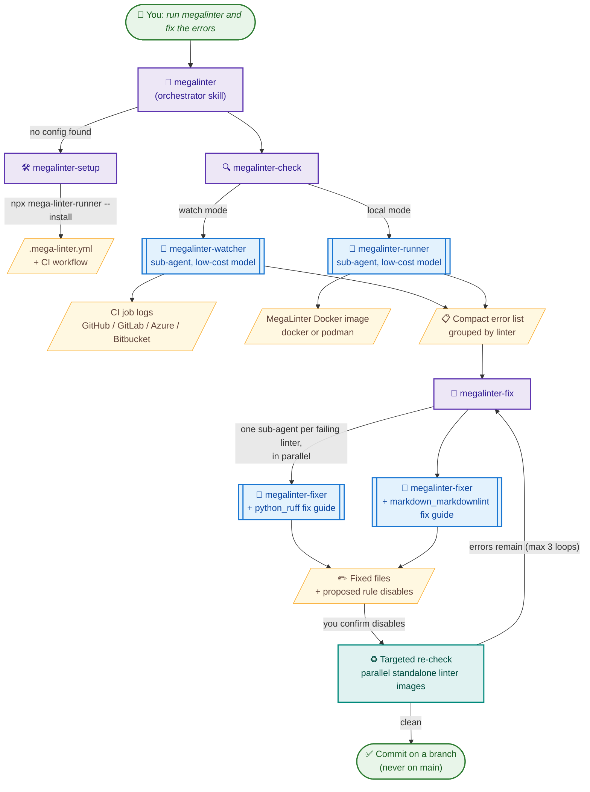

<!-- markdownlint-disable MD013 -->
<!-- Generated by .automation/build.py, please do not update manually -->
<!-- coding-agents-section-start -->

# Coding Agents

MegaLinter is designed to work hand in hand with your coding agent:

[](https://claude.com/product/claude-code)
[](https://cursor.com)
[](https://github.com/features/copilot)
[](https://openai.com/codex/)
[](https://antigravity.google/)
[](https://opencode.ai)
[](https://github.com/google-gemini/gemini-cli)
[](https://windsurf.com)
[](https://cline.bot)
[](https://roocode.com)
[](https://kilocode.ai)
[](https://ampcode.com)
[](https://block.github.io/goose/)
[](https://www.all-hands.dev)
[](https://github.com/QwenLM/qwen-code)

## Get started

Install the [MegaLinter agent skills](https://github.com/oxsecurity/megalinter/tree/main/skills) at the root of your repository:

With **Claude Code** (the skills are copied directly into `.claude/skills/`):

```bash
npx skills add oxsecurity/megalinter/skills -s '*' -a claude-code -y
```

With **another coding agent**, replace `claude-code` with your agent's identifier (`cursor`, `github-copilot`, `codex`, `antigravity`, `opencode`... full list in the [skills CLI documentation](https://github.com/vercel-labs/skills#supported-agents)) — or let the CLI **detect your installed agents** and install the skills for all of them at once:

```bash
npx skills add oxsecurity/megalinter/skills -s '*' -y --copy
```

Then just talk to your agent:

- _"Setup MegaLinter on this repo"_
- _"Run MegaLinter and fix the errors"_
- _"Why is the MegaLinter CI job failing? Fix it"_

## What the skills do

| Skill                | Role                                                                                                                                                                |
|:---------------------|:--------------------------------------------------------------------------------------------------------------------------------------------------------------------|
| **megalinter**       | Entry point: detects the repository state and orchestrates the other skills in a check → fix → re-check loop (3 iterations max)                                     |
| **megalinter-setup** | Installs or upgrades MegaLinter using `npx mega-linter-runner --install` (non-interactive), then refines `.mega-linter.yml`                                         |
| **megalinter-check** | Collects errors: watches a MegaLinter CI job (GitHub Actions, GitLab CI, Azure Pipelines, Bitbucket Pipelines) or runs MegaLinter locally with docker/podman        |
| **megalinter-fix**   | Fixes errors guided by a per-linter fix guide (one for each of the 124 linters, loaded only when its linter has errors), asks you before disabling rules or pushing |

## Sub-agents orchestration

On agents supporting sub-agents (Claude Code, OpenCode, GitHub Copilot custom agents...), `megalinter-setup` installs three sub-agents that keep large CI logs and linter outputs **out of your main agent's context**, and run on low-cost models when possible:



The fix guides combine information generated from the [linter descriptors](https://github.com/oxsecurity/megalinter/tree/main/megalinter/descriptors) (auto-fix support, rules documentation URLs, MegaLinter tuning variables) with curated fix, inline-disable and ignore instructions grounded in each linter's official documentation.

## Safety rules

- Safe fixes are applied automatically; ambiguous ones are asked to you
- Disabling a linter or a rule always requires your confirmation
- Commits are never pushed to the default branch

See also the [installation page for coding agents](https://megalinter.io/latest/install-agent-skills/).


<!-- coding-agents-section-end -->
