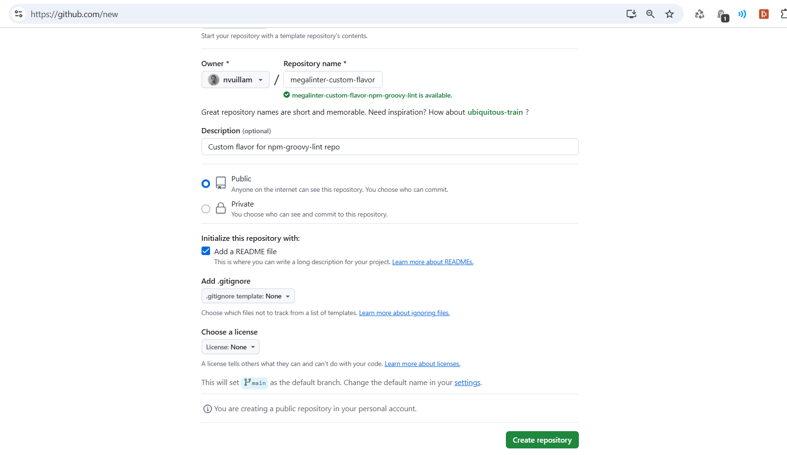
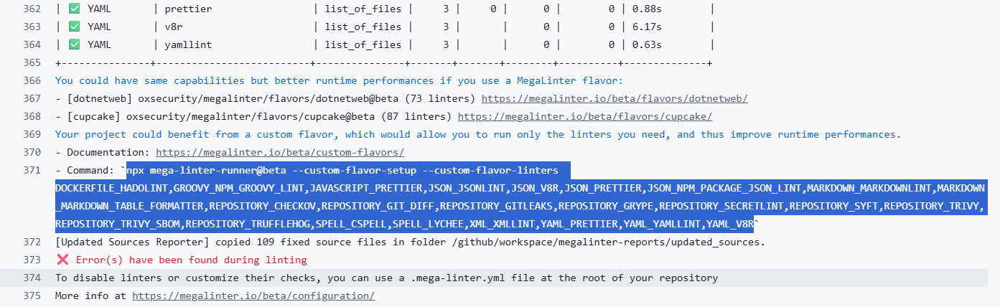
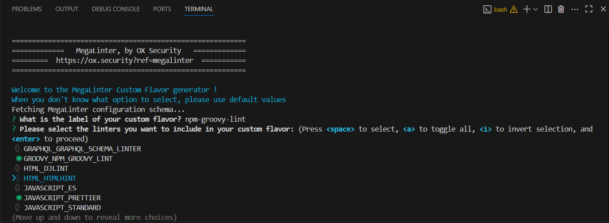
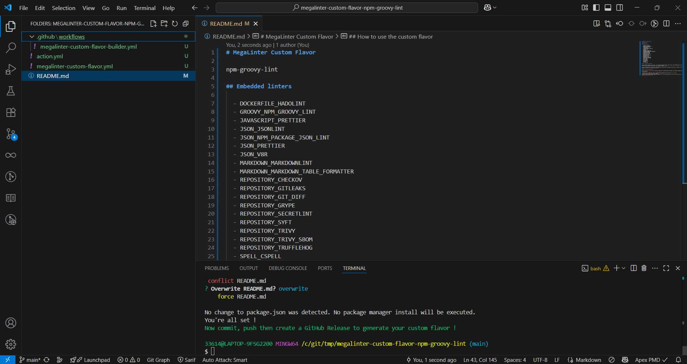
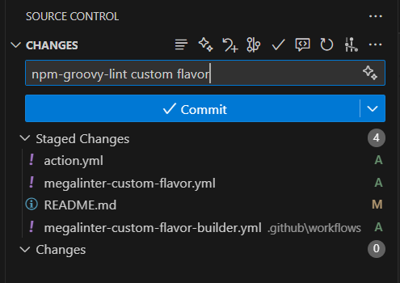
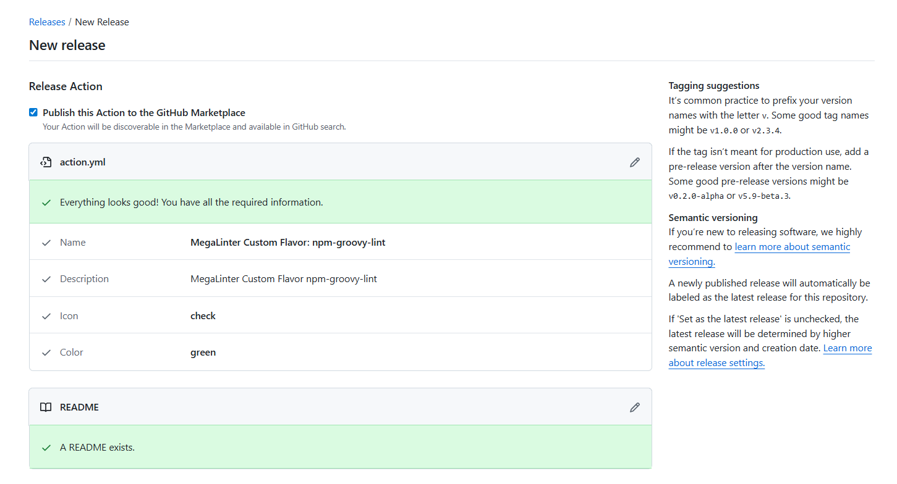
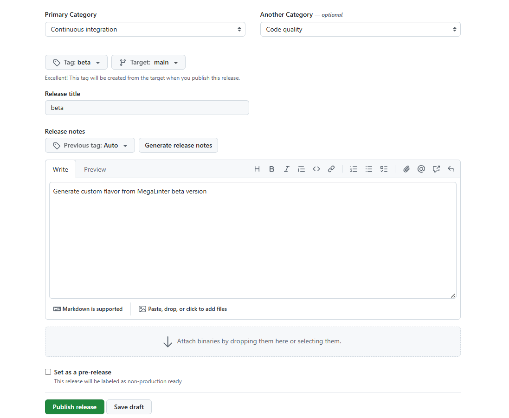
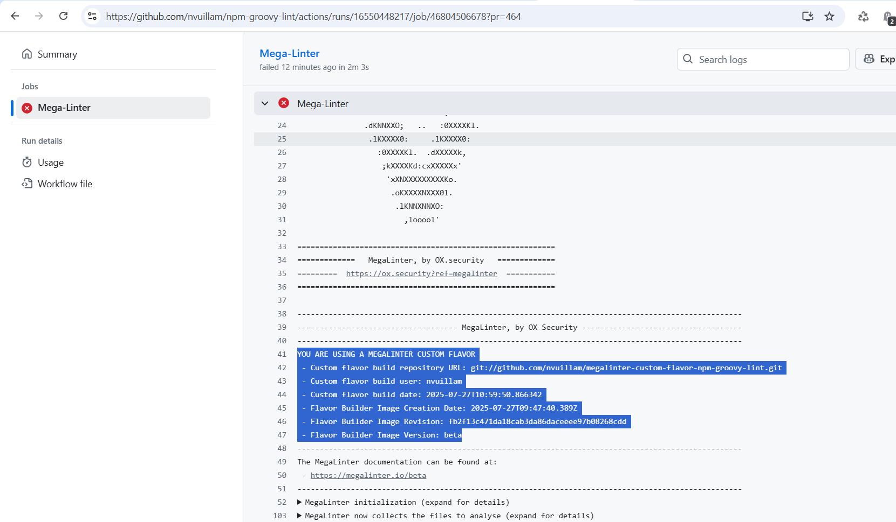

<!-- markdownlint-disable MD013 -->

# Custom MegaLinter Flavors

You can easily generate your own MegaLinter custom flavor using the `mega-linter-runner` generator.

## Create a custom flavor

### Pre-requisites

- Make sure you have [Node.js](https://nodejs.org/) installed.

### Create a new repository

- Create a new GitHub public repository whose name starts with `megalinter-custom-flavor` (example: `megalinter-custom-flavor-npm-groovy-lint`), with default README checked.



### Clone your new repository locally

Clone your new repository to your local machine.
You can work directly on **main** branch, or create a sub-branch if you prefer.

### Run the custom flavor setup command

Run the following command in your repository folder:

```bash
npx mega-linter-runner@beta --custom-flavor-setup
```

You can also send the list of linters as parameters, available from the logs of any official MegaLinter flavor (if you don't see it, make sure `FLAVOR_SUGGESTIONS: true` is defined in your `.mega-linter.yml` config file).



```bash
npx mega-linter-runner@beta --custom-flavor-setup --custom-flavor-linters "PYTHON_BANDIT,PYTHON_BLACK,PYTHON_RUFF,REPOSITORY_TRIVY"
```

### Follow the interactive prompts

Select your custom flavor label and the linters you want to include.



### Generated files

The generator will create all necessary configuration files, GitHub Actions workflows, and documentation in your repository.

Two workflows are generated:
- **megalinter-custom-flavor-builder.yml**: Builds and publishes your custom flavor Docker image
- **check-new-megalinter-version.yml**: Automatically checks daily for new MegaLinter releases and creates matching releases in your repository



### Commit and push your changes

Commit and push the generated files to GitHub.



### Configure Personal Access Token (Required)

To enable automatic version checking and release creation, you need to configure a **repository-scoped fine-grained Personal Access Token**:

1. Go to [GitHub Settings > Personal access tokens > Fine-grained tokens](https://github.com/settings/personal-access-tokens/new)
2. Token name: `MegaLinter Auto-Release`
3. Expiration: Choose 90 days or 1 year
4. **Repository access**: Select **Only select repositories**
5. Choose your custom flavor repository from the dropdown
6. **Repository permissions**:
   - **Contents**: Read and write
   - **Actions**: Read and write
7. Click **Generate token** and copy it
8. Go to your repository **Settings > Secrets and variables > Actions**
9. Click **New repository secret**
10. Name: `PAT_TOKEN`, Value: paste your token

**Important**: The token must be scoped to your specific repository. Account-level tokens or tokens without repository selection will not work.

Without this token, the automatic version checking workflow will fail, and you'll need to create releases manually.

### Optional: Configure Docker Hub publishing

By default, your custom flavor is published to GitHub Container Registry (ghcr.io). To also publish to Docker Hub:

1. Go to your repository **Settings > Secrets and variables > Actions**
2. Under **Variables**, create:
   - `DOCKERHUB_REPO`: Your Docker Hub username/organization (e.g., `nvuillam`)
3. Under **Secrets**, create:
   - `DOCKERHUB_USERNAME`: Your Docker Hub username
   - `DOCKERHUB_PASSWORD`: Your Docker Hub password or access token

### Build and publish your custom flavor

Your custom flavor will be built and published automatically in two ways:

1. **Automatic version sync** (recommended): The `check-new-megalinter-version` workflow runs daily, checks for new MegaLinter releases, and automatically creates matching releases in your repository. Each release triggers the builder workflow.

2. **Manual triggers**:
   - Create a GitHub release to build a specific version
   - Push to any branch (except main) to build a `beta` tagged image
   - Manually run the `megalinter-custom-flavor-builder` workflow






## Use a Custom Flavor

Follow [MegaLinter installation guide](https://megalinter.io/latest/install-assisted/), and replace related elements in the workflow.



### GitHub Action

On MegaLinter step in `.github/workflows/mega-linter.yml`, replace the official GitHub Action with your custom flavor repo action.

Example:

```yaml
      # Mega-Linter
      - name: Mega-Linter
        id: ml
        uses: nvuillam/megalinter-custom-flavor-npm-groovy-lint@main
        env:
          # All available variables are described in documentation
          # https://megalinter.io/#configuration
          VALIDATE_ALL_CODEBASE: true # ${{ github.event_name == 'push' && github.ref == 'refs/heads/master' }} # Validates all source when push on master, else just the git diff with master. Override with true if you always want to lint all sources
          GITHUB_TOKEN: ${{ secrets.GITHUB_TOKEN }}
          # ADD YOUR CUSTOM ENV VARIABLES HERE OR DEFINE THEM IN A FILE .mega-linter.yml AT THE ROOT OF YOUR REPOSITORY
          # DISABLE: COPYPASTE,SPELL # Uncomment to disable copy-paste and spell checks
```

### Docker image

Replace official MegaLinter image wih your custom flavor docker image

Example with gitlab-ci.yml:

```yaml
mega-linter:
  stage: test

  # You can override MegaLinter flavor used to have faster performances
  # More info at https://megalinter.io/latest/flavors/
  image: ghcr.io/nvuillam/megalinter-custom-flavor-npm-groovy-lint/megalinter-custom-flavor:latest
```

## Update your custom flavor

If you add/remove linters in your `mega-linter-flavor.yml`:

- Run `npx mega-linter-runner@beta --custom-flavor-setup` to apply upgrades to other files
- Commit and push the changes
- Create a new release or push to a branch to rebuild your custom flavor

## Upgrade your custom flavor

Your custom flavor automatically stays up to date with MegaLinter releases:

- The `check-new-megalinter-version` workflow runs daily and automatically creates new releases when MegaLinter publishes new versions
- Each release triggers the builder workflow to generate your updated custom flavor

**Manual upgrade**: If you need to upgrade immediately or the automatic workflow isn't configured:

1. Check the latest MegaLinter version at [oxsecurity/megalinter releases](https://github.com/oxsecurity/megalinter/releases)
2. Create a GitHub Release in your repository with the same version tag (e.g., `v9.0.0`)
3. The builder workflow will automatically create your custom flavor using that MegaLinter version

**Troubleshooting**: If automatic version checking isn't working, ensure you have configured the `PAT_TOKEN` secret as described in the setup instructions above.


