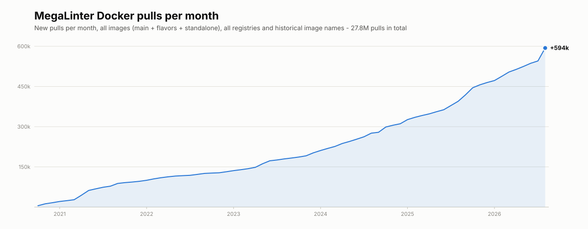

# Flavors statistics

## Docker pulls per month

MegaLinter Docker images (main image, [flavors](flavors.md) and standalone linter images) are pulled **hundreds of thousands of times every month**, on Docker Hub and ghcr.io, since the creation of the project in October 2020:

This graph is refreshed automatically: monthly points are stored in [`docker-pulls-monthly.json`](https://github.com/oxsecurity/megalinter/blob/main/.automation/generated/docker-pulls-monthly.json) and updated from the collected registry statistics.

## Cumulated Docker pulls by flavor

  <canvas id="myChart"></canvas>

