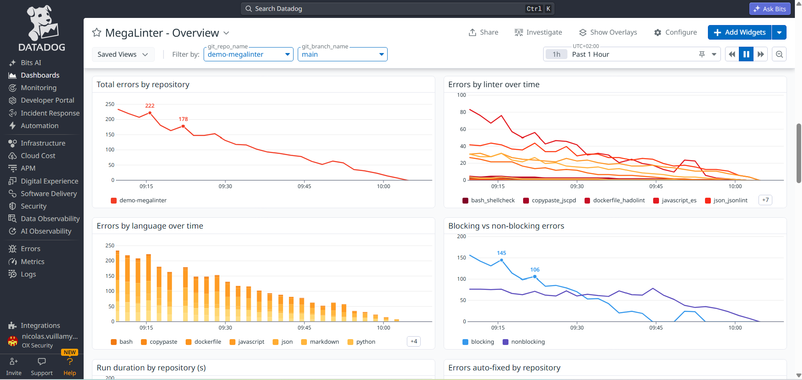

<!-- markdownlint-disable MD013 -->

# Datadog integration

Send MegaLinter results to **Datadog** (metrics + logs) and provision the MegaLinter dashboard in your Datadog organization.

## Dashboard

**MegaLinter - Overview**: quality gate pass rate, blocking / non-blocking / auto-fixed errors, error and duration trends by repository, errors by linter, top rules, top files, and the live stream of MegaLinter runs.



Provision it with:

```bash
DD_SITE=datadoghq.com DD_API_KEY=xxx DD_APP_KEY=yyy \
  npx mega-linter-runner --upload-dashboards datadog
```

| Variable                    | Description                                                                                                                                          |
|:----------------------------|:-----------------------------------------------------------------------------------------------------------------------------------------------------|
| `DD_SITE`                   | [Datadog site](https://docs.datadoghq.com/getting_started/site/) (`datadoghq.com`, `datadoghq.eu`, `us3.datadoghq.com`...) — default `datadoghq.com` |
| `DD_API_KEY` + `DD_APP_KEY` | API key + application key                                                                                                                            |
| `DD_BEARER_TOKEN`           | Service account bearer token (alternative to API + application keys)                                                                                 |

The upload is idempotent: the dashboard is matched by title and updated in place.

## Sending data

```yaml
API_REPORTER: true
API_REPORTER_PROVIDER: datadog
API_REPORTER_DATADOG_SITE: datadoghq.com # datadoghq.eu, us3.datadoghq.com...
```

| Variable                            | Description                                                   |
|:------------------------------------|:--------------------------------------------------------------|
| `API_REPORTER_DATADOG_SITE`         | Datadog site (default `datadoghq.com`)                        |
| `API_REPORTER_DATADOG_API_KEY`      | Datadog API key (define it as a CI/CD secret)                 |
| `API_REPORTER_DATADOG_BEARER_TOKEN` | Service account bearer token, used when no API key is defined |

## Data sent

- **Metrics** (gauge): `megalinter.run.*` (run KPIs) and `megalinter.linter.*` (per-linter), tagged with `source`, `org_identifier`, `git_identifier`, `git_repo_name`, `git_branch_name` (+ `descriptor`, `linter`, `linter_key`) — see the [metrics reference](../observability.md#metrics-reference)
- **Logs** (`source:megalinter`): one event per run, per linter, per top rule and per top file, tagged with `record_type` (`run`, `linter`, `rule`, `file`), with the detailed payload under the `@megalinter.*` attributes

The dashboard has **`git_repo_name` and `git_branch_name` template variables**: select a repository and/or a branch to focus every widget on it, or use the *Focus on this repository* link on repository charts. Optionally, create facets on the `@megalinter.*` log attributes to get autocompletion in the Logs Explorer.
