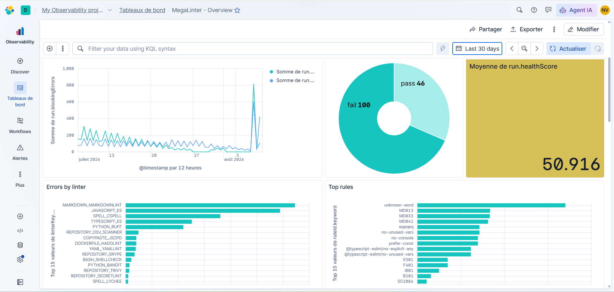

<!-- markdownlint-disable MD013 -->

# Elastic integration

Send MegaLinter results to **Elasticsearch** and provision the MegaLinter dashboard and data views in **Kibana**. Works with Elastic Cloud (including serverless projects) and self-hosted Elastic stacks.

## Dashboard

**MegaLinter - Overview**: health score, blocking / non-blocking / auto-fixed errors, quality gate distribution, errors over time, errors by linter / language / repository, health score evolution by repository, slowest linters, top rules and top files.

Click any repository, linter or rule bar to **filter the whole dashboard** on it (native Kibana filtering), and use the filter bar for any other drill-down (e.g. `gitBranchName: main`).



Provision it (dashboard + the 4 data views) with:

```bash
KIBANA_URL=https://yourproject.kb.region.provider.elastic.cloud ELASTIC_API_KEY=xxx \
  npx mega-linter-runner --upload-dashboards elastic
```

| Variable          | Description                                    |
|:------------------|:-----------------------------------------------|
| `KIBANA_URL`      | Base URL of your Kibana instance               |
| `ELASTIC_API_KEY` | API key allowed to import Kibana saved objects |

## Sending data

```yaml
API_REPORTER: true
API_REPORTER_PROVIDER: elastic
API_REPORTER_ELASTIC_URL: https://yourproject.es.region.provider.elastic.cloud
```

| Variable                            | Description                                                               |
|:------------------------------------|:--------------------------------------------------------------------------|
| `API_REPORTER_ELASTIC_URL`          | Elasticsearch endpoint URL (the `.es.` one, not the Kibana URL)           |
| `API_REPORTER_ELASTIC_API_KEY`      | Elasticsearch API key with write permission (define it as a CI/CD secret) |
| `API_REPORTER_ELASTIC_INDEX_PREFIX` | Prefix of the created indexes (default `megalinter`)                      |

## Data sent

Documents are indexed with the bulk API into 4 indexes (with a `@timestamp` field):

| Index                | Content                                                                |
|:---------------------|:-----------------------------------------------------------------------|
| `megalinter-runs`    | One document per run: quality gate, error counts, durations, KPIs      |
| `megalinter-linters` | One document per linter per run: errors, elapsed time, output          |
| `megalinter-rules`   | One document per top rule per linter per run (`ruleId`, `occurrences`) |
| `megalinter-files`   | One document per top file per linter per run (`file`, `occurrences`)   |

All documents carry `source`, `orgIdentifier`, `gitIdentifier`, `gitRepoName`, `gitBranchName` and `runId` fields.
