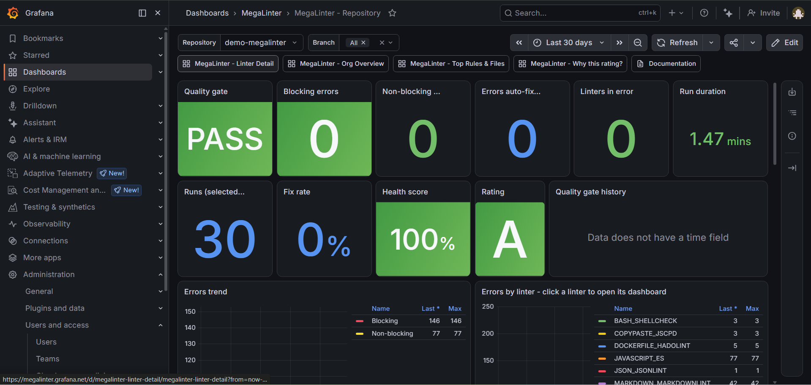

<!-- markdownlint-disable MD013 -->

# Grafana integration

Send MegaLinter results to **Grafana Loki** (logs) and **Prometheus** (metrics), and provision the MegaLinter dashboards in your Grafana instance. Works with [Grafana Cloud](https://grafana.com/products/cloud/) (free tier is enough to get started) and self-hosted Grafana + Loki + Mimir/Prometheus.

## Dashboards

| Dashboard                             | Content                                                                                      |
|:--------------------------------------|:---------------------------------------------------------------------------------------------|
| **MegaLinter - 1. Org Overview**      | Portfolio view: quality gate pass rate, blocking errors and trends across all repositories   |
| **MegaLinter - 2. Repository**        | Quality gate, KPIs, errors and duration trends, linters table and outputs for one repository |
| **MegaLinter - 3. Linter Detail**     | Drill-down on one linter: errors, duration, top rules, top files, raw output                 |
| **MegaLinter - 4. Top Rules & Files** | Most violated rules and most impacted files across repositories                              |
| **MegaLinter - 5. Why this rating?**  | Explanation of the A-E rating: formula, linters success/warning/error counts, top offenders  |



Provision them with:

```bash
GRAFANA_URL=https://yourstack.grafana.net GRAFANA_TOKEN=glsa_xxx \
  npx mega-linter-runner --upload-dashboards grafana
```

| Variable        | Description                                                                                                                        |
|:----------------|:-----------------------------------------------------------------------------------------------------------------------------------|
| `GRAFANA_URL`   | Base URL of your Grafana instance (e.g. `https://yourstack.grafana.net`)                                                           |
| `GRAFANA_TOKEN` | [Service account token](https://grafana.com/docs/grafana/latest/administration/service-accounts/) with dashboards write permission |

The dashboards are created in a **MegaLinter** folder and updated in place on subsequent uploads. Each dashboard has datasource pickers, so you can select your Loki and Prometheus datasources on first display.

The dashboards are linked together: click a repository in the Org Overview table or charts to open its *Repository* dashboard, and click a linter in the Repository dashboard to open its *Linter Detail* dashboard.

## Sending data

Add to your MegaLinter configuration (URLs in `.mega-linter.yml`, secrets as CI/CD environment variables):

```yaml
API_REPORTER: true
API_REPORTER_PROVIDER: grafana
API_REPORTER_URL: https://logs-prod-xxx.grafana.net/loki/api/v1/push
API_REPORTER_METRICS_URL: https://influx-prod-xx-prod-xx.grafana.net/api/v1/push/influx/write
```

| Variable                                   | Description                                                                       |
|:-------------------------------------------|:----------------------------------------------------------------------------------|
| `API_REPORTER_URL`                         | Loki push URL (ends with `/loki/api/v1/push`)                                     |
| `API_REPORTER_BASIC_AUTH_USERNAME`         | Loki instance id (Grafana Cloud) or basic auth username                           |
| `API_REPORTER_BASIC_AUTH_PASSWORD`         | Access token with `logs:write` scope                                              |
| `API_REPORTER_METRICS_URL`                 | Influx-format write URL (Grafana Cloud) or Prometheus remote-write compatible URL |
| `API_REPORTER_METRICS_BASIC_AUTH_USERNAME` | Prometheus instance id (Grafana Cloud) or basic auth username                     |
| `API_REPORTER_METRICS_BASIC_AUTH_PASSWORD` | Access token with `metrics:write` scope                                           |

`API_REPORTER_BEARER_TOKEN` / `API_REPORTER_METRICS_BEARER_TOKEN` can be used instead of basic auth for self-hosted endpoints.

### Grafana Cloud walkthrough

1. Create a free account on [grafana.com](https://grafana.com/auth/sign-up/create-user) and open your stack
2. **Loki push URL**: in your stack, open the **Loki** (Logs) details page: it shows the push URL (`https://logs-prod-xxx.grafana.net/loki/api/v1/push`) and the **instance id** to use as `API_REPORTER_BASIC_AUTH_USERNAME`
3. **Metrics write URL**: open the **Prometheus** (Metrics) details page, and transform the displayed URL: replace `prometheus-` by `influx-` and the path by `/api/v1/push/influx/write` (e.g. `https://influx-prod-24-prod-eu-west-2.grafana.net/api/v1/push/influx/write`); the **instance id** is `API_REPORTER_METRICS_BASIC_AUTH_USERNAME`
4. **Access token**: create a [Cloud Access Policy](https://grafana.com/docs/grafana-cloud/account-management/authentication-and-permissions/access-policies/) with `logs:write` and `metrics:write` scopes, generate a token (`glc_...`) and use it as `API_REPORTER_BASIC_AUTH_PASSWORD` and `API_REPORTER_METRICS_BASIC_AUTH_PASSWORD`

Note: the Cloud Access Policy token (`glc_...`, for **sending data**) is not the same as the service account token (`glsa_...`, for **uploading dashboards**).

## Data sent

- **Prometheus metrics**: `megalinter_run_*` (run KPIs) and `megalinter_linter_run_*` (per-linter), with `source`, `orgIdentifier`, `gitIdentifier`, `gitRepoName`, `gitBranchName` (+ `descriptor`, `linter`, `linterKey`) labels — see the [metrics reference](../observability.md#metrics-reference)
- **Loki streams**: one stream per record type (`recordType` label = `run`, `linter`, `rule` or `file`), carrying run KPIs, linter outputs, and per-rule / per-file occurrences
