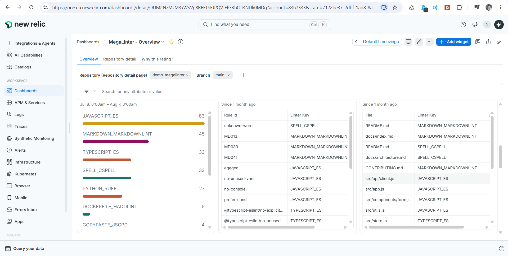

<!-- markdownlint-disable MD013 -->

# New Relic integration

Send MegaLinter results to **New Relic** (Metric API + Log API) and provision the MegaLinter dashboard in your New Relic account.

## Dashboard

**MegaLinter - Overview** (2 pages):

- *Overview*: quality gate pass rate, repository health score evolution, blocking errors, error and duration trends, errors by linter, slowest linters, top rules and files, versions in use
- *Repository detail*: health score, quality gate, errors by linter and by language over time, slowest linters, top rules and files for one repository (select it with the **Repository variable**, or click a repository facet on the Overview page). A **Branch variable** filters both pages



Provision it with:

```bash
NEW_RELIC_API_KEY=NRAK-xxx NEW_RELIC_ACCOUNT_ID=1234567 NEW_RELIC_REGION=US \
  npx mega-linter-runner --upload-dashboards newrelic
```

| Variable               | Description                                                                                                          |
|:-----------------------|:---------------------------------------------------------------------------------------------------------------------|
| `NEW_RELIC_API_KEY`    | [User API key](https://docs.newrelic.com/docs/apis/intro-apis/new-relic-api-keys/) (`NRAK-...`), used with NerdGraph |
| `NEW_RELIC_ACCOUNT_ID` | Target account id                                                                                                    |
| `NEW_RELIC_REGION`     | `US` (default) or `EU`                                                                                               |

The upload is idempotent: the dashboard is matched by name and updated in place.

## Sending data

```yaml
API_REPORTER: true
API_REPORTER_PROVIDER: newrelic
API_REPORTER_NEWRELIC_REGION: US # or EU
```

| Variable                            | Description                                                                                                                                     |
|:------------------------------------|:------------------------------------------------------------------------------------------------------------------------------------------------|
| `API_REPORTER_NEWRELIC_LICENSE_KEY` | [License key](https://docs.newrelic.com/docs/apis/intro-apis/new-relic-api-keys/#license-key) (ingest, `...NRAL`) — define it as a CI/CD secret |
| `API_REPORTER_NEWRELIC_REGION`      | `US` (default) or `EU`                                                                                                                          |

## Data sent

- **Metrics** (gauge): `megalinter.run.*` (run KPIs) and `megalinter.linter.*` (per-linter), with `source`, `orgIdentifier`, `gitIdentifier`, `gitRepoName`, `gitBranchName` (+ `descriptor`, `linter`, `linterKey`) attributes — see the [metrics reference](../observability.md#metrics-reference)
- **Logs**: one record per run, per linter, per top rule and per top file, with a `recordType` attribute (`run`, `linter`, `rule`, `file`) and the detailed payload under the `megalinter.*` attributes; rule/file records expose `ruleId` / `file` and `occurrences` for NRQL aggregations
