<!-- markdownlint-disable MD013 MD033 MD041 -->
# API Reporter (beta)

Send results as logs and metrics to observability tools, like Grafana.

## Usage

Use Grafana default MegaLinter dashboards, and build new ones to monitor everything you need from MegaLinter logs and metrics.

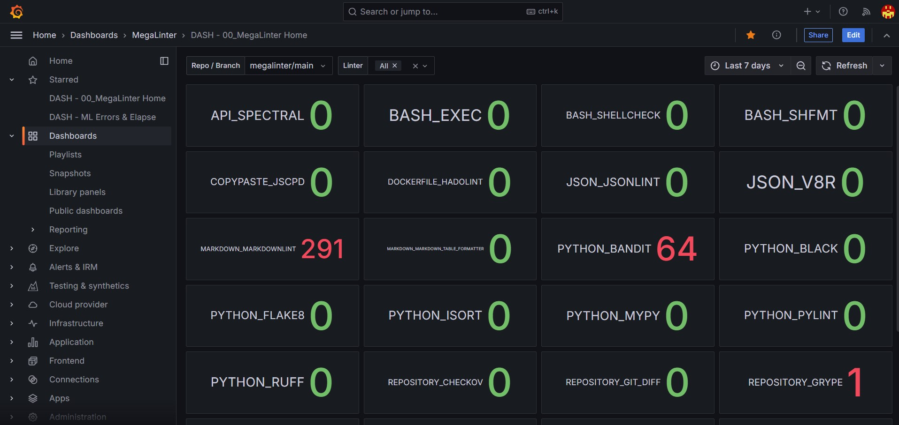

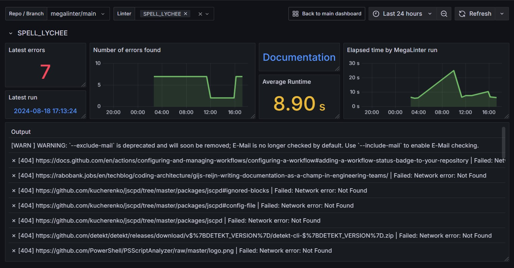

If you create new useful dashboards, please share them with the MegaLinter community by exporting them then create a pull request :)

## Logs Configuration

Define the following CI/CD variables:

- **API_REPORTER_URL** : API endpoint
- **API_REPORTER_BASIC_AUTH_USERNAME** : Basic auth username _(if using Basic Auth)_
- **API_REPORTER_BASIC_AUTH_PASSWORD** : Basic auth password/token _(if using Basic Auth)_
- **API_REPORTER_BEARER_TOKEN** : Bearer token _(if using bearer auth)_

Examples of configuration:

```sh
API_REPORTER_URL=https://logs-prod-012.grafana.net/loki/api/v1/push
API_REPORTER_BASIC_AUTH_USERNAME=3435645645
API_REPORTER_BASIC_AUTH_PASSWORD=GHTRGDHDHdhghg23345DFG^sfg!ss
```

```sh
API_REPORTER_URL=https://my.custom.endpoint.net
API_REPORTER_BEARER_TOKEN=DDHGHfgfgjfhQESRDTHFKGKHFswgFHDHGDH
```

Example of logs sent to Loki:

```json
{ 
  "streams": [
   {
    "stream": {
     "source": "MegaLinter",
     "gitRepoName": "megalinter",
     "gitBranchName": "tmpX",
     "gitIdentifier": "megalinter/tmpX",
     "orgIdentifier": "tmpX",
     "descriptor": "REPOSITORY",
     "linter": "trufflehog",
     "linterKey": "REPOSITORY_TRUFFLEHOG"
    },
    "values": [
     [
      "1724005973602212834",
      "{\"linterDocUrl\": \"https://megalinter.io/beta/descriptors/repository_trufflehog\", \"jobUrl\": \"https://github.com/oxsecurity/megalinter/actions/runs/10442830998\", \"severity\": \"warning\", \"severityIcon\": \"\\u26a0\\ufe0f\", \"output\": [\"\\ud83d\\udc37\\ud83d\\udd11\\ud83d\\udc37  TruffleHog. Unearth your secrets. \\etc...\"], \"cliLintMode\": \"project\", \"numberErrorsFound\": 1, \"elapsedTime\": 13.1}"
     ]
    ]
   },
   {
    "stream": {
     "source": "MegaLinter",
     "gitRepoName": "megalinter",
     "gitBranchName": "tmpX",
     "gitIdentifier": "megalinter/tmpX",
     "orgIdentifier": "tmpX",
     "descriptor": "SPELL",
     "linter": "cspell",
     "linterKey": "SPELL_CSPELL"
    },
    "values": [
     [
      "1724005973602212834",
      "{\"linterDocUrl\": \"https://megalinter.io/beta/descriptors/spell_cspell\", \"jobUrl\": \"https://github.com/oxsecurity/megalinter/actions/runs/10442830998\", \"severity\": \"success\", \"severityIcon\": \"\\u2705\", \"output\": [\"  1/680 .automation/build_schemas_doc.sh 1762.38ms\", \"  etc...\", \"CSpell: Files checked: 680, Issues found: 0 in 0 files.\"], \"cliLintMode\": \"list_of_files\", \"numberFilesFound\": 687, \"numberErrorsFound\": 0, \"elapsedTime\": 11.7}"
     ]
    ]
   },
   {
    "stream": {
     "source": "MegaLinter",
     "gitRepoName": "megalinter",
     "gitBranchName": "tmpX",
     "gitIdentifier": "megalinter/tmpX",
     "orgIdentifier": "tmpX",
     "descriptor": "SPELL",
     "linter": "lychee",
     "linterKey": "SPELL_LYCHEE"
    },
    "values": [
     [
      "1724005973602212834",
      "{\"linterDocUrl\": \"https://megalinter.io/beta/descriptors/spell_lychee\", \"jobUrl\": \"https://github.com/oxsecurity/megalinter/actions/runs/10442830998\", \"severity\": \"warning\", \"severityIcon\": \"\\u26a0\\ufe0f\", \"output\": [\"\\u2717 [404] https://docs.github.com/en/actions/monitoring-and-troubleshooting-workflows/monitoring-workflows/adding-a-workflow-status-badge | Failed: Network error: Not Found\", \"\\u2717 [404] deadlink | Failed: Network error: Not Found\", \"\\ud83d\\udcdd Summary\", \"---------------------\", \"\\ud83d\\udd0d Total.........2322\", \"\\u2705 Successful....1889\", \"\\u23f3 Timeouts.........0\", \"\\ud83d\\udd00 Redirected.......0\", \"\\ud83d\\udc7b Excluded.......431\", \"\\u2753 Unknown..........0\", \"\\ud83d\\udeab Errors...........2\", \"\", \"Errors in README.md\", \"\\u2717 [404] deadlink | Failed: Network error: Not Found\", \"\\u2717 [404] https://docs.github.com/en/actions/monitoring-and-troubleshooting-workflows/monitoring-workflows/adding-a-workflow-status-badge | Failed: Network error: Not Found\"], \"cliLintMode\": \"list_of_files\", \"numberFilesFound\": 346, \"numberErrorsFound\": 2, \"elapsedTime\": 6.17}"
     ]
    ]
   },
  ]
}
```

## Metrics Configuration

Additionally, you can send metrics in Prometheus format to a secondary API endpoint.

The configuration is the same than for logs, but with different variable names.

- **API_REPORTER_METRICS_URL**
- **API_REPORTER_METRICS_BASIC_AUTH_USERNAME**
- **API_REPORTER_METRICS_BASIC_AUTH_PASSWORD**
- **API_REPORTER_METRICS_BEARER_TOKEN**

Example of configuration:

```sh
API_REPORTER_METRICS_URL=https://influx-prod-72-prod-eu-west-2.grafana.net/api/v1/push/influx/write
API_REPORTER_METRICS_BASIC_AUTH_USERNAME=345673
API_REPORTER_METRICS_BASIC_AUTH_PASSWORD=GHTRGDHDHdhghg23345DFG^sfg!ss
```

Example of metrics sent to Prometheus

```text
linter_run,source=MegaLinter,orgIdentifier=tmpX,gitIdentifier=megalinter/tmpX,gitRepoName=megalinter,gitBranchName=tmpX,descriptor=REPOSITORY,linter=trufflehog,linterKey=REPOSITORY_TRUFFLEHOG numberErrorsFound=1,elapsedTime=13.1
linter_run,source=MegaLinter,orgIdentifier=tmpX,gitIdentifier=megalinter/tmpX,gitRepoName=megalinter,gitBranchName=tmpX,descriptor=SPELL,linter=cspell,linterKey=SPELL_CSPELL numberErrorsFound=0,numberFilesFound=687,elapsedTime=11.7
linter_run,source=MegaLinter,orgIdentifier=tmpX,gitIdentifier=megalinter/tmpX,gitRepoName=megalinter,gitBranchName=tmpX,descriptor=SPELL,linter=lychee,linterKey=SPELL_LYCHEE numberErrorsFound=2,numberFilesFound=346,elapsedTime=6.17
```

## Troubleshooting

If you want to see the content of the API notifications in execution logs, you can define `API_REPORTER_DEBUG=true`

## All Configuration variables

The following variables must be sent to the docker run command

| Variable                                 | Description                                              | Default value |
|------------------------------------------|----------------------------------------------------------|---------------|
| API_REPORTER                             | Activates/deactivates API reporter                       | `false`       |
| API_REPORTER_URL                         | Logs endpoint URL                                        | <!-- -->      |
| API_REPORTER_BASIC_AUTH_USERNAME         | Logs endpoint auth username                              | <!-- -->      |
| API_REPORTER_BASIC_AUTH_PASSWORD         | Logs endpoint auth password                              | <!-- -->      |
| API_REPORTER_BEARER_TOKEN                | Logs endpoint auth token                                 | <!-- -->      |
| API_REPORTER_METRICS_URL                 | Metrics endpoint URL                                     | <!-- -->      |
| API_REPORTER_METRICS_BASIC_AUTH_USERNAME | Metrics endpoint auth username                           | <!-- -->      |
| API_REPORTER_METRICS_BASIC_AUTH_PASSWORD | Metrics endpoint auth password                           | <!-- -->      |
| API_REPORTER_METRICS_BEARER_TOKEN        | Logs endpoint auth token                                 | <!-- -->      |
| API_REPORTER_DEBUG                       | Activate to see notif content in MegaLinter console logs | `false`       |

## Grafana Setup

If you don't have a Grafana server, you can use Grafana Cloud Free Tier (14 days of logs & metrics retention + 3 users, no credit card required, free forever)

### Create Grafana Account

Create a Grafana Cloud Free account at [this url](https://grafana.com/auth/sign-up/create-user?pg=hp&plcmt=cloud-promo&cta=create-free-account){target=blank}


___

Input a Grafana Cloud org name (megalinter in the example)

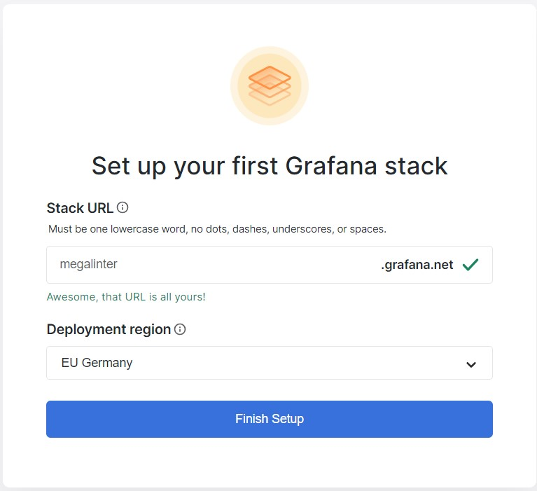

___

Next screen, you can skip setup

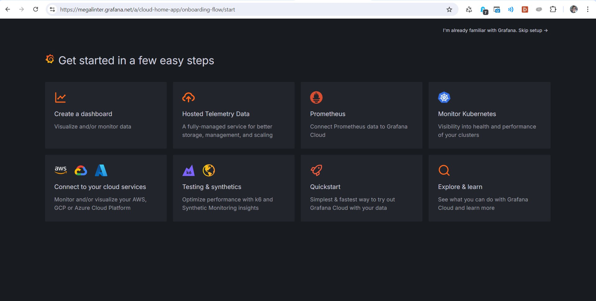

### Gather URLs & auth info

Create a notepad when you copy paste the following text

```sh
API_REPORTER_URL=
API_REPORTER_BASIC_AUTH_USERNAME=
API_REPORTER_BASIC_AUTH_PASSWORD=
API_REPORTER_METRICS_URL=
API_REPORTER_METRICS_BASIC_AUTH_USERNAME=
API_REPORTER_METRICS_BASIC_AUTH_PASSWORD=
```

### Get Loki configuration

Go to **Connections** -> **Data Sources** and click on **grafanacloud-YOURORGNAME-logs (Loki)**

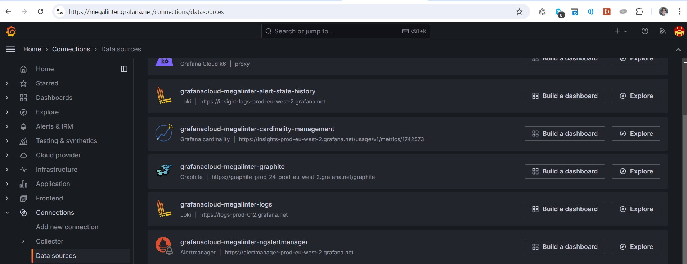

___

Build Logs push url

- Copy value of Connection URL (something like `https://logs-prod-012.grafana.net/`)
- Add `/loki/api/v1/push` at the end
- Copy value to variables `API_REPORTER_URL`

Example: `API_REPORTER_URL=https://logs-prod-012.grafana.net/loki/api/v1/push`

Copy value of Authentication -> User and paste it with variable `API_REPORTER_BASIC_AUTH_USERNAME`

Example: `API_REPORTER_BASIC_AUTH_USERNAME=898189`

Leave `API_REPORTER_BASIC_AUTH_PASSWORD` empty for now, you can't get it here

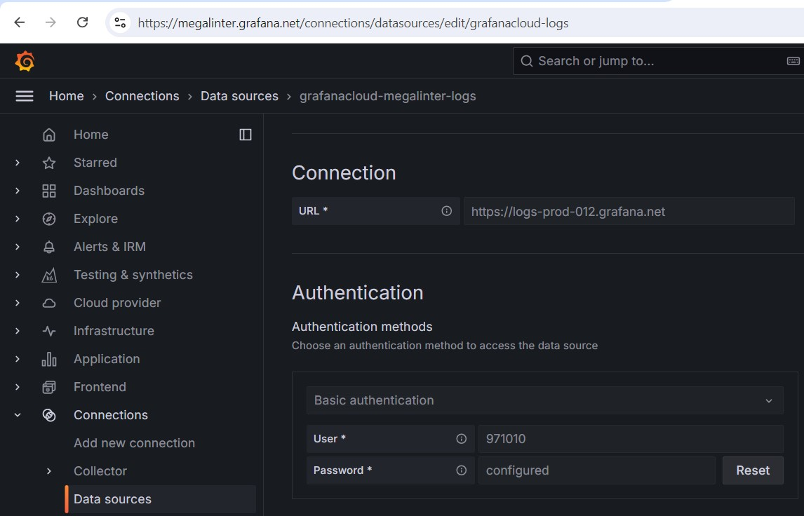

_See [Grafana documentation](https://grafana.com/blog/2024/03/21/how-to-use-http-apis-to-send-metrics-and-logs-to-grafana-cloud/#sending-logs-using-the-http-api) for more info_

### Get Prometheus configuration

Go to **Connections** -> **Data Sources** and click on **grafanacloud-YOURORGNAME-prom (Prometheus)**

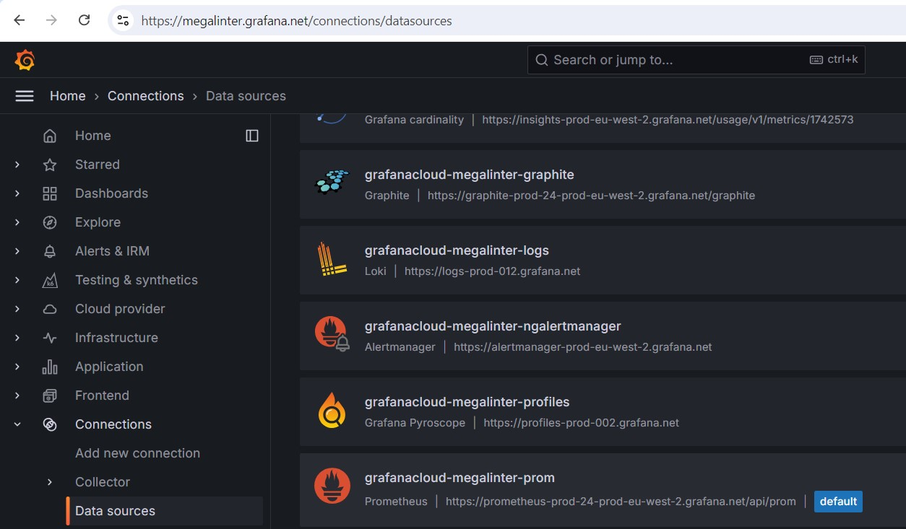

___

Build Metrics push url

- Copy value of Connection URL (something like `https://prometheus-prod-24-prod-eu-west-2.grafana.net/api/prom`)
- Replace `prometheus` by `influx`
- Replace `api/prom` by `api/v1/push/influx/write`
- Then copy value to variables `API_REPORTER_METRICS_URL`

Example: `API_REPORTER_METRICS_URL=https://influx-prod-24-prod-eu-west-2.grafana.net/api/v1/push/influx/write`

Copy value of Authentication -> User and paste it with variable `API_REPORTER_METRICS_BASIC_AUTH_USERNAME`

Example: `API_REPORTER_METRICS_BASIC_AUTH_USERNAME=1596503`

Leave `API_REPORTER_METRICS_BASIC_AUTH_PASSWORD` empty for now, you can't get it here

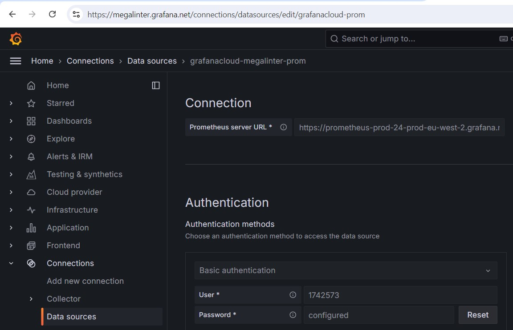

_See [Grafana documentation](https://grafana.com/blog/2024/03/21/how-to-use-http-apis-to-send-metrics-and-logs-to-grafana-cloud/#sending-metrics-using-the-http-api) for more info_

### Create Service Account

Go to **Administration** -> **Users and Access** -> **Cloud Access Policies**, then click on **Create Access Policy**

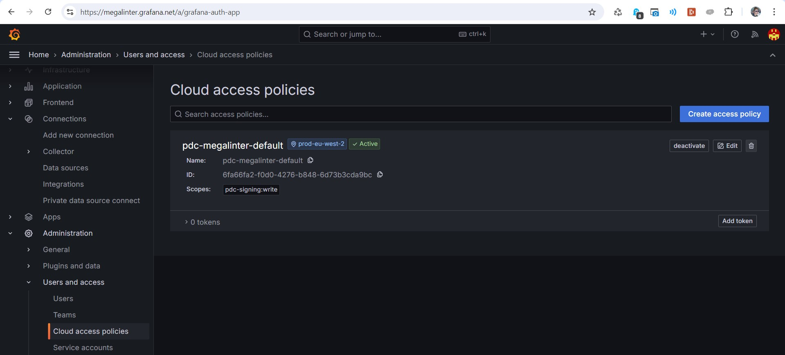

___

Create the access policy

- Define **MegaLinter** as name and display name
- Select **write** for items **metrics, logs, traces, profiles, alerts** (only metrics and logs are used today, but who knows hat new features we'll release in the future !)
- Click on **Create**

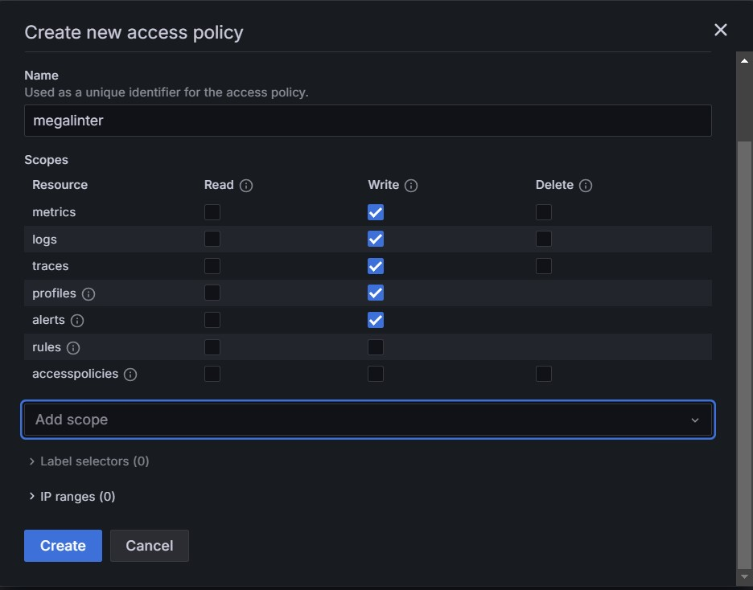

___

On the new Access Policy `MegaLinter`, click on **Add Token** at the bottom right

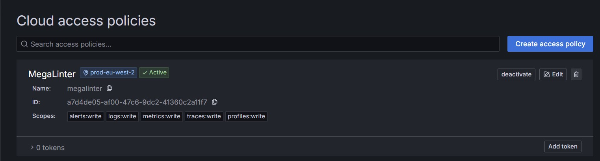

___

Name it megalinter-token, let `No expiration` then click **Create**

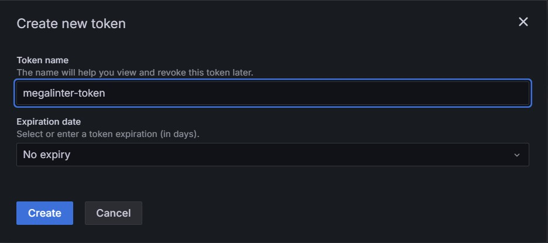

___

On the next screen, click on **Copy to clipboard** then paste in your notepad in front of variables **API_REPORTER_BASIC_AUTH_PASSWORD** and **API_REPORTER_METRICS_BASIC_AUTH_PASSWORD**

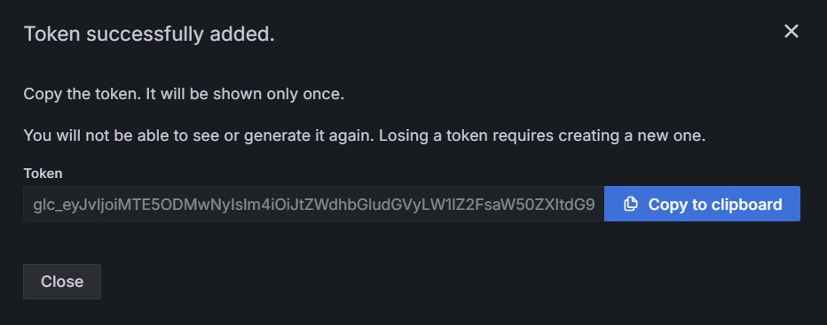

Example:

```text
API_REPORTER_BASIC_AUTH_PASSWORD=glc_eyJvIjoiMTEzMjI4OCIsIm4iOiJzZmR4arZW4iLCJrIjoiN0x6Mz1IM041IiwibSI6eyJyXN0LTIifX0=
API_REPORTER_METRICS_BASIC_AUTH_PASSWORD=glc_eyJvIjoiMTEzMjI4OCIsIm4iOiJzZmR4arZW4iLCJrIjoiN0x6Mz1IM041IiwibSI6eyJyXN0LTIifX0=
```

### Configure CI variables on repository

Now configure all of the 6 variables on the repository running MegaLinter.

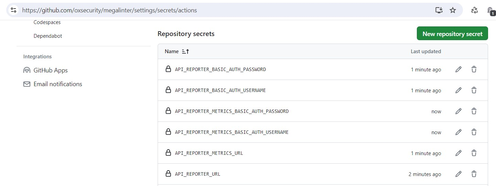

There value must be accessible from MegaLinter Docker image, so you might need to redeclare them in YML workflows depending on your git provider.

_Example with GitHub Workflow:_

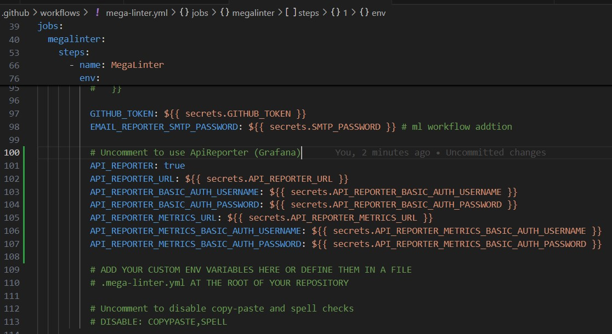

```yaml
          API_REPORTER: true
          API_REPORTER_URL: ${{ secrets.API_REPORTER_URL }}
          API_REPORTER_BASIC_AUTH_USERNAME: ${{ secrets.API_REPORTER_BASIC_AUTH_USERNAME }}
          API_REPORTER_BASIC_AUTH_PASSWORD: ${{ secrets.API_REPORTER_BASIC_AUTH_PASSWORD }}
          API_REPORTER_METRICS_URL: ${{ secrets.API_REPORTER_METRICS_URL }}
          API_REPORTER_METRICS_BASIC_AUTH_USERNAME: ${{ secrets.API_REPORTER_METRICS_BASIC_AUTH_USERNAME }}
          API_REPORTER_METRICS_BASIC_AUTH_PASSWORD: ${{ secrets.API_REPORTER_METRICS_BASIC_AUTH_PASSWORD }}
          API_REPORTER_DEBUG: false
```

### Download MegaLinter dashboards

Download all MegaLinter Dashboard JSON files from [this MegaLinter repo folder](https://github.com/oxsecurity/megalinter/tree/main/docs/grafana)

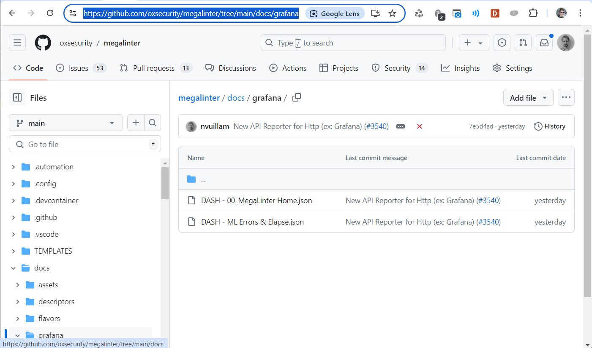

### Create Dashboard folder

Go in menu **Dashboards** then click on **New** then **New folder**

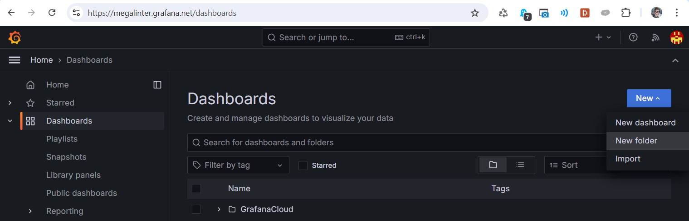

___

Create folder `MegaLinter Dashboards`

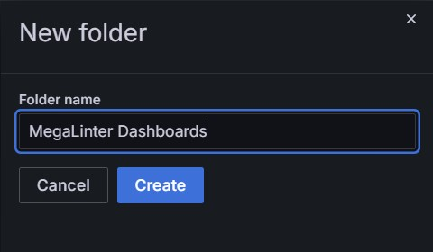

### Import default MegaLinter Grafana Dashboards

For each downloaded Dashboard JSON file, process the following actions.

Click **New** then **Import**

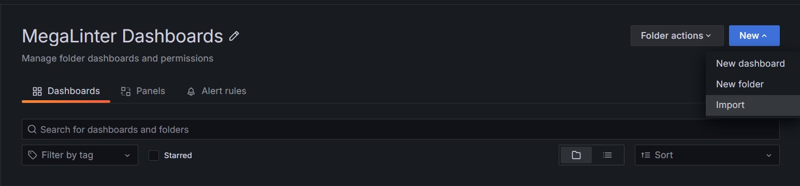

___

Click on **Upload Dashboard JSON File** and select one of the Dashboards JSON files you downloaded on your computer.


___

- Let Name, Folder and UID default values
- Select your Loki or Prometheus source. They can be:
  - **grafanacloud-YOURORGNAME-logs (Loki)**
  - **grafanacloud-YOURORGNAME-prom (Prometheus)**
- Click import

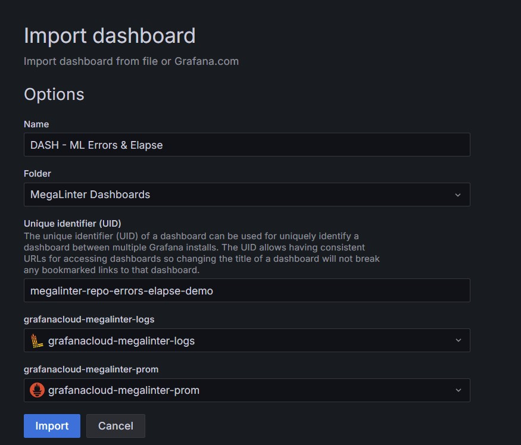

__

Repeat the operation for all Dashboard JSON files, and you're all set !

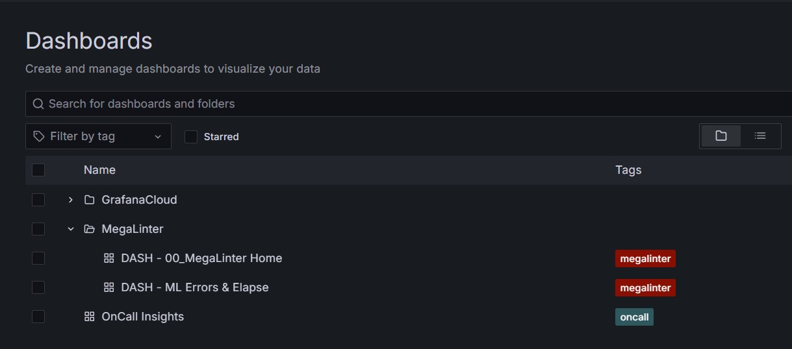
