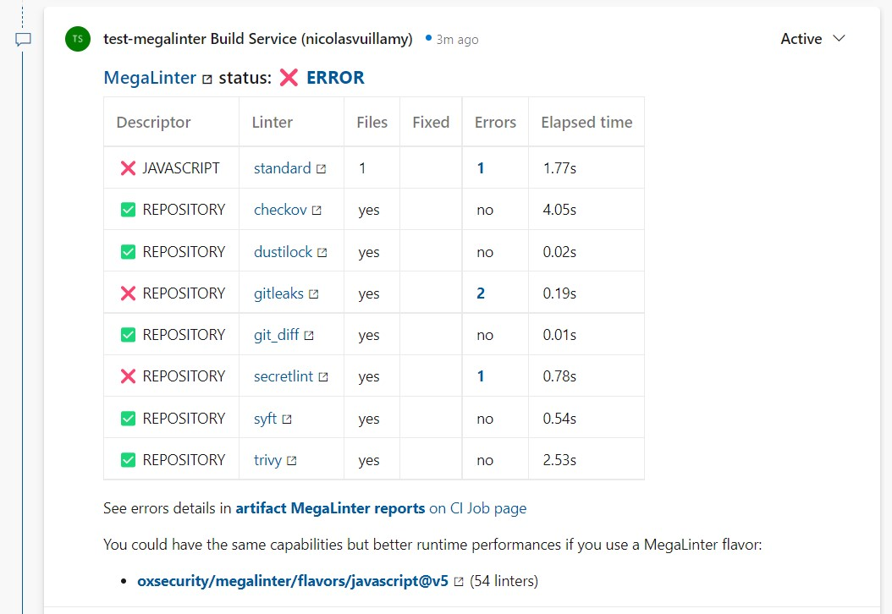
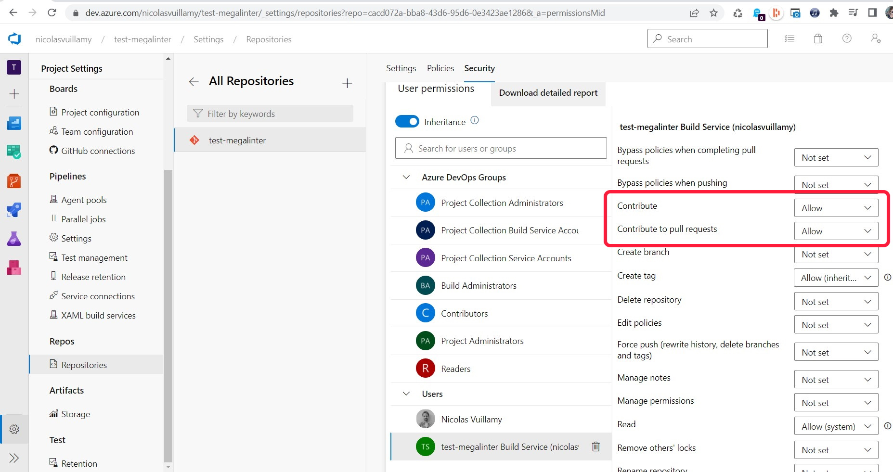

<!-- markdownlint-disable MD013 MD033 MD041 -->
# Azure Comment Reporter

Posts Mega-Linter results summary in the comments of the related Azure Pipelines pull request (if existing)

## Usage

Click on **MegaLinter-reports** artifact from the main job log to view or download results.



## Configuration

- The following variables must be sent to the docker run command

Example:

```yaml
      - script: |
          docker run -v $(System.DefaultWorkingDirectory):/tmp/lint \
            --env-file <(env | grep -e SYSTEM_ -e BUILD_ -e TF_ -e AGENT_) \
            -e SYSTEM_ACCESSTOKEN=$(System.AccessToken) \
            -e GIT_AUTHORIZATION_BEARER=$(System.AccessToken) \
            oxsecurity/megalinter:v7
        displayName: Run MegaLinter
```

- A build policy must be defined

  - See <https://docs.microsoft.com/en-US/azure/devops/repos/git/branch-policies?view=azure-devops&tabs=browser#build-validation>

- You must allow **Contribute** and **Contribute to Pull Requests** on your Build Service (Settings -> Repositories -> Select your build service)



| Variable                          | Description                                                                        | Default value |
|-----------------------------------|------------------------------------------------------------------------------------|---------------|
| AZURE_COMMENT_REPORTER            | Activates/deactivates reporter                                                     | true          |
| AZURE_COMMENT_REPORTER_LINKS_TYPE | Set to `build` if you want comments linking to target Build and not artifacts page | `artifacts`   |
| REPORTERS_MARKDOWN_TYPE           | Set to `simple` to avoid external images in generated markdown                     | `advanced`    |
