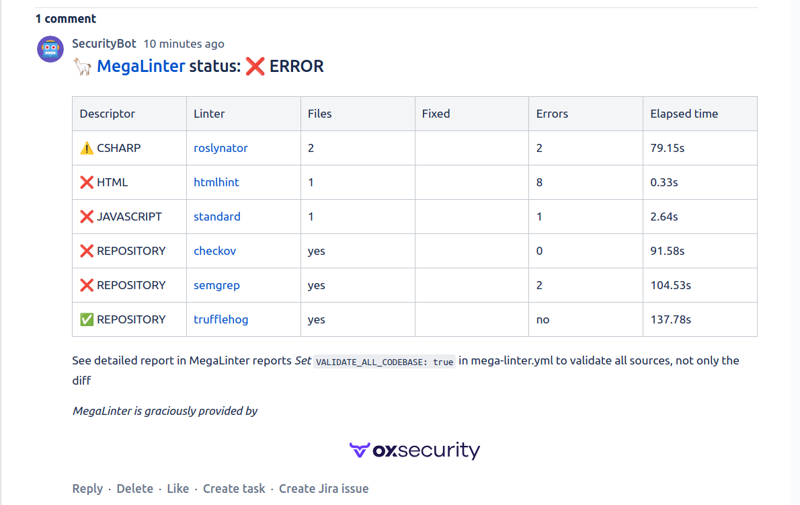

<!-- markdownlint-disable MD013 MD033 MD041 -->
# Bitbucket Comment Reporter

Posts MegaLinter results summary in the comments of the related Bitbucket pull request (if existing)

## Usage

Click on hyperlinks to access detailed logs (click on **Download** in **Artifacts section** at the left of a CI job page)

After a first MegaLinter run, a comment is posted on the PR. To avoid multiplicating MegaLinter PR comments, future MegaLinter runs will update the existing PR comment instead of posting a new one.

If you really want a new PR comment for each MegaLinter run, define variable `BITBUCKET_COMMENT_REPORTER_OVERWRITE_COMMENT` to `false`.

## Configuration

- [Create a Repository Access Token](https://support.atlassian.com/bitbucket-cloud/docs/create-a-repository-access-token/) with scope **Pull-requests: Write**
- Paste the access token in a [masked CI/CD variable](https://support.atlassian.com/bitbucket-cloud/docs/variables-and-secrets/) named **BITBUCKET_REPO_ACCESS_TOKEN** in your project (repository)

| Variable                                     | Description                                                                                  | Default value |
|----------------------------------------------|----------------------------------------------------------------------------------------------|---------------|
| BITBUCKET_COMMENT_REPORTER                   | Activates/deactivates reporter                                                               | `true`        |
| BITBUCKET_REPO_ACCESS_TOKEN                  | Must contain a Bitbucket repository access token defined with api access                     | <!-- -->      |
| BITBUCKET_COMMENT_REPORTER_OVERWRITE_COMMENT | Set to false to not overwrite existing comments in case of new runs on the same Pull Request | `true`        |
