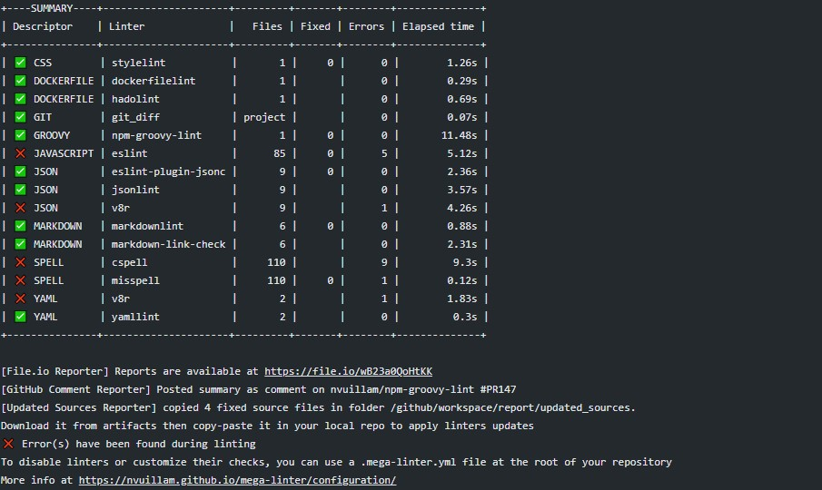

# Console Reporter

Posts MegaLinter results execution logs in the console

## Usage

Open GitHub action (or other CI tool) logs and look in MegaLinter step

## Configuration

| Variable                  | Description                                             | Default value |
|---------------------------|---------------------------------------------------------|---------------|
| CONSOLE_REPORTER          | Activates/deactivates reporter                          | true          |
| CONSOLE_REPORTER_SECTIONS | Activates/deactivates sections for console logs         | true          |
| OUTPUT_DETAIL             | `simple` for only error files, `detailed` for all files | `simple`      |