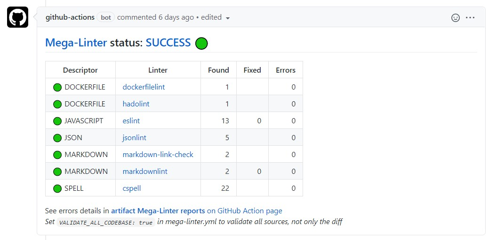

<!-- markdownlint-disable MD013 MD033 MD041 -->
# GitHub Comment Reporter

Posts MegaLinter results summary in the comments of the related pull request (if existing)

## Usage

Click on hyperlinks to access detailed logs.

If [LLM Advisor](../llm-advisor.md) is activated, it will also show its suggestions to fix linter errors.

## Configuration

| Variable                | Description                                                                               | Default value            | Notes                                        |
|-------------------------|-------------------------------------------------------------------------------------------|--------------------------|----------------------------------------------|
| GITHUB_COMMENT_REPORTER | Activates/deactivates reporter                                                            | true                     |                                              |
| GITHUB_API_URL          | URL where the github API can be reached Must be overridden if using GitHub Enterprise | `https://api.github.com` | For GHE, use `https://my.company.com/api/v3` |
| GITHUB_SERVER_URL       | URL of the GitHub instance Must be overridden if using GitHub Enterprise              | `https://github.com`     |                                              |
| CI_ACTION_RUN_URL       | URL of the CI job visualization page url (if using Github but not GitHub Actions)         | <!--  -->                |                                              |
| REPORTERS_MARKDOWN_TYPE | Set to `simple` to avoid external images in generated markdown                            | `advanced`               |                                              |
| REPORTERS_MARKDOWN_SUMMARY_TYPE | Display summary in PR/MR comments as `sections`, `table` or both (`sections-table` or `table-sections`) | `table-sections` |  |
| REPORTERS_ACTION_RUN_URL | Override default URL of the CI job visualization page | <!-- --> |  |
| JOB_SUMMARY_ADDITIONAL_MARKDOWN | Custom markdown to add at the end of the summary message | <!-- --> |  |
| MEGALINTER_MULTIRUN_KEY | Key to identify multirun when multiple MegaLinter runs are executed in the same pipeline (ex: `java`) | <!-- --> |  |
