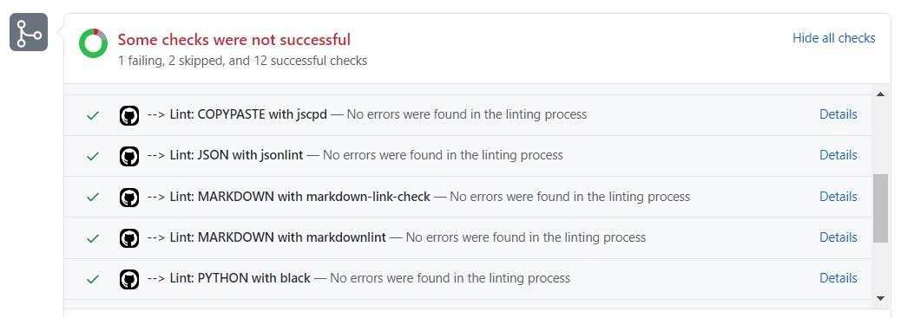

# GitHub Status Reporter

Posts a status on the pull request for each processed linter

## Usage

Click on **Details** to access detailed logs

## Configuration

| Variable | Description | Default value |
| ----------------- | -------------- | :--------------: |
| GITHUB_STATUS_REPORTER | Activates/deactivates reporter | true |
