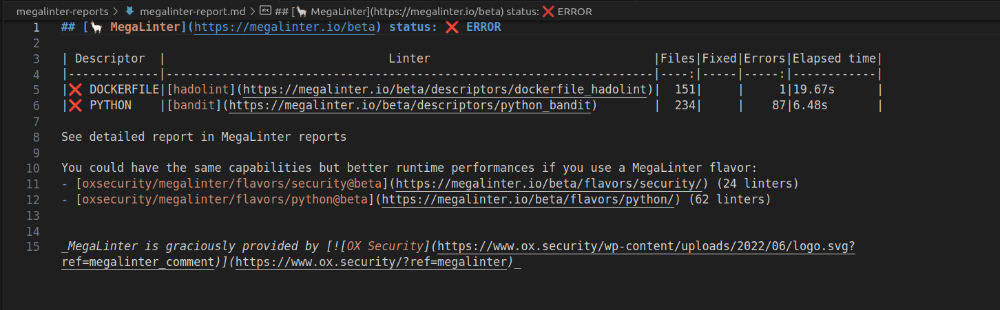
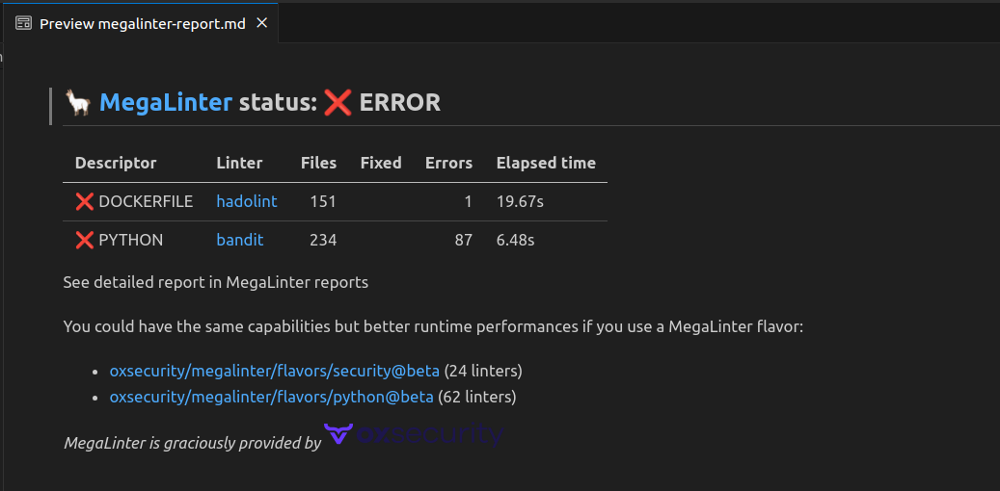

# Markdown Summary Reporter

Generates a summary of SAST results in Markdown within a file named **megalinter-report.md**, located in the report folder.

If [LLM Advisor](../llm-advisor.md) is activated, it will also show its suggestions to fix linter errors.

If **GITHUB_STEP_SUMMARY** is set, the related file will also be written.

This reporter **is deactivated by default**, except if env variable GITHUB_STEP_SUMMARY is found.

## Usage

Activate the reporter (`MARKDOWN_SUMMARY_REPORTER: true`) to generate markdown summary report file.

## Configuration

| Variable                            | Description                                              | Default value          |
|-------------------------------------|----------------------------------------------------------|------------------------|
| MARKDOWN_SUMMARY_REPORTER           | Activates/deactivates reporter                           | `false`                |
| MARKDOWN_SUMMARY_REPORTER_FILE_NAME | File name for MARKDOWN_SUMMARY report output file        | `megalinter-report.md` |
| JOB_SUMMARY_ADDITIONAL_MARKDOWN     | Custom markdown to add at the end of the summary message | <!-- -->               |
