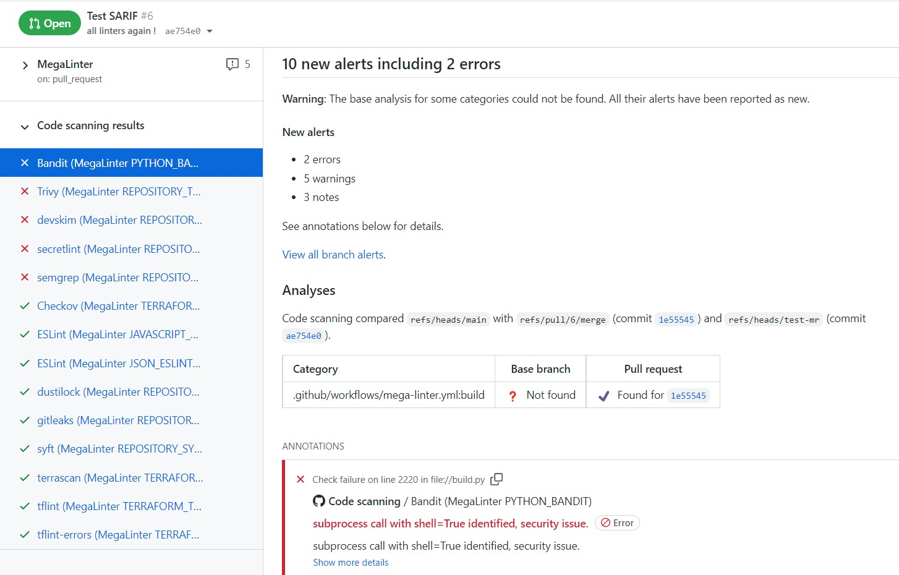
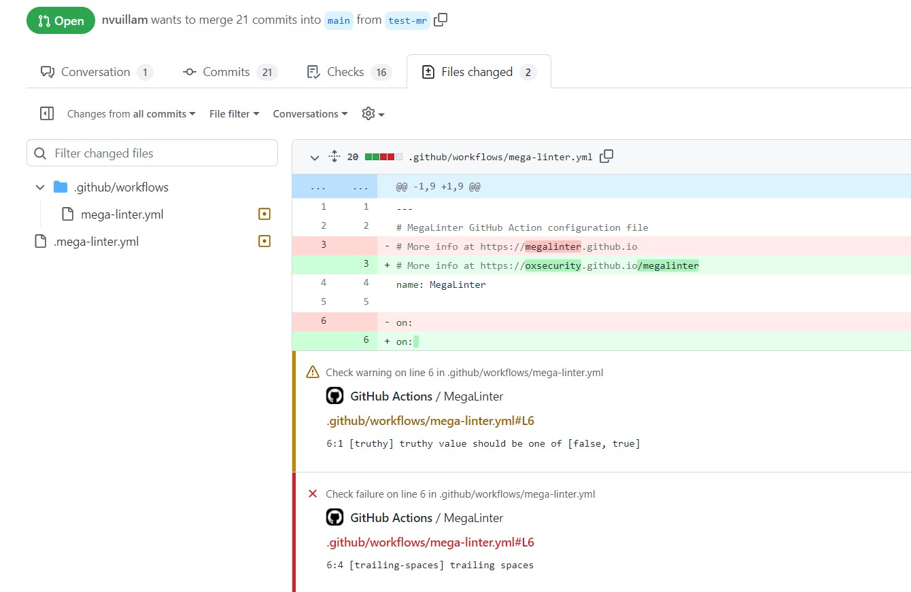

# SARIF Reporter (beta)

Generates a full execution log in SARIF format within a file named **mega-linter-report.sarif** , located in report folder.

Note: Only linters able to handle SARIF will provide output in the aggregated SARIF file.

This reporter **is deactivated by default**.





## Usage

Activate the reporter (`SARIF_REPORTER: true`) to generate JSON report file.

If you want GitHub to handle the SARIF file to display it in its UI, add the following step in your GitHub Action Workflow.

```yaml
- name: Upload MegaLinter scan results to GitHub Security tab
if: ${{ success() }} || ${{ failure() }}
uses: github/codeql-action/upload-sarif@v2
with:
    sarif_file: 'megalinter-reports/megalinter-report.sarif'
```

## Configuration

| Variable                                | Description                                                                                                | Default value              |
|-----------------------------------------|------------------------------------------------------------------------------------------------------------|----------------------------|
| SARIF_REPORTER                          | Activates/deactivates reporter                                                                             | `false`                    |
| SARIF_REPORTER_NORMALIZE_LINTERS_OUTPUT | Remove DEFAULT_WORKSPACE prefix in SARIF-files, i.e. 'DEFAULT_WORKSPACE/src/main' would be 'src/main' etc. | `true`                     |
| SARIF_REPORTER_FILE_NAME                | File name for SARIF report output file                                                                     | `mega-linter-report.sarif` |
| SARIF_REPORTER_LINTERS                  | List of linter keys that will output SARIF (if not set, all SARIF compliant linters will output SARIF)     | `[]`                       |
