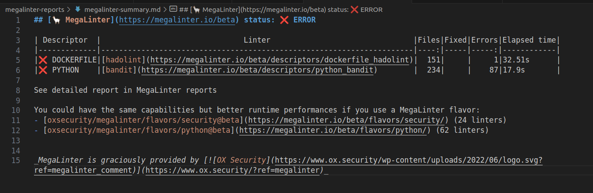
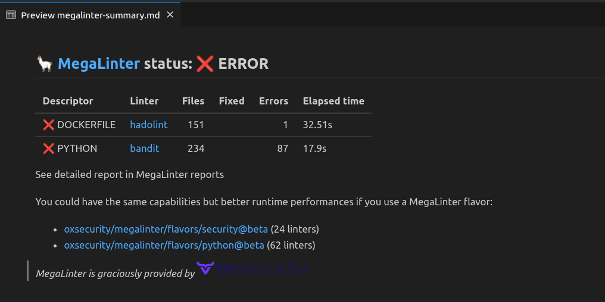

# Summary Reporter

Generates a summary of SAST results in Markdown within a file named **megalinter-summary.md**, located in the report folder.

This reporter **is deactivated by default**.

## Usage

Activate the reporter (`SUMMARY_REPORTER: true`) to generate summary report file.

## Configuration

| Variable                                | Description                                                                                                       | Default value              |
|-----------------------------------------|-------------------------------------------------------------------------------------------------------------------|----------------------------|
| SUMMARY_REPORTER                          | Activates/deactivates reporter                                                                                    | `false`                    |
| SUMMARY_REPORTER_FILE_NAME                | File name for SUMMARY report output file                                                                            | `megalinter-summary.md` |
