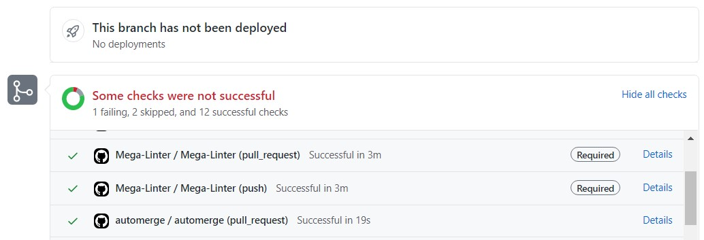
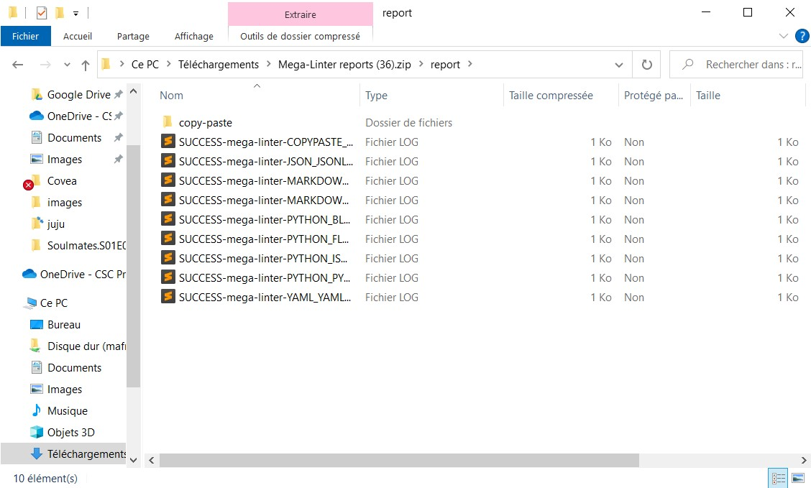

# Text Reporter

Posts a pack of text logs , zipped as a GitHub Action artifact

- General execution log `mega-linter.log` (same as [ConsoleReporter](ConsoleReporter.md) log)
- A separate log file for each processed linter

## Usage

### Get Artifacts on GitHub Actions

- Access GitHub action run

- Click on Artifacts then click on [**Mega-Linter reports**](#report-folder-structure)

### Get Artifacts on GitLab CI

- Access GitLabel CI job page

- In **Job Artifacts** section, click on [**Download**](#report-folder-structure)

### Other CI tools

- You can export `mega-linter.log` and folder `<WORKSPACE>/report` as external artifacts

- You can also use [File.io Reporter](https://megalinter.github.io/reporters/FileIoReporter/) or [E-mail Reporter](https://megalinter.github.io/reporters/EmailReporter/)

## Report folder structure

- Open the downloaded zip file and browse **linters_logs** folder for reports

## Configuration

| Variable                 | Description                                       | Default value  |
|--------------------------|---------------------------------------------------|----------------|
| TEXT_REPORTER            | Activates/deactivates reporter                    | `true`         |
| TEXT_REPORTER_SUB_FOLDER | Sub-folder of reports folder containing text logs | `linters_logs` |
