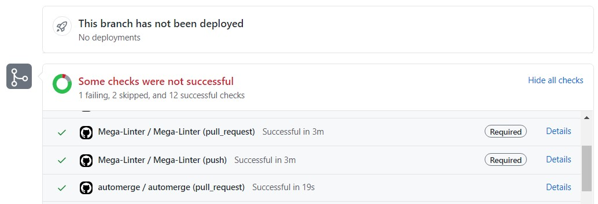
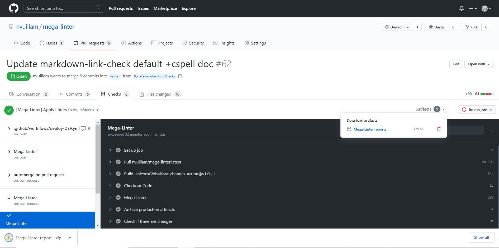
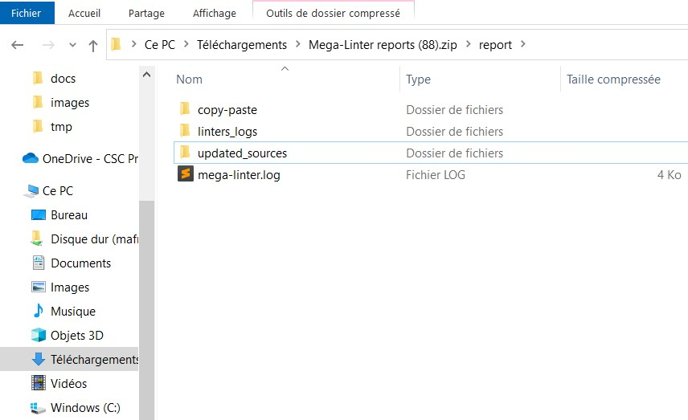
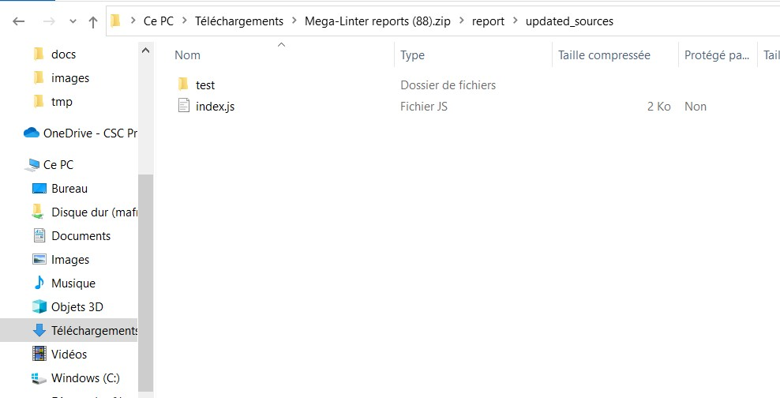

# Updated Sources Reporter

Posts a **pack** of files containing **only the source files fixed by linters**

This folder can be unpacked to currently repository to apply automated fixes on the repository

## Usage

Access GitHub action run

Click on Artifacts then click on **MegaLinter reports**

Open the downloaded zip file and copy the content of folder **updated_sources**

Paste the result in your repository

### Other CI tools

If you aren't using GitHub Actions, you can:

- use [File.io Reporter](FileIoReporter.md): Updated sources folder will be in the downloadable reports zip
- use [Email Reporter](EmailReporter.md): Updated source folder will be in the email attachment reports zip
- publish folder `<WORKSPACE>/report/updated_sources` as artifact with your CI tool

### Empty updated sources folder

The folder is empty when MegaLinter can not list the files updated by the linters. This happens on a **read-only workspace** whose repository uses **git-lfs**: the LFS filter has nowhere to write its temporary files, so the `git diff` used to detect updated files fails.

MegaLinter logs a warning naming the workspace and the failed command, then completes the run. Mount `.git` as writable to get the updated sources back.

## Configuration

| Variable                     | Description                                             | Default value   |
|------------------------------|---------------------------------------------------------|-----------------|
| UPDATED_SOURCES_REPORTER     | Activates/deactivates reporter                          | true            |
| UPDATED_SOURCES_REPORTER_DIR | Sub-folder of reports folder containing updated sources | updated_sources |
